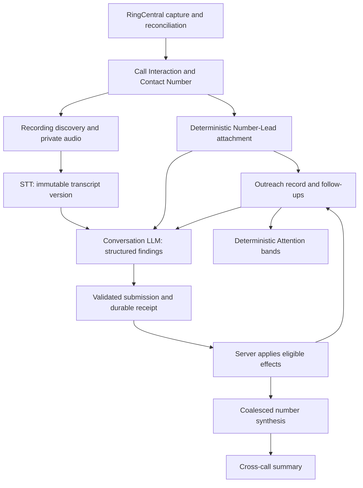

# 17 — Sales Intelligence efficiency: implementation handoff for Fable 5.1

Date: September 21, 2026. Status: evidence-backed analysis and proposed implementation sequence, **not a change to the product contract**. No runtime, model, budget, flag, or retention setting was changed for this analysis.

## 1. Objective and starting point

Make Sales Intelligence deliver useful, correctly attributed Outreach work with fewer MongoDB writes, fewer redundant jobs, less model context, and fewer failed model submissions. Preserve lead-to-number identity, transcript understanding, structured findings, Owner decisions, and timely Attention bands. Do not achieve efficiency by silently skipping eligible conversations or weakening identity rules.

Fable 5.1 is the intended **implementation agent**. The Owner's available Anthropic spending is not an instruction to replace the production inference provider. The current runtime uses an explicit model allowlist and Gateway pricing/budget accounting; provider migration would be a separate, measured decision.

Read first:

- [Product specification](../call-sales-intelligence/01-specification.md), [pipeline](../call-sales-intelligence/03-server-pipeline-and-jobs.md), and [intelligence contract](../call-sales-intelligence/10-intelligence-agent-contract.md).
- [Earlier model/context analysis](15-analysis-context-and-model-efficiency.md) and [MCP/attachment analysis](16-mcp-tool-surface-precomputed-context-and-attachment.md). Their recommendations and measurements are dated, and some code has since changed.
- [Fresh production aggregates](17-efficiency-baseline-2026-09-21.json), collected read-only at 18:04–18:05 UTC. No transcripts, customer identifiers, credentials, or customer document bodies were exported.

Inspected server checkout: `main`, HEAD `f051d029b3c5bb1636ee497ea8c502bda81a7f00`, repository `jbell-rusty-vantage/vantage-movers-server`. The deployed commit was not verified. Existing uncommitted work was present in `src/models/salesIntelligence/infrastructure.ts`, `src/services/salesIntelligence/outreach/attention.ts`, `outreach/reads.ts`, and a new `outreach/attention-chunks.test.ts`. Preserve it. The pack requires implementation on `sales-intelligence`; reconcile the actual branch/worktree and existing work before editing. This handoff only adds documentation and aggregate evidence.

## 2. Main conclusion

There are **two separate problems**:

1. Repeated deterministic maintenance creates a large durable job history. At the first storage audit, Sales Intelligence jobs occupied about 71 MiB while the actual findings occupied under 0.3 MiB including indexes. Most jobs are not LLM calls.
2. The model pipeline is producing little completed intelligence relative to available transcripts. The fresh snapshot contains 355 runs, only nine completed runs, many budget pauses, and recurring schema/bounds failures. These are lifecycle counts, not a controlled success-rate experiment or a count of paid requests.

Prioritize useful completed analyses and bounded maintenance. A smaller schema or a cheaper model alone will not stop the Outreach repair queue growing. Shorter job retention alone will not make structured extraction succeed.

## 3. Product model that must survive



Keep these responsibilities distinct:

| Responsibility | Authority | LLM needed? |
|---|---|---|
| Phone normalization, candidate lookup, exact session identity, event-time attachment | Attachment policy and Owner decisions | No |
| Outreach state: `unworked`, `open`, `waiting_on_customer`, `identity_review`, `closed` | Server commands and official/Owner precedence | No for state derivation; findings can propose eligible effects |
| Attention bands and clocks | `outreach/derive.ts`, staffing policy, follow-ups and restrictions | No |
| What the conversation meant: promises, dates, objections, restrictions, money, completion claims | Transcript extraction into validated findings | Yes |
| Whether a finding may create/change an action | Server application rules and current identity | No |
| Cross-call narrative | Number synthesis over authorized evidence | Yes in the current contract; no conversation effects |

Current band order is: promised callback overdue; no call yet for a Form Lead; missed call without callback; follow-ups due; no next step; missing responsibility; going cold. The lowest matching band wins. Bands, overdue, cooldown and review badges are derived signals, not additional Outreach states and not model-assigned labels.

The LLM must not resolve ambiguous identity by guessing, create official Bookings, close work autonomously, or send customer/rep messages. Owner Rep Nudge remains an explicit Owner command. Closed-work analysis may still provide useful context; do not add a blanket closed-record or short-call skip gate.

## 4. Measured production baseline

Live queries are non-atomic: counts can change between aggregations. MiB means bytes / 1,048,576.

| Measurement at approximately 18:04 UTC | Result |
|---|---:|
| All CSI jobs | 90,456; 59.94 MiB documents + 11.32 MiB indexes |
| Completed `outreach_ensure` jobs | 76,720 |
| Completed `attachment_refresh` jobs | 9,736 |
| Pending `number_refresh` jobs | 1,434 |
| Pending conversation `analysis` jobs | 305 |
| Completed transcription jobs | 344 |
| Intelligence Runs | 355 |
| Completed conversation / number runs | 7 / 2 |
| Initial runs paused with `budget_exhausted` | 306 |
| Runs paused with `schema_exhausted` | 14 |
| Runs paused with `bounds_exhausted` | 10 |
| Runs paused with `contract_mismatch` | 3 |
| Call Interactions / Lead Conversations / Contact Numbers | 559 / 447 / 257 |
| Number-Lead attachment edges | 225 |
| Outreach Records / Follow-ups | 7,795 / 6 |
| Findings / Effects | 60 / 20 |

The 20 effects include 10 applied, four blocked by `outreach_binding_unavailable`, and six needing review. This does not prove blocked effects should have been applied; it establishes that attribution and effect eligibility must be part of the acceptance tests.

Outreach includes 6,078 unworked Lead records, 142 open Lead records, 1,560 closed Lead records, six Lead records in identity review, and nine Number Reviews. The large Lead inventory versus only 257 captured numbers is not itself a defect: no-call Form Leads belong on the desk before a recording or number attachment exists.

Earlier in the same session, about 61,900 completed jobs were specifically `csi:outreach:repair:OutreachRecord:*`, accounting for about 40.56 MiB of document data. Recent complete hourly buckets contained approximately 3,000–3,700 new jobs/hour and 2.0–2.4 MiB/hour of job documents. These are a short-window observation, not a steady-state forecast.

Operational Events were separately cleared with Owner authorization, taking estimated application-database usage to about 397 MiB. That was emergency headroom, not a CSI fix. The original measurements and cleanup receipt are in the workspace-root `mongodb-storage-*.json` and `mongodb-operational-events-cleanup-2026-09-21.json` artifacts.

## 5. P0 — Explain budget admission before changing spending

At 18:05 UTC, the persisted September budget held:

- Ceiling: 8,000 cents ($80).
- Recorded actual: 415 cents ($4.15).
- Reserved: 1,217 cents ($12.17).
- Uncommitted: 6,368 cents ($63.68).

Therefore the 306 `budget_exhausted` run rows do **not** establish that the monthly allowance was consumed. Recorded actual is not a provider billing reconciliation, and incomplete usage must not be reported as zero cost.

`analysis/worker.ts` throws the same error when no activated period exists, when conversation reservation exceeds `policy.per_recording_ceiling_cents`, or when budget reservation cannot be admitted. The current code defaults reserve a 12-step loop with 1,536,000 cumulative input tokens and 96,000 cumulative output tokens. `context_tokens = 128,000` is actually enforced by a conservative UTF-8 byte counter, not a tokenizer. Production can replace the limits object through configuration; this analysis did not inspect the deployed override.

Reservation formula:

```text
ceil((total_input_tokens * input_cents_per_million
    + total_output_tokens * output_cents_per_million) / 1,000,000)
    + steps - 1
```

The final term covers per-step cent rounding. Do not remove the conservative bound without replacing its accounting guarantee.

**Implement first:** report distinct admission reasons and the non-secret evaluated numbers: estimated invocation cents, per-recording limit, activated period, remaining monthly amount, model/pricing version, and runtime limits. Reproduce a paused run's admission with those exact inputs before changing any ceiling. Verify that pause/resume cannot repeatedly create runs or re-enqueue unchanged work just because a cron fires. Do not infer job state from run state; the snapshot has paused run rows associated with a larger pending-job cohort.

The reservation aggregates include 56 analysis reservations still reserved after provider start, totaling 1,056 estimated cents. Inspect their age and recovery eligibility; this snapshot alone does not prove a leak. Recover receipts and provider usage when possible. Never release uncertain provider spend just to make the budget look available, and never rerun paid analysis when a durable submission already exists.

## 6. P0 — Bound Outreach maintenance without breaking clock transitions

**Observed mechanism:** `outreach/worker.ts:runOutreachEnsureOnce` scans EntityChange and runs rolling repair passes across Form Leads, Call Leads, Call Interactions and Outreach Records. Lead repair dedupes semantic official flags; OutreachRecord repair uses the sweep-cycle timestamp in its dedupe key. Each new sweep cycle can generate another durable job for every record, including records whose relevant state has not changed. The stored job families are consistent with this being the dominant growth source. Verify the deployed revision and reproduce before labeling every repeated job a bug.

**Proposed design:** separate three causes of work:

1. A material source change nominates the affected subject with a semantic revision/fingerprint.
2. A time boundary nominates it with the specific expected boundary/version: first-action deadline, follow-up due/snooze expiry, wait expiry, restriction expiry, staffed going-cold threshold, or cooldown expiry.
3. A bounded repair sweep catches missed events and legacy records. It should avoid inserting completed no-op history for every subject on every cycle.

A persisted `next_recompute_at` or equivalent indexed schedule is a candidate design, not an existing field. Preserve read-time freshness: the Attention desk must still cross a deadline when no call, Lead update, or LLM result arrives. Closed records normally need no periodic clock job, but official changes, Owner commands and relevant evidence must still wake them when the contract requires it.

Coalesce to one outstanding subject task with a durable requested generation and processed generation, or another demonstrably race-safe mechanism. If a source changes during a lease, the later generation must survive completion. Do not reset leased jobs in place or turn `dedupe_key` into a permanent key that suppresses future real work.

**Acceptance:** a frozen idle corpus over repeated sweeps produces no new semantic audit/effect rows and no linearly growing completed repair-job history; every scheduled boundary still appears on the desk within the agreed freshness target. Test two workers, lease loss, late commits and a mid-flight revision change.

## 7. P1 — Preserve recent improvements; finish attachment efficiency carefully

Current source already contains improvements that older documents describe as proposals:

- `attachment/refresh.ts:findLeadsByNumber` uses normalized phone lookup instead of scanning every Lead for every number.
- Contact Number attachment watermark reads `last_activity_at`, rather than generic `updatedAt`, and only initiates its number scan when no edge exists.
- `transactions.ts:assertIndexes` caches successful unique-index verification per namespace in process.
- Job exhausted-claim housekeeping has a cadence instead of a full sweep before every claim.
- `analysis/scheduling.ts` consumes an audit stream plus a slow repair sweep; it is no longer only five round-robin numbers per run.
- Dirty working-tree Attention changes batch-load derivation inputs and add chunked snapshots. Do not overwrite or claim them as this handoff's implementation.

Remaining targets to measure:

- Lead attachment watermarks still use `updatedAt`. Separate identity-relevant changes from unrelated edits with a semantic fingerprint, preserving late commits and equal-time keyset behavior.
- `analysis/reads.ts:leadRelevance` still mixes normalized equality with raw-phone regex alternatives. The indexed attachment lookup does not automatically fix this separate model-facing query. Backfill/verify normalization coverage, then use indexed predicates; measure `explain('executionStats')` rather than assuming a winning plan.
- `attachment/hooks.ts:rediscoverAttachmentPage` fans a number attachment revision out into recording-discovery and Outreach jobs for up to 500 interactions per page. Measure useful changes versus no-ops; narrow to event-applicable affected calls or coalesce equivalent work without losing previously ineligible calls that become eligible.
- `attachment/store.ts:lockNumber` writes the shared number revision before fan-in, and `unchangedNumber` restores it for no-ops. This is a concurrency fence against write skew across different Lead pairs. Do **not** simply delete it or move it after unprotected reads. An optimization must revalidate under the shared fence/CAS and pass competing-pair tests.

A correctness issue intersects efficiency: current `autoAttachNumber` can promote an unambiguous phone edge to `attached` with certainty `likely`, while `conversationAnalysisInput` and `outreach/effects.ts` still exclude `likely` from some Lead effects. Preserve that policy unless explicitly revised. Show whether a completed analysis is number-only or Lead-actionable; do not spend repeated model calls expecting them to repair a deterministic identity gate. Do not adopt older nearest-time tie-break proposals without domain approval and historical attribution fixtures.

## 8. P1 — Give the model the relevant evidence once

Current `analysis/runtime.ts` preloads context, number timeline, Lead search, Booking search, per-interaction Rep identity and transcript pages, then advertises all 12 tools to the model. The model may repeat those reads. Number synthesis can reload many transcripts already processed individually.

Fresh local artifact measurement: generated envelope schema is 41,424 JSON bytes; the `tools` object is 45,682 bytes. These are serialized artifact sizes, **not billed tokens**. The citation inventory is additional navigation metadata alongside full captured pages; it is not a second copy of all transcript text. Measure its value and overhead rather than deleting citation support blindly.

Implement a common fast path for a resolved conversation:

- One pinned transcript version, call identity and event-time Rep attribution.
- One authoritative resolved-subject projection containing Lead reference, attachment certainty, effect eligibility and blocked reason.
- Only relevant official status, active actions, restrictions, Owner instructions and required historical context.
- Complete coverage/provenance indicators and stable citation locators.

Keep ambiguity and missing coverage explicit. Unresolved identity can use a scoped discovery path; the model does not gain permission to choose an attachment. Precomputed context must be captured through the same authorized evidence/manifest boundary, not inserted as uncitable instructions.

Derive a per-run tool allowlist. Main-server already stores `permitted_tools`, but `run.ts` grants all `CSI_TOOLS`, and runtime validates against the global tool count. Change issuance, MCP registration expectations, preflight and runtime together. SDK `activeTools` is a presentation control, not authorization. A conversation with complete captured context should not search live RingCentral unless a specific missing fact requires that authorized capability.

Version the generated schema and test `$defs`/`$ref` compaction through both actual schema adapters and the provider path. Keep all server refinements, citation membership and cross-field checks. Old runs retain their pinned schema and prompt; either support versioned replay or explicitly surface unavailable replay. Do not silently repin historical runs.

Target a first-pass structured submission and at most one focused validation repair on ordinary fixtures. Preserve the existing receipt protocol and uncertainty stop. A direct structured-output experiment is possible, but is not required for the first optimization pass; it must still use the trusted submission/application boundary.

## 9. P1 — Reduce number synthesis and failed-run amplification

`scheduleNumberIntelligence` already compares a semantic fingerprint, prevents another active analysis/application, and delays a new job 15 seconds. Preserve this. Some `number_refresh` jobs are signals or no-transcript no-ops, not model requests; the 1,434 pending jobs cannot be equated with 1,434 paid analyses.

Measure separately: nominated numbers, unchanged fingerprints, signal jobs consumed, real synthesis runs, excluded/no-transcript inputs, stale inputs, and provider calls. Check whether cheap eligibility can precede broad evidence collection without suppressing later activation.

Evaluate batching a burst of completed conversation extractions into one number synthesis with a bounded maximum wait. Ensure a change arriving during active analysis/application is revisited afterward. Exclude synthesis's own summary writes from its triggering fingerprint. Keep Owner correction, changed restriction, official status and attachment changes as real invalidations.

Using versioned conversation findings plus changed transcripts for incremental synthesis is a later optimization requiring completeness and quality proof: a cached summary must not replace evidence needed for contradictions, commitments or Owner instructions. Never silently truncate long-number history. Use explicit chunking/coverage or a visible bounded failure with a recovery path.

Separate failure classes: admission pause, missing coverage, provider throttle, malformed schema, stale identity, delivery uncertainty and application conflict. Retry only the recoverable stage. Reuse transcripts across analysis retries; reuse accepted submissions across application retries; recover receipts before another model call. No paid rerun should be caused by a cosmetic timestamp or read-only dashboard request.

## 10. Retention and model organization

The four model modules are a useful starting point, not the whole optimization surface:

| Module under `src/models/salesIntelligence/` | Responsibility | Treatment |
|---|---|---|
| `capture.ts` | Call/number identity, aliases and provider state | Preserve canonical identity and reconciliation checkpoints |
| `outreach.ts` | Work records, follow-ups, attachments and related operational state | Preserve active work, Owner decisions and event-time attribution |
| `intelligence.ts` | Runs, snapshots, submissions, findings, effects, review/restriction evidence | Coordinated retention with tombstones and provenance |
| `infrastructure.ts` | Jobs, commands, audit, budgets, policy, Attention snapshots | Distinguish disposable execution history from replay/budget authority |

A live 14-day TTL on completed jobs exists and completed timestamps are BSON dates. None of the recent job burst was yet old enough to expire. A shorter stage-specific lifetime may help, but deleting jobs also deletes their dedupe keys. Prove replay behavior first, including an old repair watermark and retained references to application jobs. Keep small dedupe tombstones where required instead of retaining full result bodies indefinitely.

Do not TTL pending/leased/retry/paused/dead-letter jobs, command receipts, unresolved reservations or application effect identities as an indiscriminate cleanup. Audit events are separate from queue output. Existing content retention handles source snapshots, derived summaries and tombstones; raw collection deletion bypasses it. Audio is private object storage, so audio cleanup does not directly recover the same MongoDB bytes.

## 11. Implementation order and verification contract

1. **Establish current truth.** Preserve dirty work, verify deployed revision/flags/indexes, capture evaluated admission settings and rerun aggregate baseline. Resolve the per-recording budget blocker without misrepresenting unknown spend.
2. **Bound deterministic maintenance.** Replace unnecessary cycle-driven jobs with semantic changes and due-time scheduling; retain a slow repair path. Measure Mongo operations and job bytes, not only runtime latency.
3. **Finish focused reads.** Normalize/query Lead identity efficiently; coalesce attachment fan-out; keep cross-pair fencing. Integrate and verify existing Attention batching work.
4. **Improve extraction completion.** Compact/version schema, capture resolved context, scope tools and fix concrete schema failures. Compare identical frozen evidence before/after.
5. **Coalesce synthesis and apply retention.** Prove fresh summaries, late-source recovery, dedupe and safe purge. Roll out in bounded stages with rollback of writers/configuration; deletion itself is not reversible without an archive.

Build a deterministic isolated replay using actual services and a replica-set test database. No production writes or messages are needed to prove this work. Existing test anchors include `analysis/runtime.test.ts`, `attachment/suggest.test.ts`, and `scripts/dev_ops/test-csi-{attachment,outreach,runtime,intelligence,transcription}.ts` plus the `test-csi15-{budget,retention,period}` suites. Inspect each script's database safeguards and current package commands before executing it.

Required fixtures:

- One new Form Lead without a call remains Unworked/band 2 without an LLM.
- Exact Call Lead attachment; auto-attached Likely Form Lead; Owner-confirmed and Owner-rejected attachment; shared/reused phone with overlapping and non-overlapping moves.
- Missed inbound episode, first outbound attempt, clear promised callback, customer-will-call, uncertain date, reschedule, restriction, Owner correction, official Booking and Cancellation.
- Frozen idle corpus and advancing staffed clocks, including overnight/weekend/DST, snooze and restriction expiry; no source event at the transition.
- Duplicate provider delivery, out-of-order updates, concurrent Lead-pair attachment, lease loss, source change during synthesis, and source change during application.
- Long transcript/long number history; schema-invalid first submission with one repair; accepted submission with lost response; provider 429/Retry-After; unknown billing; budget increase and resume without duplicate effects.
- Retention during analysis, original-evidence rerun after purge, and late replay after completed-job expiry.

Record before/after: jobs and BSON/index growth per 1,000 source changes; jobs per idle record/day; query docs examined/returned; no-op writes; backlog oldest age by stage; p50/p95 source-to-band and transcript-to-applied latency; preflight pages/bytes; actual reported model input/output and steps; first-submit validity; accepted-and-applied completion rate; known cost per completed eligible conversation; unknown-cost share; duplicate effects; incorrect Lead attribution; and missed commitments/restrictions.

Proposed engineering acceptance targets, to baseline before claiming success: at least 90% fewer idle Outreach repair insertions; zero repeated paid extraction for unchanged pinned evidence except explicit Owner reruns; a typical resolved conversation submits within one or two model steps; and no regression in fixture attribution, restrictions, due-band timing, or commitment recall. The 90% target is a goal, not a measured result. Do not promote a faster model on schema validity alone—score factual findings and correctly applied actions.

## 12. Copyable assignment for Fable 5.1

> Read this handoff, its aggregate baseline and the authoritative CSI product/pipeline/intelligence contracts. Preserve current uncommitted Attention work and use the required sales-intelligence implementation branch. First verify the deployed revision and distinguish per-recording admission failures from monthly exhaustion. Build a deterministic replay of the actual Outreach repair loop, attachment changes, transcript extraction, submission and application. Reduce recurring no-op durable jobs while preserving every clock-driven Attention transition. Reuse the indexed attachment lookup, cached index verification and audit-driven scheduling already implemented. Optimize the remaining model-facing Lead query, resolved context, generated schema and per-run tool scope. Preserve event-time identity, Owner precedence, restrictions, budget uncertainty, receipt recovery, immutable evidence and server-side effect validation. Report before/after database growth, model usage, completion quality and user-visible latency. Do not treat this document as authorization to delete additional production data, change identity policy, raise spending, or switch the production model provider.
