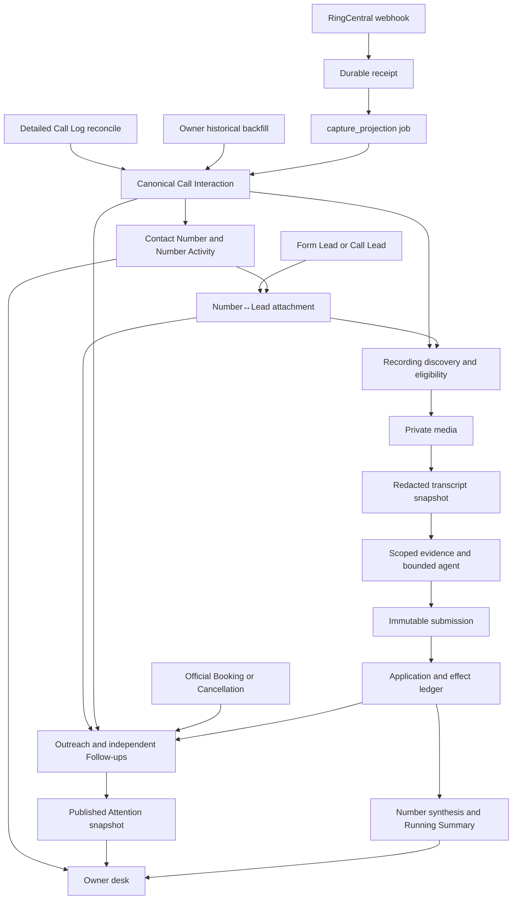

# 20 — How Sales Intelligence works today

Reviewed September 21, 2026. This is the current Sales Intelligence walkthrough requested in [task 19](19-system-walkthrough-and-owner-demo-backfill-task.md), including the surrounding Lead lifecycle, RingCentral capture, MCP and Admin boundaries. It is not an audit of every unrelated Vantage service. The companion [Workflow recommendation](24-workflows-and-mongodb-recommendation-2026-09-21.md) explains the proposed changes.

**Evidence boundary:** source review of main-server HEAD `43d2a43c9477875d102330437dd721ff1d3ece17` plus the existing working-tree changes, MCP HEAD `3ac3aa8d1a1af0171cacb8c2ceee17907cba2185`, and Admin HEAD `3d9ee80708858a62b422996a044e85b74724ab45`. These repositories belong to `jbell-rusty-vantage`, verified from their Git remotes. No production query, paid analysis, backfill, deployment or flag change was performed for this report. Production measurements in older reports are historical evidence, not measurements repeated here.

## The system in one pass

Sales Intelligence connects three things: what RingCentral observed, which Vantage records that evidence belongs to, and what sales work remains. MongoDB holds the authoritative domain records. The main server interprets identity, eligibility, deadlines, budgets and permitted effects. Admin displays those decisions. The dedicated intelligence MCP exposes scoped evidence and accepts an analysis submission; it does not decide business authority independently.

A call can appear under Numbers without becoming a Call Lead, without having a recording, and without creating Outreach. Likewise, analysis can complete without being allowed to change a Lead's Outreach. These distinctions explain many apparently missing results.

Jobs already provide substantial durability: a stored intent, deduplication key, lease owner/epoch, retries and completion. Domain changes, audit and downstream intent commit together where the service supplies a transaction. The queue carries only a job ID; Mongo determines the stage and inputs. This does not currently checkpoint every intermediate model turn. See [jobs.ts](../../src/services/salesIntelligence/jobs.ts), `claimCsiJob`, `completeCsiJob`, and [jobDispatch.ts](../../src/services/numberActivity/jobDispatch.ts), `dispatchCsiWakeup`.

## 1. A call enters through three routes

The webhook stores a RingCentral receipt first. `fanOutCaptureProjection` ensures a deduplicated `capture_projection` job, then attempts a queue wake-up. A bounded enqueue failure does not erase the receipt; `runReceiptWatermarkRecovery` scans stored receipts to close that gap. The queue consumer calls `runCaptureProjectionJob`, which normalizes the observation and persists the projection.

The all-direction Detailed Call Log reconcile is a separate recovery source. It has its own cursor, lease and completeness watermark. Owner-planned historical backfill captures fixed windows with durable page checkpoints. Historical calls defer sales activation until capture and attachment readiness permit it, preventing an old missed call from becoming current work before later fulfillment is known.

A Call Interaction represents a canonical provider session. Identity is account-scoped: telephony session ID, session ID, then Call Log aliases. A provider record naming both identities can prove a merge; phone/time similarity cannot. Per-party sequence fencing prevents stale webhooks regressing newer evidence. Terminal and connected facts do not regress; Call Log evidence has precedence for its authoritative result/duration. Recording observations enrich this same identity.

Call Qualification remains separate: inbound, answered, mapped source number, caller phone, and at least 120 seconds. Capturing an outbound or short call does not create a qualified Call Lead.

**Stored:** receipts, `call_interactions`, `call_interaction_aliases`, sync state, audit, jobs. **Owner:** Activity and Coverage. **Stalls:** capture flags, missing account identity, reconcile gaps, or pending capture jobs.

Source: [webhookFanout.ts](../../src/services/numberActivity/webhookFanout.ts), `fanOutCaptureProjection`; [captureProjectionWorker.ts](../../src/services/numberActivity/captureProjectionWorker.ts), `runCaptureProjectionJob`; [interactionProjection.ts](../../src/services/numberActivity/interactionProjection.ts), `fromWebhookParties`, `fromCallLogRecord`, `mergeProjections`; [persistInteraction.ts](../../src/services/numberActivity/persistInteraction.ts); [reconcileCallLog.ts](../../src/services/numberActivity/reconcileCallLog.ts), `runCallLogReconcileOnce`; [backfill/step.ts](../../src/services/salesIntelligence/backfill/step.ts).

## 2. The Contact Number makes activity discoverable

External endpoints normalize to E.164. North American numbers also receive `national_ten`; reversed digits support suffix matching. Withheld, malformed and service-code endpoints do not acquire invented external identities. Directory evidence identifies company DIDs and extensions.

Endpoint kind and Contact Number classification are different. Classification can be `customer`, `company`, `non_customer` or `unknown`; contact eligibility also records suppression. Capture updates number activity rollups and `last_activity_at`. Those facts indicate observed activity, not a human conversation or an identified household.

Numbers searches phone forms and stored search terms, including names, Job Numbers and agent names. Attachment/rebuild owns the bounded set of 50 terms. Capture may add an observed caller-ID name but cannot evict older Lead-derived search terms. Search reads do not refresh providers or rebuild records.

**Stored:** `contact_numbers`, with projection changes committed alongside interaction work. **Owner:** searchable Numbers and Activity, even when no Lead applies. **Stalls:** incomplete capture or stale derived search data can look like an absent number.

Source: [phone.ts](../../src/services/numberActivity/phone.ts), `classifyEndpoint`, `toE164`, `toNationalTenDigit`; [search.ts](../../src/services/numberActivity/search.ts), `searchNumberActivity`; [searchTerms.ts](../../src/services/numberActivity/searchTerms.ts), `boundSearchTerms`, `addObservedSearchTerm`; [rebuild.ts](../../src/services/numberActivity/rebuild.ts).

## 3. Attachment decides whose call it was

The attachment worker compares official Lead evidence with the number. Exact account-scoped RingCentral identity can attach the original Call Lead. Phone equality supplies windowed evidence, not an identity merge. A Form Lead window spans 36 hours before to 14 days after its timestamp; a Call Lead window spans 12 hours either side.

Candidate edges can become Ambiguous when competing windows overlap. Exact evidence or an Owner command can establish Attached; rejection remains durable. These are not compulsory steps in one linear sequence. Owner attach, reject and detach retain evidence/history and cannot be silently reversed by a refresh.

When enabled, `AUTO_ATTACH` promotes unambiguous eligible phone evidence to Attached/**Likely**: confidence 0.90 for one qualifying source kind, 0.95 for two agreeing kinds. It does not turn phone evidence into Exact or Confirmed by you. Snapshot contact evidence can assist matching but is not one of these automatic-confidence source kinds.

`resolveAtInteraction` evaluates the call's actual timestamp and provider identity. It does not count lifetime attachments. An Exact edge for the originating interaction does not automatically make all later calls Exact. **Likely can support attachment and analysis context while still lacking permission for Lead effects.** The provenance badge communicates this evidence strength, not model confidence.

**Stored:** `number_lead_attachments`, number revisions/search terms, audit and refresh intent. Attachment changes mirror deciding evidence onto Outreach and schedule one number-revision Outreach replay, plus recording rediscovery for calls with recordings. **Owner:** Matches and provenance. **Stalls:** competing identities, missing refresh, rejected pairs, or insufficient effect authority.

Source: [attachment/suggest.ts](../../src/services/salesIntelligence/attachment/suggest.ts), `leadWindow`, `suggest`, `ambiguityFanIn`, `autoAttachConfidence`, `resolveAtInteraction`; [store.ts](../../src/services/salesIntelligence/attachment/store.ts), `persistLeadAttachments`; [hooks.ts](../../src/services/salesIntelligence/attachment/hooks.ts), `rediscoverAttachmentPage`.

## 4. Outreach represents the work

An eligible Lead can create Outreach on arrival. A Number Review can open through an Owner action, an eligible unanswered inbound, or a sufficiently clear accepted sales commitment without inventing a Lead. States are Unworked, Open, Waiting on Customer, Identity Review and Closed. Overdue, cooldown and responsibility gaps are derived signals.

`ensureInteraction` interprets attributable attempts, human conversation and missed episodes. Provider connection alone does not prove meaningful human contact with a reviewed Sales Rep. Rep identity is resolved at event time. Applied-call audit identity prevents replay from repeatedly creating work; later calls can fulfill historical missed episodes.

Follow-ups are independent records: several callbacks, estimates or waits may coexist, including undated obligations. A completed call does not indiscriminately complete every callback. Owner assignments and corrections retain precedence. Starting a call in Admin records call progress; it does not dial or manufacture contact evidence.

Default staffed hours are Monday–Saturday, 08:00–20:00 America/New_York. First-action allowance is 30 staffed minutes; missed callback is 15; Going cold is 1,440. Persisted policy overrides defaults. A staffed duration skips closed hours and respects DST. Explicit promises outside hours remain promises; ambiguous dates stay undated rather than receiving guessed precision.

Official Booking/Cancellation closes Outreach and cancels outstanding work through `officialClosure`. EntityChange scanning handles changes; the Lead repair sweep repairs missed reactions. Analysis cannot reopen officially closed work. Closed records remain inspectable under Numbers.

Minute maintenance now uses semantic revision keys. Wait expiry is the persisted clock transition; other deadlines are derived. Attachment replay processes 25 calls per page. Repeated sweeps of unchanged data no longer deliberately manufacture a new repair job per sweep cycle.

**Stored:** `outreach_records`, `outreach_followups`, restrictions, reviews, Owner instructions and audit. **Owner:** Work, follow-ups and responsibility. **Stalls:** identity review, restrictions, closure, missing rep mapping or worker lag.

Source: [ensure.ts](../../src/services/salesIntelligence/outreach/ensure.ts), `ensureLead`, `ensureInteraction`; [transitions.ts](../../src/services/salesIntelligence/outreach/transitions.ts), `officialClosure`, `callFacts`, `fulfilledByCall`; [policy.ts](../../src/services/salesIntelligence/policy.ts), `defaultCsiPolicy`; [staffing.ts](../../src/services/salesIntelligence/outreach/staffing.ts); [worker.ts](../../src/services/salesIntelligence/outreach/worker.ts), `runOutreachEnsureOnce`, `waitExpiryNomination`, `outreachRepairNomination`.

## 5. Attention is an immutable published view

`derive` evaluates all applicable reasons; the lowest numerical band wins:

| Band | Reason |
|---|---|
| 1 | Promised callback overdue |
| 2 | No call yet: Unworked Form Lead |
| 3 | Missed call without callback |
| 4 | Follow-ups due |
| 5 | No next step |
| 6 | Missing responsibility |
| 7 | Going cold |

No-call-yet can appear before the 30-minute deadline; the overdue signal is distinct. Likewise a missed episode can appear before its callback is overdue. Closed and Identity Review records receive no band. Review badges can still create review-bearing rows, including conversation-scoped reviews without an Outreach row.

The minute publisher scans records in pages of 500, batches derivation inputs, and builds detail only for included rows. It publishes a complete immutable snapshot, using chunk documents when needed. Current code allows a 90-second build and gives snapshots five-minute expiry. GET binds pagination to the snapshot and filters; it does not create a new one. Thus Attention reflects publication time, while detail can derive at the current time.

`pending_projection` means no usable complete snapshot, with unknown count; it does not mean zero work. A booked subject has no band, but can remain reachable under Numbers and, if it has review badges, through review-related presentation.

Source: [derive.ts](../../src/services/salesIntelligence/outreach/derive.ts), `derive`; [attention.ts](../../src/services/salesIntelligence/outreach/attention.ts), `publishAttentionSnapshot`, `readAttention`; [reads.ts](../../src/services/salesIntelligence/outreach/reads.ts), `loadOutreachInputsBatch`.

## 6. Recording discovery and media

`recording_discovery` evaluates recording observations and analysis eligibility, creates account-scoped Lead Conversation identity, and schedules `media_fetch`. Analysis eligibility has no 120-second Call Qualification gate. Eligible evidence includes a Form/Call Lead context, Number Review, mapped sales inbound or outbound by a reviewed rep. Ambiguous Lead context can justify number-scoped analysis without granting Lead effects. Ordinary internal/company and known non-customer cases are excluded; missing required context can remain undetermined. An audited Owner exception is a distinct authorized path.

Booking, contact restrictions and voicemail do not themselves prohibit learning from an otherwise eligible recording. They still constrain downstream work.

The discovery availability window is **72 hours from first observation**, an engineering retry window, not a guarantee of provider retention. `runMediaFetchJob` retrieves bounded recording media through the provider adapter, verifies/stores immutable private Blob media and schedules transcription. Permission failures differ from recording-pending retries and exhausted availability.

Default retention is 90 days audio, 365 days redacted content and 730 days activity/audit, subject to persisted policy. Purge removes content and invalidates derived caches while preserving appropriate non-content identities/tombstones; successful evidence must not be republished from a held stale copy.

**Stored:** `lead_conversations`, interaction discovery state, Blob pointer/digest, jobs/audit. **Owner:** recording availability and Coverage. Source: [eligibility.ts](../../src/services/salesIntelligence/conversations/eligibility.ts), `decideAnalysisEligibility`, `loadEligibilityInputs`; [discover.ts](../../src/services/salesIntelligence/conversations/discover.ts), `runRecordingDiscoveryJob`; [media.ts](../../src/services/salesIntelligence/conversations/media.ts), `runMediaFetchJob`; [mediaPolicy.ts](../../src/services/salesIntelligence/conversations/mediaPolicy.ts); [retention.ts](../../src/services/salesIntelligence/retention.ts).

## 7. Transcription produces evidence

`runTranscriptionJob` checks eligibility and reserves budget using duration and the configured STT rate. It reads private Blob media, verifies bytes/digest, and makes a bounded Gateway transcription call with a 90-second abort. This is separate from the extraction agent.

`prepareTranscript` redacts sensitive payment/digit content before persistence. Unsupported timing remains null; an unknown speaker does not become a rep by inference. Completion stores immutable transcript evidence and version, updates the conversation cache, reconciles known cost, and enqueues `analysis` with conversation and transcript snapshot IDs.

Unknown provider spend is not reported as zero. Empty transcription does not produce invented evidence. A crash after provider success but before commit can require another paid call: Mongo idempotency does not imply provider exactly-once execution.

**Stored:** `intelligence_evidence_snapshots`, conversation transcript cache/version, budget reservations, analysis intent. **Owner:** transcript readiness or a concrete unavailable reason. Source: [transcribe.ts](../../src/services/salesIntelligence/conversations/transcribe.ts), `runTranscriptionJob`, `resumeTranscriptAnalysisJobs`; [transcript.ts](../../src/services/salesIntelligence/conversations/transcript.ts), `prepareTranscript`.

## 8. The agent reads a pinned evidence set

The queue-first `runIntelligenceJob` validates current transcript/media identity and prepares an Intelligence Run. Preparation pins prompt version, schema digest, subject, dataset, permitted tools and credential nonce against a leased job. Defaults are four model steps, one repair opportunity, a 128,000-byte serialized context ceiling despite the `context_tokens` name, 8,000 output tokens per call, 512,000/32,000 cumulative input/output token limits, and 200 seconds runtime, configurable up to 240 seconds elapsed. This runtime deadline includes transport setup and evidence loading.

Before model reasoning, the worker uses the remote MCP to capture context, Number Activity, Leads, Bookings, rep identity and transcript pages. Pages have explicit bounds/completeness; missing evidence cannot silently become complete evidence. Each normalized tool call captures one immutable run-scoped response. Original-evidence replay uses retained parent responses, never a fallback to current records.

The transport is currently main server → intelligence MCP → main server → Mongo/provider. MCP preflights `/submission` for every request, then forwards the requested operation. The main server revalidates scope/lease and transactionally captures evidence. The general MCP's broad Mongo tools are **not** available to these intelligence credentials. Optional RingCentral reads are fixed, scoped server adapters using an existing valid cached token; they are not arbitrary URLs or recording downloads.

The installed runtime uses AI SDK `ToolLoopAgent`, not WorkflowAgent. Model-visible tools are narrower than the full permitted preload set. Versioned prompt prefixes and compact `$defs` schema rendering reduce repeated prompt cost without changing old pinned runs. Submit accepts one versioned envelope; a repairable rejection allows one bounded correction. An uncertain submission is checked through its receipt rather than blindly repeated.

Admission distinguishes `no_active_period`, `per_recording_ceiling` and `monthly_budget`. Only analysis is subject to the per-recording ceiling; number synthesis still needs monthly headroom. Atomic budget reservation remains authoritative after the precheck. A monthly increase cannot fix a per-recording refusal. Coverage exposes the estimate, ceiling and pause counts.

The current source configures 800 seconds for the API and CSI queue consumer, with a 300-second analysis lease renewed before provider execution. This offers headroom; it does not make the in-memory model loop durable. Cron recovers overdue jobs when a queue wake-up is lost.

Source: [analysis/worker.ts](../../src/services/salesIntelligence/analysis/worker.ts), `runIntelligenceJob`, `drainIntelligenceJobs`; [run.ts](../../src/services/salesIntelligence/analysis/run.ts), `prepareIntelligenceRun`; [runtime.ts](../../src/services/salesIntelligence/analysis/runtime.ts), `invokeIntelligenceAgent`; [capture.ts](../../src/services/salesIntelligence/analysis/capture.ts), `captureIntelligenceRead`; [admission.ts](../../src/services/salesIntelligence/analysis/admission.ts); [MCP handler](../../../vantage-movers-mcp/lib/intelligence/handler.ts), `createIntelligenceHandler`; [operational.ts](../../src/services/salesIntelligence/analysis/operational.ts), `createScopedRingCentralGet`.

## 9. Submission, application and number synthesis

`submitIntelligenceAnalysis` validates against the server's captured manifest, then atomically stores the envelope, receipt, run finalization and `application` intent. **Submitted means accepted, not applied.** Invocation completion releases application work; receipt recovery handles uncertain delivery.

`runIntelligenceApplicationJob` writes findings and uses the existing `applyOutreachEffect` boundary. It rechecks source identity, transcript freshness, current attachments, Owner instructions, later fulfillment and official closure. Outcomes include `applied`, `no_change`, `blocked_identity`, `blocked_owner`, `blocked_closed`, `needs_review` and `stale`. These outcomes are evidence of policy decisions, not all execution failures.

`outreach_binding_unavailable` means the run lacks an acceptable Outreach binding for that effect. It does not mean the analysis vanished. Number-only contact-type and restriction handling have explicit constrained paths; the model cannot manufacture Lead authority. Owner corrections append attributed history rather than rewriting original assertions.

Number refresh coalesces meaningful source changes into a fingerprint/generation. A number-owned run synthesizes current eligible retained transcript evidence into Running Summary. No transcript evidence produces a terminal no-op without model spend. Changes during an active run can schedule one successor; generic timestamps and clock ticks are excluded from the source fingerprint.

Source: [submit.ts](../../src/services/salesIntelligence/analysis/submit.ts), `submitIntelligenceAnalysis`; [apply.ts](../../src/services/salesIntelligence/analysis/apply.ts), `runIntelligenceApplicationJob`, `publishCurrent`; [effects.ts](../../src/services/salesIntelligence/outreach/effects.ts), `applyOutreachEffect`; [scheduling.ts](../../src/services/salesIntelligence/analysis/scheduling.ts), `scheduleNumberIntelligence`; [sources.ts](../../src/services/salesIntelligence/analysis/sources.ts), `numberAnalysisInput`.

## 10. Read the Owner desk in evidence order

| Surface | Stored basis and meaning |
|---|---|
| Attention | Published snapshot: band, reasons, responsibility and review badges at `as_of` |
| Activity | Canonical interactions merged with messages, conversations and audited actions |
| Matches | Attachment evidence, windows and Owner decisions; provenance is Exact/Likely/Unsure/Confirmed by you |
| Number Analysis | Conversation/run findings, evidence and effects; Lead-actionable versus number-only context |
| Running Summary | Latest published number synthesis, distinct from any single call summary |
| Work | Outreach states, independent Follow-ups, waits, assignment, notes, restrictions and closure |
| Coverage | Capture gaps, availability, backfill progress and analysis admission, including unresolved usage |
| Settings | Persisted policy and budgets; deployment kill switches are visible but not editable here |
| Reps | Directory evidence and reviewed effective-dated Rep Identity Links |

For a walkthrough, start at a Number, inspect its Activity and Matches, then its analysis/effects, Work and Running Summary. Finally explain why Attention includes or omits it. This avoids treating a band as proof that all recording work finished.

Owner reads flow through Admin's authenticated BFF. SSE sends invalidation topics, not customer evidence. The source uses a 15-second clock invalidation, change coalescing and 240-second connection lifetime; Admin also refetches on reconnect and through fallback behavior. Screens always reread server decisions. Rep nudges remain explicit Owner actions; background analysis does not send messages.

Source: [live.ts](../../src/services/salesIntelligence/live.ts); [Admin detail-panel](../../../vantage-admin/components/sales-intelligence/detail-panel.tsx), [analysis-panel](../../../vantage-admin/components/sales-intelligence/analysis-panel.tsx), [coverage-view](../../../vantage-admin/components/sales-intelligence/coverage-view.tsx), [workspace](../../../vantage-admin/components/sales-intelligence/workspace.tsx).

## 11. Failure and stall catalogue

The following inspections are a runbook, not commands executed for this report. Project only identifiers, status/reason, revisions, timestamps and numeric usage; never print customer content.

| Desk symptom | Stage | Evidence | Inspection entry point |
|---|---|---|---|
| `pending_projection` | Attention publish/read | Latest header/chunk count, expiry; publisher `snapshot_budget` | `scripts/check-csi-attention-ready.ts`; `readAttention` |
| Empty bands | Derivation | Outreach state, actions, attachment, snapshot filters/as-of | `derive`; `scripts/status-csi-attention-subjects.ts` |
| Budget reached | Admission | Job `result.admission`, run `processing_reason`, budget/reservation totals | Coverage `analysis_admission`; `scripts/measure-csi-efficiency.ts` |
| `per_recording_ceiling` | Admission | Estimated cents versus per-recording ceiling | `decideAnalysisAdmission`; monthly headroom alone cannot resolve it |
| `eligibility_undetermined` | Discovery/eligibility | Conversation eligibility reasons/missing inputs; job may say `eligibility_pending` | `loadEligibilityInputs`; project conversation eligibility and pending stage |
| `recording_pending` | Discovery/media | First observation, next retry, 72-hour window | `runRecordingDiscoveryJob`, `runMediaFetchJob` |
| Recording `permission_denied` | Media/provider | Paused job, conversation availability, provider capability | Coverage; `scripts/inspect-csi-run-blockers.ts` |
| `schema_exhausted` | Agent submission | Run schema failure count and sanitized rejection paths | `invokeIntelligenceAgent`; run usage/checkpoint |
| `bounds_exhausted` | Agent loop | Step/token/elapsed bounds, last checkpoint and receipt | `scripts/inspect-csi-run-blockers.ts`; runtime limits |
| `incomplete_coverage` | Evidence capture | Missing ranges, cursor/pages and context byte bound | Run-scoped snapshot metadata; `captureIntelligenceRead` |
| `outreach_binding_unavailable` | Application | Run binding, effect status/reason and review item | `runIntelligenceApplicationJob`; Number Analysis |
| Submitted but no effect | Application | Receipt, application job pause/lease, effect ledger | `resumeApplicationIntents`; application worker |
| Summary missing | Number refresh | Source fingerprint, run and `no_transcript_evidence` | `scheduleNumberIntelligence`; number-owned job |
| UI lacks documented fields | Deployment parity | Deployed revision/capability response versus reviewed source | Coverage response and deployment metadata; inspect before rerunning paid work |

## Appendix — drift and review limits

1. Task 19 predates [23's duration/queue changes](23-duration-queue-and-token-implementation-2026-09-21.md). Report 18's 95-second runtime and 120-second hosting limit are historical; reviewed source uses 200 and 800 seconds respectively.
2. The Outreach Service's later paragraph still says 40-second/12 MB abort, while its opening paragraph and current code use a 90-second budget and chunk large snapshots. The 12 MB value is the inline threshold, not a blanket snapshot rejection.
3. A booked record has no band. Task 19's shorthand that closed subjects cannot appear in Attention is too broad: publisher inclusion also checks review badges, and standalone reviews are supported.
4. MCP prose describing a fixed twelve-tool surface is older than per-run grants; the handler registers the credential's permitted set and the runtime checks that exact set.
5. Original contract-pack headings saying “not implemented” are historical specification labels. Concrete current entry points live in `analysis/`, not the older illustrative `conversations/extract.ts` map.
6. Defaults and checked-in schedules do not prove deployed flags, indexes, permissions, latency or current production success. Existing unrelated working-tree changes were preserved. This document does not assert that the earlier records disappeared or diagnose their present production state; [the existing demo report](21-owner-demo-backfill-evidence-2026-09.md) is a separate evidence artifact.
