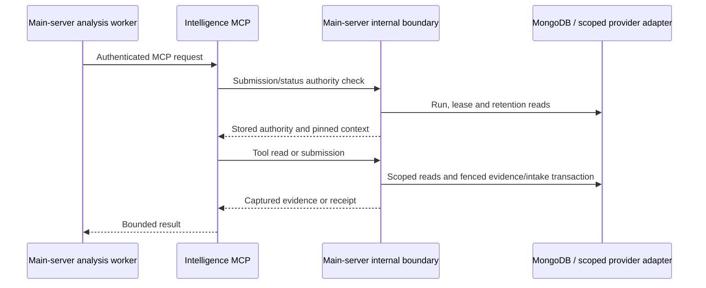
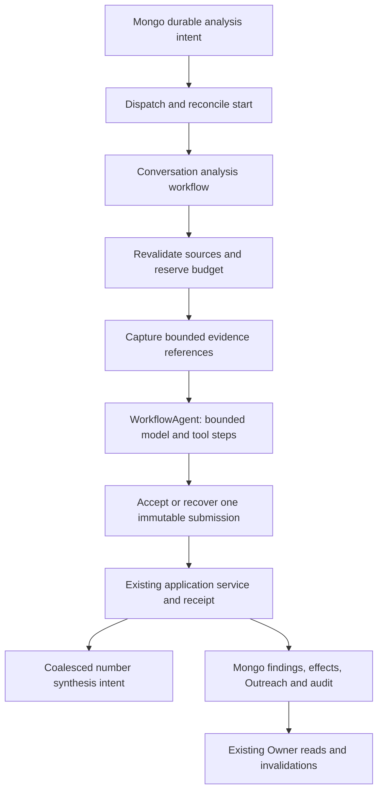

# 24 — MongoDB efficiency and durable Sales Intelligence with Workflows

September 21, 2026. Recommendation and implementation plan, not an implemented architecture or production benchmark. Read [20 — current-system walkthrough](20-how-sales-intelligence-works-walkthrough.md) first. Its source revisions and evidence boundary also apply here. This document answers the user's two questions and replaces neither the current product contract nor an accepted ADR.

## Recommendation

**Adopt Workflows for Sales Intelligence orchestration, and prove AI SDK v7's WorkflowAgent for the bounded analysis loop. First measure and reduce repeated Mongo reads. Keep business authority in main-server.** Do not introduce eve or a shell-enabled sandbox for ordinary transcript extraction: the current task needs constrained evidence tools, schema validation and durable application, which can be provided without either.

The immediate work has two tracks with separate success measures:

1. **Read efficiency:** less Mongo work, fewer repeated joins, smaller responses and fewer network round trips for the same authorized result.
2. **Execution durability:** preserve completed evidence/model/tool work across function termination, while retaining existing budget, identity, retention and application safeguards.

Workflows solve orchestration recovery. They do not automatically improve queries, authorize evidence, resolve ambiguous identity, or guarantee a paid API call happens exactly once.

The linked [durable-agent cookbook](https://workflow-sdk.dev/cookbook/agent-patterns/durable-agent) now directs new development to `WorkflowAgent` from `@ai-sdk/workflow`. Its [AI SDK v7 documentation](https://ai-sdk.dev/v7/docs/agents/workflow-agent) requires Workflow 5, currently distributed under the `beta` tag. Main-server already declares `ai: 7.0.68`, but the reviewed package manifests do not declare `workflow` or `@ai-sdk/workflow`; no corresponding bundled Workflow documentation was present in the checked server/MCP locations. Pin compatible exact versions in a spike and test the actual build rather than copying the installed skill's older `DurableAgent` example.

## 1. Should intelligence MCP call Mongo and RingCentral directly?

### What the extra server hop currently does

The dedicated intelligence endpoint is not the general-purpose MCP Mongo interface. Its request path is:

`createIntelligenceHandler` preflights every request, including discovery/prompt/resource requests. Tool invocation then makes another internal request. `captureIntelligenceRead` loads current run authority, reuses a prior immutable response if available, otherwise resolves scope and reads evidence, then revalidates/fences authority when persisting it. That transaction is why the returned evidence is auditable and why a stale worker cannot extend a finalized manifest.

Consequently, replacing the server calls with simple MCP `find()` and RingCentral GET adapters would remove more than transport latency. It would bypass or duplicate dataset isolation, event-time relevance, redaction, immutable snapshots, original-evidence replay, provider account scoping and purge fencing. Even a read-only database credential cannot capture new authoritative evidence snapshots.

Source: [MCP handler](../../../vantage-movers-mcp/lib/intelligence/handler.ts), [API transport](../../../vantage-movers-mcp/lib/intelligence/api.ts), [capture.ts](../../src/services/salesIntelligence/analysis/capture.ts), [lease.ts](../../src/services/salesIntelligence/analysis/lease.ts), [reads.ts](../../src/services/salesIntelligence/analysis/reads.ts), [operational.ts](../../src/services/salesIntelligence/analysis/operational.ts).

### The boundary I recommend

| Option | Benefit | Cost/constraint | Recommendation |
|---|---|---|---|
| Keep current remote MCP; optimize server queries and bounded preload transport | Least contract change; preserves current evidence authority | Retains network round trips | First production optimization |
| Run trusted Workflow steps alongside main-server services; use one shared evidence/tool implementation in-process | Removes server → MCP → server loop for first-party workers | Explicit amendment to remote-MCP-only contract; packaging/parity work | Preferred target if measurements confirm transport matters |
| Give dedicated MCP independent domain Mongo/provider adapters | Separately scalable runtime | Moves or duplicates authority, database credentials, capture transactions and lifecycle code | Do not do as a quick optimization |
| Let MCP read server-produced immutable projections/snapshots | Can decouple heavy evidence reads | Requires revocation/retention checks, bounded versioned contract and capture semantics | Later option if separate hosting is needed |

Direct infrastructure access is not inherently wrong. A trusted worker may use Mongo or RingCentral directly **through the server-owned service/adapters**, rather than HTTP, without duplicating policy. If compute later moves to another deployment, publish a versioned server-owned package or a narrow service boundary with parity tests. Do not import a second hand-maintained implementation into MCP.

For RingCentral in particular, share account selection, throttling, cached-token/OAuth ownership and coverage semantics. Current intelligence reads deliberately do not refresh expired OAuth credentials or fetch recordings. Merely moving these GETs cannot fix absent grants or incomplete capture. Prefer stored canonical interactions and directory snapshots when sufficient; use live reads only for an admitted gap.

This target changes [contract 10](../call-sales-intelligence/10-intelligence-agent-contract.md), which explicitly requires remote MCP for reasoning tools. Record the proposed transport change in an ADR and revise the contract before implementation. It preserves [MongoDB as system of record](../../../docs/adr/0001-mongodb-system-of-record.md) and the workspace instruction that server behavior stays in main-server.

## 2. MongoDB: concrete opportunities in current source

These are source-verified mechanisms, not measured production bottleneck rankings. Query shape, data distribution and deployed indexes must determine priority. Adding a workflow or another connection pool does not reduce the underlying reads.

| Priority | Observed source behavior | Proposed change | Evidence of success |
|---|---|---|---|
| P0 | `readAttention` fetches the full inline snapshot or **all** chunk siblings, filters/counts in memory, then slices one page | First measure bytes and CPU. Introduce a compact list projection; for larger snapshots, row documents indexed by snapshot/rank with immutable publication marker and server-side filtering/pagination. Store filter counts or calculate them once per snapshot/filter, not per browser refetch | Page bytes/docs examined scale with requested rows; identical ordering, filters, counts and expiry behavior |
| P0 | Each new analysis evidence read invokes `loadReadScope`; common number/conversation/attachment joins recur across preloaded tools/pages | Add a bounded server-owned evidence bundle/preparation seam, sharing request-local scope and reads while preserving per-tool snapshots, manifests and final fences | Lower Mongo command count and p95 time to first model call, same evidence digest/content/coverage |
| P1 | `loadEligibilityInputs` fetches one Lead per non-rejected attachment | Batch Form Lead and Call Lead IDs separately with minimal projections; retain legacy exact-evidence verification and missing-reference reporting | Fixed query count per batch instead of growth with edge count; identical event-time attribution |
| P1 | `readNumberOutreach` batches derivation inputs but calls `toOutreachDto` without shared side data; each DTO can reload Lead/Booking/Agent/latest-call display data | Call `loadOutreachSideData` once for the record set and pass it through as Attention already does | Fewer queries for numbers with multiple Outreach Records; identical plural Work output |
| P1 | Analysis `context` loads Follow-ups separately for each Outreach record | One bounded query grouped by Outreach ID, retaining per-record overflow/coverage rules | Fewer round trips; no silent truncation of Owner instructions or open actions |
| P1 | Activity evidence performs exact `countDocuments` preflights for limits such as 100 or 2,000 | Where only overflow matters, fetch/count no more than cap + 1 with an appropriate projection/index | Bounded work for large numbers; same fail-closed result |
| P1 | Attention builds all non-purged records each publication; input batches include historical actions/reviews; standalone reviews use repeated array searches | Separate compact derivation inputs from detail history, batch review grouping with maps, profile index coverage; later consider dirty-record projection with clock-boundary nominations | Lower publish duration/CPU without dropping review-only or clock-driven rows |
| P2 | SSE clock/reconnect and fallback refetch can amplify desk reads; new snapshots change `as_of` | Measure requests per visible desk; dedupe concurrent queries and cache immutable snapshots by dataset/snapshot/filter with bounded TTL and authorization | Lower request load per session with unchanged visible freshness |

Primary code: [attention.ts](../../src/services/salesIntelligence/outreach/attention.ts), `readAttention`, `publishAttentionSnapshot`; [outreach/reads.ts](../../src/services/salesIntelligence/outreach/reads.ts), `readNumberOutreach`, `loadOutreachInputsBatch`, `loadOutreachSideData`; [analysis/reads.ts](../../src/services/salesIntelligence/analysis/reads.ts), `loadReadScope`, `context`, `readIntelligenceEvidence`; [eligibility.ts](../../src/services/salesIntelligence/conversations/eligibility.ts), `loadEligibilityInputs`; [live.ts](../../src/services/salesIntelligence/live.ts).

Important qualifications:

- Attention already batches 500 records and display-side joins. Do not present that existing work as a new fix. Full-snapshot hydration on GET remains a separate issue.
- `lean()` already appears widely. Recommending it indiscriminately is not a useful optimization; reducing fields and repeated work matters more here.
- Normalized phone equality, semantic repair keys, coalesced attachment fan-out and the job-claim index already exist. Verify their deployment before proposing them again.
- A cache of immutable content is different from a cache of authorization. Do not cache a live lease, Owner authority, purge permission or applicable attachment indefinitely. On resume, current authorization and mutation preconditions must be checked again.
- Batch source reads outside transactions where appropriate. Do not run parallel operations on one Mongo transaction session merely to reduce wall time; preserve transaction-supported sequencing and final validation.

### Measure first, then choose indexes

Capture a redacted baseline for Attention first/next/filtered pages, Number detail/Work, one conversation preload, one multi-conversation synthesis and idle maintenance. Record p50/p95 latency, Mongo command count, response bytes, documents/keys examined, returned rows, pool wait, transaction retries and time spent in server↔MCP requests. Separate queue delay, evidence time, model time and application time.

Use bounded `explain("executionStats")` on representative read shapes, with an explicit time limit and production-safe projections; do not run unbounded collection scans just to measure them. Compare declared indexes with actual `listIndexes`, including normalized-phone indexes and `csi_job_claim`. A schema index declaration is not proof of deployment.

Candidate index investigations, not instructions to create them blindly:

| Read | Candidate shape / existing index to examine |
|---|---|
| Live job claim | Existing dataset/stage/status/priority/next-attempt/ID compound index; test both explicit-ID and stage recovery paths |
| Latest snapshot header | Existing dataset/as-of index versus partial header-only index; chunk siblings currently share the collection |
| Chunk retrieval | Existing parent-snapshot/chunk-index index |
| Follow-ups by Outreach | Existing Outreach/status/due index versus the actual `_id` order and open-action projection |
| Recent unsuccessful-attempt audit | Subject + event kind + current attempt flags + event time; consider a selective partial index only after cardinality checks |
| Canonical number activity | Number + canonical/merge predicate + event-time/ID sort |

Index changes increase write/storage cost; retain unique identity fences and TTL semantics. Run the existing [efficiency measurement script](../../scripts/measure-csi-efficiency.ts) before/after idle sweep cycles, but add request/query instrumentation: collection/job totals alone do not establish read efficiency. This review intentionally does not claim measured savings.

## 3. What Workflows do about timeouts

**Yes: completed durable steps can survive a timeout and execution can continue. No: a workflow does not preserve an arbitrary instruction pointer halfway through an unfinished network call.** Workflow orchestration replays recorded results; an interrupted step may execute again. A model request that always exceeds its individual step deadline will not succeed merely by retrying it forever. Split the work, use supported asynchronous provider execution with an operation ID, or use an appropriate external compute operation and wait durably for it. [Workflows and steps](https://workflow-sdk.dev/docs/foundations/workflows-and-steps), [idempotency](https://workflow-sdk.dev/docs/foundations/idempotency).

The current platform documentation distinguishes unlimited total run duration from bounded individual step runtime. It also lists 10,000 steps and 25,000 events per run and 240 seconds maximum replay duration. Large histories should be divided into bounded runs. Default post-completion state retention is 1/7/30 days for Hobby/Pro/Enterprise, so Workflow storage cannot replace Vantage's longer evidence/audit retention. [Workflow pricing and limits](https://vercel.com/docs/workflows/pricing).

Our checked-in functions currently request 800 seconds; our analysis runtime aborts at 200 seconds by default. Vercel's June 2026 announcement adds up to 1,800 seconds for supported Node/Python functions on Pro/Enterprise. Verify project/runtime support and the generated workflow endpoints before relying on that upper bound; an existing 800-second configuration does not change itself. Raising a timeout alone also leaves the current in-memory loop vulnerable. [Function duration announcement](https://vercel.com/changelog/vercel-functions-can-now-run-up-to-30-minutes).

The appropriate policy is **continue while progress, authority and budget permit**, then expose a precise waiting, failed or terminal result. Workflow steps retry ordinary errors by default up to three times; explicit retry delay and fatal classification are available. Configure retries deliberately so Workflow retries do not multiply the existing eight-claim CSI failure policy or provider retries. [Errors and retrying](https://workflow-sdk.dev/docs/foundations/errors-and-retries).

### Example: one interrupted conversation

1. Capture transcript/version and authorized evidence; persist their references.
2. Finish a model/tool step; the workflow records its result.
3. The next step times out before its completion is durable.
4. On retry, check whether that step's Vantage receipt or provider operation already exists. Recover it if possible; otherwise repeat only that unit under an explicit retry/budget policy.
5. Recheck retention and authority before returning evidence or applying anything. A Booking arriving during the interruption can now block the effect.
6. Finish application through the existing idempotent command/receipt path, then schedule coalesced number synthesis.

If the interruption occurred inside a paid provider request and there is no retrievable operation/result, duplicate spend remains possible. Keep unknown cost visible; do not release it as zero or conceal it behind a successful retry.

## 4. WorkflowAgent, sandbox and eve are separate choices

| Component | Job in this design |
|---|---|
| Workflow | Durable orchestration, sleeps, retries and resumptions |
| WorkflowAgent | Durable model/tool loop inside that orchestration |
| Vercel Sandbox | Optional isolated environment for tools that truly execute code or need a filesystem |
| eve | Broader agent framework; not a prerequisite for this recommendation |

The Workflow deterministic execution environment is not a general-purpose isolated Linux sandbox. Steps have normal runtime capabilities. WorkflowAgent supports an optional sandbox handle, but that handle is not durable context: pass identifiers and reattach inside executing steps. None of this makes Mongo clients, MCP sessions or expiring credentials serializable across a suspension. [WorkflowAgent](https://ai-sdk.dev/v7/docs/agents/workflow-agent).

For transcript extraction, retain the current allowlisted model and schema-bound tools. No shell tool is needed. If later work requires audio processing or code execution, introduce a narrow sandbox tool: start or attach an operation, persist its ID, wait through workflow sleep/callback, retrieve a validated result and clean up. Do not hold one function open merely polling the sandbox. Sandbox session duration and filesystem persistence are separate from agent/process recovery; persist checkpoints outside the live process. [Sandbox duration and persistence](https://vercel.com/kb/guide/vercel-sandbox-duration-and-persistence).

This recommendation follows the user's preference to avoid eve and the existing product contract's lack of a filesystem-agent requirement. It is not a claim that every future agent fits the same runtime.

## 5. Proposed Sales Intelligence workflow boundaries

Keep the first migration narrow: **conversation analysis from an existing immutable transcript through the existing submission/application boundary**. Capture, attachment, media, STT and Attention can initially stay on their existing workers. Expand after parity and interruption tests.

| Boundary | Durable result | Invariant retained |
|---|---|---|
| Claim/admit | Run binding, pinned versions, reservation identity | Dataset, eligibility, monthly/per-recording limits |
| Evidence capture | Manifest/snapshot IDs and digests; bounded pages | Server-owned scope, completeness and purge checks |
| Model/tool execution | Completed model/tool step plus usage/attempt identity | Four-step starting bound, token limits, one repair, granted tools only |
| Submit/recover | Submission receipt | Same run/key/payload converges; changed payload conflicts |
| Apply | Application receipt/effect outcomes | Owner precedence, exact identity, official closure and revision fences |
| Number refresh | Source fingerprint/generation and coalesced intent | At most current work plus successor for changed sources |

Number synthesis should be a separate bounded workflow per number/generation, not an endless run containing every future call. A future backfill coordinator can issue bounded child runs per window/page with controlled concurrency; it should not accumulate the entire historical corpus in one event history.

### This is not a class-name replacement

Wrapping the entire existing `invokeIntelligenceAgent` in one `"use step"` would retain the same coarse failure boundary. To get model-loop durability, run WorkflowAgent at workflow level and define serializable durable tool boundaries. In the current API it uses `stream()` and `stopWhen` (for example `isStepCount(4)`), not the older `DurableAgent.maxSteps` option. Rebuild clients inside steps; preserve schema digest verification and receipt recovery. Treat this as a compatibility spike, not paste-ready production code. [WorkflowAgent migration guide](https://ai-sdk.dev/v7/docs/agents/workflow-agent#migrating-from-durableagent).

Vantage-specific adaptation must preserve cumulative usage, repair counts, prompt/schema pinning, per-run tool grants, original-evidence behavior and fatal/incomplete-coverage classification across retries. Automatic tool serialization does not supply these business rules.

## 6. The difficult integration work

### Lease and credential lifetime

Today's intelligence token binds an active CSI job lease/epoch and expires within a bounded interval; MCP checks live authority on every request. A multi-hour workflow cannot simply reuse that token. A cached successful authorization step would also be stale after a suspension.

Proposed protocol: retain a durable workflow-to-business-run binding, but acquire bounded execution authority for each active operation. Mint short-lived credentials only in trusted executing code, never as model-controlled tool arguments. Each mutating/evidence operation validates current ownership and fences its commit. Release or expire short leases while sleeping; a resumed worker reacquires and revalidates. Credentials and SDK handles stay out of workflow inputs/outputs. The prototype must prove this protocol before any long-lived production workflow is admitted.

### One execution owner and a recoverable start

Mongo transactions cannot atomically include Vercel `start()`. Preserve a durable dispatch intent. A dispatcher starts the workflow and records its run ID; a reconciler handles uncertainty. Duplicate starts must converge through a **business** idempotency key and an atomic executor-generation fence before provider work. Do not assume `start()` itself supplies the exact application deduplication semantics required here.

Choose the executor in stored state (`legacy` or `workflow`, proposed field), before launching work. Legacy cron must not claim workflow-owned work. If dispatch times out, find/reconcile the existing run or start a competing candidate that loses the business fence safely. On rollback, fence/cancel the workflow before returning a job to the legacy executor. A still-running stale model request may incur cost, but must not commit effects.

### Budget and retry ownership

Keep `reserveCsiBudget` and the reservation ledger. Give each paid attempt a stable identity; never charge again just because usage reconciliation retries. Conversely, a genuinely repeated provider call may incur additional cost and needs admission/accounting. Set explicit retry and cumulative cost limits for the business run, not just each individual SDK step.

Do not reuse stranded-reservation recovery unchanged: it currently reasons from CSI lease liveness and age. A workflow may legitimately be suspended with no live short lease. Teach recovery to reconcile workflow/external-operation state before deciding a reservation is stranded. Unknown usage stays distinguishable from observed spend and known-unused reservations.

Use bounded concurrency per provider account and per model, plus an overall Mongo connection budget. Preserve live work ahead of historical work. A large workflow fan-out can otherwise replace slow serial processing with provider throttling, pool contention and simultaneous budget reservations.

| Condition | Proposed orchestration response |
|---|---|
| Transient network error / provider 429 | Bounded retry with backoff/Retry-After; recover uncertain receipts first |
| Per-recording or monthly refusal | Persist reason and wait for the relevant policy/period event; do not spend retries polling a permanent refusal |
| Provider permission missing | Pause for capability repair with an operator-visible reason |
| Purged evidence / permanently invalid subject | Terminal result; never recreate erased content |
| Lease lost / executor superseded | Stop that executor; trusted reconciliation decides which run continues |
| Owner or official state changed | Revalidate and record blocked/stale effects rather than blindly retrying application |
| Step/retry/schema allowance exhausted | Persist failed/reviewable outcome; explicit recovery decision, not an infinite loop |

### Purge, Owner changes and model evidence

Workflow history can persist inputs, outputs, context and stream chunks. Passing snapshot IDs is helpful but does **not** prevent WorkflowAgent from persisting model messages/tool results containing redacted transcript content. Inventory those copies, authorized viewers, expiry and erasure behavior. Do not log tokens, raw audio or unredacted provider payloads. If required erasure cannot be demonstrated with the chosen runtime, keep sensitive operations in bounded existing workers until that gap is resolved.

Check retention/purge state before every external evidence use after resumption and before publication. The existing Mongo retention fence cannot erase copies already in Workflow history by itself. Owner corrections, restrictions, booking and attachment changes must also be rechecked at application, even when completed evidence steps replay successfully.

### Hosting and transport

Prefer workflow orchestration in main-server's code ownership. The official [Express integration](https://workflow-sdk.dev/docs/getting-started/express) includes build/runtime integration; adding directives to the current Express files is insufficient. Prove generated endpoints are reachable despite the current catch-all rewrite to `/api`, configure their duration/region, and validate Preview/TEST_MODE isolation. If the existing packaging makes this impractical, use a separate worker deployment backed by the same server-owned services; do not move business policy into Admin merely because its Next.js integration is convenient.

Preserve current remote MCP during the first spike. Compare it with an in-process shared boundary before accepting the transport ADR. A bounded batch must retain each captured tool response and its manifest identity; it must not turn many current small responses into one oversized, timeout-prone payload.

## 7. Delivery plan and acceptance gates

These phases are an implementation sequence, not time estimates. The requested deliverable here is the plan and walkthrough; runtime changes come next.

| Phase | Work | Exit criteria |
|---|---|---|
| A — Establish baseline | Record reviewed/deployed revisions, flags, actual indexes, representative timings and query stats; separate prior fixes from remaining issues | Reproducible redacted measurements for each read/stage; no assumed production parity |
| B — Reduce reads | Batch eligibility/context/display joins; bound preflight counts; optimize Attention retrieval after measuring it; instrument MCP hops | Same IDs/order/counts/evidence/authority; lower measured p95 or Mongo work, with no regression in publish freshness |
| C — Workflow compatibility spike | Pin Workflow 5 + WorkflowAgent versions; synthetic transcript/run; prove Express build, credentials, step boundaries and error behavior | Actual function interruption resumes a bounded unit; no duplicate submission/effects; token renewal and budget outcomes tested |
| D — Shadow comparison | Same synthetic/retained evidence through old/new paths; disable domain application in shadow; live paid comparison only within an explicitly scoped budget | Compare valid envelopes, effect plans, coverage, latency and cost distributions; explain model nondeterminism |
| E — Small canary | Route a bounded allowlist of analysis intents to Workflow; keep existing application authority; cap concurrency and spend | End-to-end findings/Work/summary parity, stable queue age, no ambiguous executor ownership |
| F — Expand selectively | Add number synthesis, then media/STT/backfill orchestration if measurements support it; retire only redundant scheduler paths | Recovery and rollback rehearsed; retained audit/evidence survives orchestration expiry |

Agree numeric performance targets from Phase A. A suggested initial target is a substantial reduction in preload round trips and Attention bytes per page, with no p95 regression and **zero tolerance for lost Owner precedence or duplicate applied effects**. Do not promise a percentage speedup without the baseline.

Required failure tests include duplicate wake-ups/start responses; death after provider response but before checkpoint; death after submit commit but before acknowledgement; lease expiry during sleep; budget refusal and later policy change; Owner correction/Booking during suspension; purge between capture and application; provider 429; schema repair exhaustion; lost callback; deployment replacement; and rollback while a run is active. Assert one accepted submission and idempotent domain effects, while accounting honestly for potentially repeated provider calls.

Use existing replica suites for identity, Outreach, budget and application behavior; add Workflow integration/interruption tests for the new execution boundary. No tests were run for this documentation-only review, and it does not claim the spike passes.

## 8. Other parts of Vantage worth considering

The current schedules expose several candidates. These are opportunities for separate service-level audits, not a claim that their existing workers are defective.

| Area | Workflow fit | Boundary to preserve |
|---|---|---|
| Historical CSI capture/activation | High: pages, rate limits, readiness and resumable window progress | Existing Sync Window checkpoints, live-over-historical priority, attachment readiness |
| Media/STT | High when provider waits/retries span invocations | Immutable media/transcript identity, unknown-spend handling, retention |
| Number synthesis | High: coalesced finite generation, bounded agent work | Source fingerprint, newer-source successor, no-evidence no-op |
| Reporting delivery/export | Promising: prepare artifact, deliver, verify, retry selectively | Delivery receipts, retention and duplicate-send controls |
| CPL Corrections / sheet repair | Promising: bounded batches and progress | Existing command/idempotency rules and Mongo-first authority |
| Granot automation/reconciliation | Potential: waits and retryable external steps | Existing lifecycle authority and unsafe-repeat recovery; inspect owning Service first |
| Owner Rep Nudge / Lead Messages | Limited orchestration benefit | Explicit authorization, destination guards and uncertain-send recovery; no automatic resend on generic retry |
| Attention | Optimize projection/read design first; workflow can later coordinate a bounded publication | Atomic complete snapshot, staffed-time semantics, review rows and cursor stability |
| Webhook ingress and ordinary CRUD | Keep request-time receipt/transaction short; dispatch after durable intent | Acknowledge durable receipt promptly; do not wait for analysis |
| SSE and search GETs | Poor migration target | Read-only, low-latency authoritative responses; workflow must not be started by a GET |

See the configured entry points in [vercel.json](../../vercel.json) and the [Service catalog](../index.md) before expanding scope.

## 9. Cost and operational decision

Measure the whole operation: Mongo reads/writes, server/MCP function time, queue operations, workflow events and stored data, model tokens/retries, Blob media and any Sandbox usage. Workflow billing includes events, written/retained data, function compute and underlying Queues usage. It is not a flat-cost replacement for the current worker. Keep large evidence/media out of orchestration state where possible and compare **cost per completed conversation**, not just token price. [Workflow pricing](https://vercel.com/docs/workflows/pricing).

The decision I would make now is to approve the architecture direction and implement **measurement plus read batching first**, alongside a synthetic WorkflowAgent compatibility spike. Adopt durable execution when the spike demonstrates safe step recovery, fresh authority, reliable accounting and compatible retention. Consider removing the remote MCP loop only after its actual share of latency is measured and the shared server boundary passes parity tests. That sequence addresses both the efficiency problem and the timeout problem without rewriting the sales rules that already protect the Owner's work.
