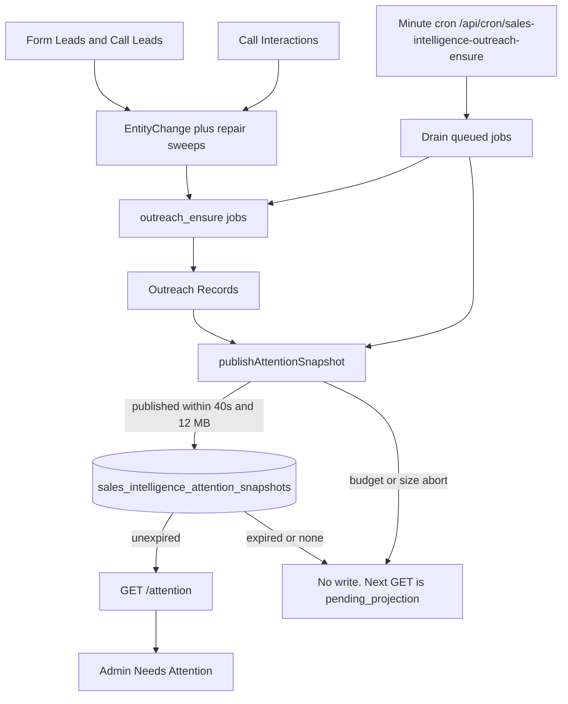

# Needs Attention projection

How the Sales Intelligence **Needs Attention** tab is built, why it can say the desk is being prepared, and what production looked like on 20 September 2026. This is an operations explainer. Authority for invariants stays in the [Outreach Service card](../../knowledge/services/sales-intelligence-outreach.md), [live invalidations](../../knowledge/services/sales-intelligence-live.md), and [04-server-routes](../04-server-routes.md).

No customer phones are recorded here.

---

## What the Owner sees

On [Needs Attention](https://vantage-admin-rho.vercel.app/sales-intelligence?view=attention) the dashboard shows four tabs, a Coverage line, then one of these Attention states:

| Dashboard copy | Server meaning |
| --- | --- |
| Loading Needs attention… | Browser request in flight |
| **Attention is being prepared. Counts are not yet available.** | `data.status = pending_projection`. No live snapshot. `total_items` is **null**, not zero. |
| *N* distinct subjects · As of … | `data.status = ready`. Snapshot exists and has not expired. |
| Nothing needs attention right now | Ready snapshot whose filtered page is empty, and Coverage has no open gaps. |
| Nothing needs attention in what we can see | Ready snapshot, empty page, but Coverage reports gaps. |
| Couldn't load this. | HTTP / parse failure. Different from pending. |

Admin copy lives in `vantage-admin/components/sales-intelligence/sales-intelligence-copy.ts` (`copy.page.pendingProjection`). The tab does not invent counts. It renders whatever `GET /api/v1/admin/sales-intelligence/attention` returns.

The `rc_account_id` query param on that URL is leftover RingCentral Accounts / directory context. Attention filters do not read it.

---

## Two facts on the same page

The strip **History known through Sep 20, 3:48 PM EDT** is **Coverage**, not Attention.

| Fact | What it answers | Source | If missing |
| --- | --- | --- | --- |
| Coverage `known_through` | How far RingCentral call-log history is believed complete | `readCaptureCoverage()` from call-log sync state | “History completeness unknown” |
| Attention snapshot | Which subjects need Owner work **right now**, ranked | `sales_intelligence_attention_snapshots` | “Attention is being prepared…” |

Coverage can be healthy while Attention is pending. That is the current production picture: call-log watermark is moving; the Attention list has never been published.

Live SSE (`GET /api/v1/admin/sales-intelligence/live`) only tells Admin to refetch. It does **not** publish Attention. Opening the page does **not** publish Attention.

---

## End-to-end process



There are three separate machines:

1. **Ensure** — create or refresh one Outreach Record per subject (Lead or Number Review).
2. **Publish** — walk those records, derive bands, write one immutable snapshot.
3. **Read** — GET binds to that snapshot. Admin paginates it. No writes.

If (2) never succeeds, (3) stays `pending_projection` forever, even when (1) has thousands of records and analyses have completed.

---

## 1. How Outreach Records appear

Flag: `SALES_INTELLIGENCE_OUTREACH_ENSURE=true`.

Minute cron: `/api/cron/sales-intelligence-outreach-ensure` (`vercel.json`, `* * * * *`).

Job recovery also drains `outreach_ensure` under the same flag.

`runOutreachEnsureOnce` (`src/services/salesIntelligence/outreach/worker.ts`):

1. Acquire lease `outreach_ensure` (5 minutes). If held, return `lease_held` and **do not publish**.
2. In a transaction:
   - Scan `EntityChange` for Form Lead / Call Lead rows after the applied-at cursor (limit 100) and enqueue `outreach_ensure` jobs.
   - Run bounded `_id` repair sweeps (50 rows each) over Form Leads, Call Leads, Call Interactions, and Outreach Records. Each row enqueues a deduped repair/clock job.
3. Drain up to 100 jobs, or until a **40 second** drain deadline.
4. Call `publishAttentionSnapshot()`.
5. Release the lease.

Each job (`runOutreachEnsureJob`) claims one `outreach_ensure` row and runs `ensureLead` or `ensureInteraction`. Official Booked / Cancelled wins: those subjects close; they do not become current overdue from history.

Ensure does **not** mean “this subject belongs on Needs Attention.” It means “this subject has an Outreach Record.” Closed booked work is an Outreach Record with `state: closed`. Historical Leads from the repair sweep become `unworked` records. Those sit in Mongo whether or not a snapshot ever lists them.

---

## 2. How a snapshot is published

`publishAttentionSnapshot()` (`src/services/salesIntelligence/outreach/attention.ts`).

Rules (contractual):

- Built by the worker only. **GET never writes.**
- **No partial publication.** Abort with `{ status: "incomplete", reason }` and write nothing.
- Time budget: **40 seconds** from start (`snapshot_budget`).
- Size budget: **12 MB** JSON of rows (`snapshot_size`).
- Successful write expires **5 minutes** after `as_of` (`expires_at = now + 300_000`).
- Mongo TTL index `csi_attention_expiry` deletes expired documents.

Build steps:

1. Page **every** Outreach Record with `purged_at: null`, 50 at a time, `_id` ascending.
2. For each record call `toOutreachDto(record, now, coverage)`.
3. Keep the row only if `derived.attention_band` is set **or** `derived.review_badges` is non-empty.
4. Add open Review Items whose `subject_key` is not already in the list, as review-only rows (`outreach: null`, `call_blockers: ["review_only"]`).
5. Sort by band (1 first, then 2…7, then review-only as 8), then due time, then `subject_key`.
6. Insert `{ snapshot_id: "outreach:<uuid>", rows, counts.total_items, expires_at, deployment, database }`.

`toOutreachDto` is a full Owner DTO, not a slim list card. Per record it currently:

- resolves policy again
- loads follow-ups, restrictions, reviews, Contact Number, recent unsuccessful-attempt audit
- loads Agents
- loads the Lead, Bookings, Cancellations
- loads the latest Call Interaction on that number
- runs `derive()`

That is on the order of **8–10 Mongo reads per Outreach Record**. At a few thousand records this cannot finish in 40 seconds. The Service card already named this: *“production scale remains a deployment check.”*

---

## 3. Who would appear if a snapshot published

`derive()` (`outreach/derive.ts`) is pure. Closed and identity-review subjects are not **actionable** (no band). Everyone else can get one or more reasons; the stored band is the **minimum** (highest priority).

| Band | Owner copy | When it fires |
| --- | --- | --- |
| 1 | Promised callbacks overdue | Open call action with origin `rep_promise` whose Attention due time is now or past |
| 2 | No call yet after form submission | `state === unworked` **and** subject is a Form Lead |
| 3 | Missed calls with no callback | Open action with a missed-episode key, not snoozed past now |
| 4 | Follow-ups due | Any open action whose Attention due time is now or past |
| 5 | Being worked, but no next step | `state === open` and no open actions |
| 6 | Open work nobody owns | Record or an open action has no responsible Agent |
| 7 | Going cold | No future planned Attention time, and staffed age ≥ policy (default 1440 staffed minutes) |

Closed subjects never enter those seven bands. They can still appear as **Needs review** when open Review Items (or review badges such as missing date / restriction / identity) exist.

Counts on the ready desk are **distinct subjects**, not a sum of reasons. One subject appears once, under its highest band, with every matching reason attached.

---

## 4. How the dashboard reads it

`GET /api/v1/admin/sales-intelligence/attention` → `readAttention()`.

1. Parse filters (`band`, `needs_review`, `state`, `agent_id`, `cursor`, `limit`). Cursor is bound to `snapshot_id + offset + filter digest`.
2. Load the latest unexpired snapshot for this CSI dataset (`deployment` + database), or the cursor’s `snapshot_id`.
3. If none:
   - with a cursor → `ATTENTION_SNAPSHOT_EXPIRED`
   - without a cursor → empty items, `snapshot_id: null`, `total_items: null`, `status: pending_projection`
4. If found, filter the **immutable** rows in memory. Do not re-derive. Do not scan Outreach again.
5. Return a page (`limit` default 50, max 200), `reason_counts`, `status: ready`.

Admin proxies that envelope through the signed Owner BFF. TanStack Query key `sales-intelligence`. Live SSE, visibility, online, and a 30-second fallback only **invalidate** that key. They never construct rows.

Opening a row loads Number / Outreach **detail** at current server time (`toOutreachDto` again). Detail is live. The list is a snapshot. Deadlines can move between list and detail; the list will not reshuffle mid-page because the cursor is pinned to `as_of`.

---

## 5. Flags, clocks, and live

Required for the list to exist in production:

- `SALES_INTELLIGENCE_ENABLED` — Owner reads
- `SALES_INTELLIGENCE_OUTREACH_ENSURE` — ensure jobs + snapshot publish
- Minute cron actually invoking `/api/cron/sales-intelligence-outreach-ensure`
- Replica-capable Mongo (TTL + change streams for live)

Related but not sufficient:

- `SALES_INTELLIGENCE_LIVE_SSE` — refetch signal only
- `SALES_INTELLIGENCE_EXTRACTION_ENABLED` — analysis / application
- `SALES_INTELLIGENCE_BACKFILL_DAYS` — historical capture windows, not Attention publish
- `SALES_INTELLIGENCE_NUDGE_ENABLED` — Owner messaging, not the list

A completed conversation analysis does **not** publish Attention. Application may open or change follow-ups on an Outreach Record; the next successful snapshot is what the tab shows.

---

## Production observation — 20 September 2026, 20:09 UTC

Inspect scripts (no phones):

```text
pnpm exec tsx --env-file=.env scripts/inspect-csi-attention-projection.ts
pnpm exec tsx --env-file=.env scripts/inspect-csi-attention-candidates.ts
```

| Fact | Value |
| --- | --- |
| Attention snapshots total | **0** |
| Live (unexpired) snapshots | **0** |
| Latest snapshot | none — never published |
| Dashboard verdict | `pending_projection` |
| Outreach Records | 4,008 (3,192 unworked, 815 closed, 1 open) |
| Unworked Form Leads | 2,250 — all missing an owner |
| Unworked Call Leads | 944 — all missing an owner |
| Open follow-ups | 1 (on 1 record) |
| Open Review Items | 5 |
| `outreach_ensure` jobs | 7,278 completed, 3,633 still pending |
| `analysis` jobs | 3 completed, 17 paused |
| `outreach_ensure` last_sync_to | 2026-09-20T20:08:47.403Z — cron is alive |

So: ensure is running and creating/repairing records. Publish has **never** written a row. The Owner message is the honest empty-projection state, not a stuck spinner and not “nothing to do.”

### Why publish never lands

Two stacked budgets:

1. **Drain** uses up to 40 seconds on the pending 3,633-job backlog every minute.
2. **Publish** then walks all 4,008 records through `toOutreachDto` and aborts at 40 seconds without writing.

Even if publish were given enough time, a successful walk would try to include roughly:

- 2,250 Form Lead unworked subjects as **band 2** (`no_call_yet`)
- most of the 944 Call Lead unworked subjects as **band 6** (no owner) and often **band 7** (going cold)
- the 1 open record and 5 reviews

That payload is likely to hit the **12 MB** abort and still refuse to publish. The live desk the Owner asked to see is closer to **one open Outreach Record plus a handful of reviews**, not three thousand historical unworked Leads from the repair sweep.

### What this is not

- Not a missing RingCentral account id on the Attention URL.
- Not Coverage being incomplete (the watermark is present).
- Not “analysis has not run” (three analysis jobs have completed).
- Not Admin failing to call the API (pending is a 200 with `status: pending_projection`).

---

## What “ready” would require

All of the following:

1. `publishAttentionSnapshot` finishes without `snapshot_budget` or `snapshot_size`.
2. A document exists in `sales_intelligence_attention_snapshots` with `expires_at` in the future.
3. Minute cron (or recovery) keeps republishing before that 5-minute expiry. If cron skips a few minutes, the tab flips back to pending even after a good publish.
4. Admin refetch (live or 30-second fallback) picks up `status: ready`.

Until (1) is true at production volume, refreshing the Vercel tab will keep showing the same sentence.

A later code change has two separate decisions:

- **Make publish cheap enough** (batch the DTO reads; skip closed records that have no open review). That is an implementation repair of the named deployment check.
- **Decide whether historical unworked Form Leads belong on this desk.** Including all of them is what `derive()` says today. Showing only current open work and reviews is a product filter, not a snapshot bug.

Do not have GET build the list to “just show something.” That would violate the immutable-cursor contract (elapsed deadlines must not insert or drop rows mid-page).

---

## Code map

| Piece | Path |
| --- | --- |
| Publish + read | `vantage-main-server/src/services/salesIntelligence/outreach/attention.ts` |
| Ensure + cron entry | `vantage-main-server/src/services/salesIntelligence/outreach/worker.ts` |
| Band / reason rules | `vantage-main-server/src/services/salesIntelligence/outreach/derive.ts` |
| Heavy per-record DTO | `vantage-main-server/src/services/salesIntelligence/outreach/reads.ts` (`toOutreachDto`) |
| Owner route | `vantage-main-server/src/routes/sales-intelligence-admin.routes.ts` `GET …/attention` |
| Cron route | `vantage-main-server/src/routes/sales-intelligence-cron.routes.ts` `CSI_CRON_PATHS.outreachEnsure` |
| Snapshot model | `vantage-main-server/src/models/salesIntelligence/infrastructure.ts` (`SalesIntelligenceAttentionSnapshot`) |
| Envelope | `vantage-main-server/src/services/salesIntelligence/dto.ts` (`attentionPageDtoSchema`) |
| Admin query / copy | `vantage-admin/lib/api/salesIntelligence.ts`, `components/sales-intelligence/{workspace,sales-intelligence-copy}.tsx` |
| Inspect | `vantage-main-server/scripts/inspect-csi-attention-projection.ts`, `inspect-csi-attention-candidates.ts` |
