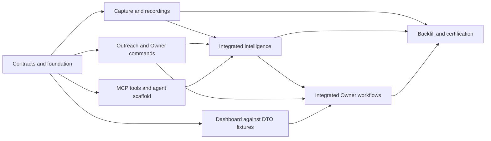

# Call & Sales Intelligence — agent-team workspace

Status: partial local implementation through CSI-13; review and dashboard/release work remain. Updated September 19, 2026. Current execution order: [SPRINT-PLAN](SPRINT-PLAN.md). Copy-ready next session: [NEXT-SESSION](NEXT-SESSION.md). This is a coordination workspace, not a new runtime package.

## Start here

1. Read the [product specification](../01-specification.md), [agent contract](../10-intelligence-agent-contract.md), [RingCentral capability summary](RINGCENTRAL-CAPABILITY.md), and [workspace instructions](AGENTS.md).
2. Read the [current sprint revision](SPRINT-PLAN.md) and [ledger](LEDGER.md). G1 is frozen; do not restart Team A. Next session is merge to `main` and deploy the internal dashboard ([NEXT-SESSION](NEXT-SESSION.md)). “Ready” never means a deployed capability has been verified until that session records URLs and flags.
3. Freeze the interfaces in [contracts and handoffs](CONTRACTS.md), then assign the remaining teams according to the dependency waves below. Teams can build fixtures/skeletons against frozen contracts before providers are available.
4. Each team records changes, checks and artifacts in the ledger and uses the [handoff template](HANDOFF-TEMPLATE.md). Integration follows the [acceptance walkthrough](ACCEPTANCE.md).

## Authority

The September 17 revisions of 01–06 plus 10 are the build contract. [09](../09-owner-workflow-interview.md) records accepted decisions and their history; 07 is the current Claude design intake contract and 08 is a superseded interview handoff. 12 records Owner-supplied deployment inputs and proposed model policy. Do not implement old review-only AI, duration filters, voicemail skips, single-action storage, or mandatory citation verification from those historical files. When uncertain, inspect 01/10 and report the precise conflict; do not ask the Owner to repeat settled decisions.

| Team | Home / owned work | Start condition |
| --- | --- | --- |
| [A — contracts and foundation](teams/a-contracts.md) | Main-server models, schema, policy, durable jobs/audit and shared type/route interfaces; CSI-01 | Start now |
| [B — capture and recordings](teams/b-capture.md) | All-direction capture, reconciliation, number history, media/STT; CSI-02/03/04/11/12 | A interfaces frozen; discovery integrates C's identity data |
| [C — Outreach and Owner commands](teams/c-outreach.md) | Attachments, actions, ownership, clocks, restrictions/reviews, Reps, nudges; CSI-05/06/10/14 | A; capture fixtures, then B integration |
| [D — MCP and intelligence](teams/d-intelligence.md) | Scoped MCP adapter plus main-server agent/evidence/submit/apply; CSI-17/13 and server half of CSI-18 | A; scoped fixtures first, then B transcript and C command contracts |
| [E — Owner dashboard](teams/e-dashboard.md) | Admin Attention/Search/Needs review/Reps/Coverage, live BFF and intervention UI; CSI-07/08/09 and UI half of CSI-18 | A DTOs frozen; fixtures first, then B/C/D endpoints |
| [F — integration and release proof](teams/f-integration.md) | Backfill/retention/budget integration, certification and documentation; CSI-15/16 | Own scenario fixtures early; certify after B–E |

## Original dependency waves (current execution order is in SPRINT-PLAN)

MCP reads/prompts can be implemented while capture is built; effect application cannot be certified until C's invariants are available. E must not invent missing server behavior. A coordinates shared migration/config/router registration changes rather than several teams editing the same file concurrently. F can write black-box fixtures early without changing another team's runtime files.

## Repositories and execution

Main server is the system of record. `vantage-admin` renders and invokes commands; `vantage-movers-mcp` adapts scoped tools/prompts to main-server services. Read each repo's AGENTS/CONTEXT/rules before edits. Owner-required branch: agents must perform all Call & Sales Intelligence implementation work on `sales-intelligence` in both `vantage-main-server` (server) and `vantage-admin` (dashboard). Inspect the current branch and working tree before edits; use the existing branch or create that exact branch if absent, preserving uncommitted work. Do not implement on the default branch or substitute a differently named team branch. Record repository, branch and owned files in the workspace ledger and handoff. Coordinate agents sharing a checkout; Git cannot check out the same branch in multiple worktrees of one repository, so use separate clones when independent checkouts are necessary, and coordinate integration to avoid divergent pushes. This documentation update does not itself create or switch branches.

This workspace does not launch agents, install dependencies, create external tasks, send messages, or enable production. It provides concrete work assignments for the Owner's teams. The ledger records actual implementation and review evidence; preserve existing in-progress work discovered by the implementing team.

## Completion criteria

All rows in the ledger have evidence of implementation and relevant checks, contract changes are reconciled across all three repos, the acceptance walkthrough passes, and open capability/rollout checks are explicit. A code-complete Preview can be certified without claiming recording grants, production backfill, live message proof, or deployment happened. Record those separately.

## Existing deployment inputs

Read [12](../12-deployment-inputs-and-model-policy.md) before provisioning services or selecting models. The server Gateway key, deployed MCP, Blob and Redis configuration are Owner-reported as available. Use the [capability report](RINGCENTRAL-CAPABILITY.md) as historical, partly trusted evidence and the [mapping proposals](../backfill_assistance/agent_ring_central_account_connections_possible.md) as unreviewed bootstrap data.
