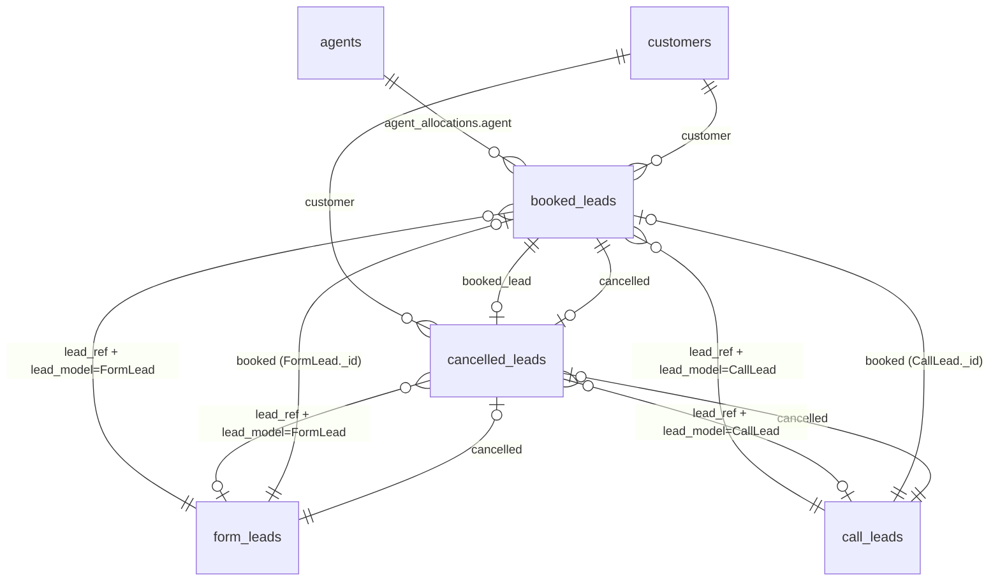

# Vantage Movers Historical Database — Schema Reference

**Purpose:** Handoff document for backfill agents and scripts. Describes the MongoDB database `vantagemovershistorical` (same Atlas cluster as production, separate database).

**Source of truth:** `scripts/historical_db_models/`

**Init script:** `pnpm run db:init-historical` → `scripts/init-historical-db.ts`

---

## Database

| Property               | Value                                                                                                                                |
| ---------------------- | ------------------------------------------------------------------------------------------------------------------------------------ |
| **Database name**      | `vantagemovershistorical`                                                                                                            |
| **Connection**         | Same `MONGO_URI` as main app; `mongoose.connection.useDb("vantagemovershistorical")`                                                 |
| **Main production DB** | `vantagemovers` (do not confuse)                                                                                                     |
| **Validation**         | Relaxed — almost no required fields; no enums on `source_company` / `local` / `lead_model`; **no `sheet_sync`** subdocument anywhere |

---

## Collections overview

| Mongoose model  | MongoDB collection | Role                                                 |
| --------------- | ------------------ | ---------------------------------------------------- |
| `Agent`         | `agents`           | Sales agents referenced from booked deals            |
| `Customer`      | `customers`        | Person/contact for booked and cancelled deals        |
| `FormLead`      | `form_leads`       | Web form inbound lead                                |
| `CallLead`      | `call_leads`       | Phone/inbound call lead                              |
| `BookedLead`    | `booked_leads`     | Closed/won deal linked to a lead + customer          |
| `CancelledLead` | `cancelled_leads`  | Cancellation record linked to booked + optional lead |

Every collection has automatic timestamp fields from Mongoose `timestamps: true`:

| Field       | Type       | Notes               |
| ----------- | ---------- | ------------------- |
| `_id`       | `ObjectId` | MongoDB document ID |
| `createdAt` | `Date`     | Set on insert       |
| `updatedAt` | `Date`     | Updated on save     |

---

## Entity relationship diagram



---

## Relationship reference (how documents link)

### Lead → Booked (conversion)

| From collection | Field    | Points to        | Target collection |
| --------------- | -------- | ---------------- | ----------------- |
| `form_leads`    | `booked` | `BookedLead._id` | `booked_leads`    |
| `call_leads`    | `booked` | `BookedLead._id` | `booked_leads`    |

### Booked → Lead (polymorphic origin)

| From collection | Field                     | Mechanism                                                          | Valid `lead_model` values                                  |
| --------------- | ------------------------- | ------------------------------------------------------------------ | ---------------------------------------------------------- |
| `booked_leads`  | `lead_ref` + `lead_model` | **refPath** — `lead_ref` resolves using `lead_model` as model name | `"FormLead"` or `"CallLead"` (plain strings, not enforced) |

- When `lead_model` = `"FormLead"` → `lead_ref` → `form_leads._id`
- When `lead_model` = `"CallLead"` → `lead_ref` → `call_leads._id`

### Lead → Cancelled

| From collection | Field       | Points to             |
| --------------- | ----------- | --------------------- |
| `form_leads`    | `cancelled` | `cancelled_leads._id` |
| `call_leads`    | `cancelled` | `cancelled_leads._id` |

### Booked → Cancelled

| From collection | Field       | Points to             |
| --------------- | ----------- | --------------------- |
| `booked_leads`  | `cancelled` | `cancelled_leads._id` |

### Cancelled → upstream records

| From collection   | Field                     | Points to              | Notes                        |
| ----------------- | ------------------------- | ---------------------- | ---------------------------- |
| `cancelled_leads` | `booked_lead`             | `booked_leads._id`     | Primary link to the deal     |
| `cancelled_leads` | `customer`                | `customers._id`        | Optional denormalized link   |
| `cancelled_leads` | `lead_ref` + `lead_model` | Same refPath as booked | `"FormLead"` or `"CallLead"` |

### Booked → Customer & Agents

| From collection | Field                       | Points to       |
| --------------- | --------------------------- | --------------- |
| `booked_leads`  | `customer`                  | `customers._id` |
| `booked_leads`  | `agent_allocations[].agent` | `agents._id`    |

### Customer virtuals (read-only, not stored)

| Virtual on `customers` | Populates from             |
| ---------------------- | -------------------------- |
| `booked_leads`         | `booked_leads.customer`    |
| `cancelled_leads`      | `cancelled_leads.customer` |

### BookedLead virtuals (computed, not stored)

| Virtual         | Source                                           |
| --------------- | ------------------------------------------------ |
| `agent`         | First `agent_allocations[0].agent_name_snapshot` |
| `binder_amount` | `total_binder_amount`                            |

---

## Collection: `agents`

**Model:** `Agent`

| Field             | Type      | Required | Default         | Index | Notes               |
| ----------------- | --------- | -------- | --------------- | ----- | ------------------- |
| `name`            | `string`  | No       | —               | —     | trimmed             |
| `normalized_name` | `string`  | No       | —               | Yes   | trimmed, lowercased |
| `active`          | `boolean` | No       | `true`          | —     |                     |
| `role`            | `string`  | No       | `"agent"`       | —     | trimmed             |
| `created_from`    | `string`  | No       | `"booked_lead"` | —     | trimmed             |

**Referenced by:** `booked_leads.agent_allocations[].agent`

---

## Collection: `customers`

**Model:** `Customer`

| Field          | Type     | Required | Default | Index | Notes               |
| -------------- | -------- | -------- | ------- | ----- | ------------------- |
| `full_name`    | `string` | No       | —       | —     | trimmed             |
| `phone_number` | `string` | No       | —       | Yes   | trimmed             |
| `email`        | `string` | No       | —       | Yes   | trimmed, lowercased |

**Referenced by:**

- `booked_leads.customer`
- `cancelled_leads.customer`

---

## Collection: `form_leads`

**Model:** `FormLead`

| Field                 | Type       | Required | Default    | Index                  | Notes                                                    |
| --------------------- | ---------- | -------- | ---------- | ---------------------- | -------------------------------------------------------- |
| `source_company`      | `string`   | No       | —          | Yes                    | **Free string** (not enum); trimmed                      |
| `name`                | `string`   | No       | —          | —                      | trimmed                                                  |
| `source_company_site` | `string`   | No       | —          | —                      | trimmed                                                  |
| `timestamp`           | `Date`     | No       | `Date.now` | —                      |                                                          |
| `lid`                 | `string`   | No       | —          | Yes, **unique sparse** | trimmed; unique only when present                        |
| `pickup_zip`          | `string`   | No       | —          | —                      | trimmed                                                  |
| `destination_zip`     | `string`   | No       | —          | —                      | trimmed                                                  |
| `pickup_state`        | `string`   | No       | —          | —                      | trimmed, uppercased                                      |
| `delivery_state`      | `string`   | No       | —          | —                      | trimmed, uppercased                                      |
| `move_size`           | `string`   | No       | —          | —                      | **Free string** (not enum); trimmed                      |
| `move_date`           | `Date`     | No       | `Date.now` | —                      |                                                          |
| `ref_no`              | `string`   | No       | —          | Yes                    | trimmed                                                  |
| `booked`              | `ObjectId` | No       | —          | —                      | **ref:** `BookedLead`                                    |
| `over_2000`           | `boolean`  | No       | `false`    | —                      |                                                          |
| `over_4000`           | `boolean`  | No       | `false`    | —                      |                                                          |
| `local`               | `string`   | No       | —          | Yes                    | **Free string** (e.g. `local`, `long_distance`); trimmed |
| `email`               | `string`   | No       | —          | Yes                    | trimmed, lowercased                                      |
| `phone_number`        | `string`   | No       | —          | Yes                    | trimmed                                                  |
| `cpl`                 | `number`   | No       | `0`        | —                      | cost per lead                                            |
| `quoted`              | `boolean`  | No       | `false`    | —                      |                                                          |
| `post_to_granot`      | `boolean`  | No       | `true`     | —                      |                                                          |
| `cancelled`           | `ObjectId` | No       | —          | —                      | **ref:** `CancelledLead`                                 |
| `cubic_feet`          | `number`   | No       | —          | —                      |                                                          |

**Compound indexes:** `{ source_company: 1, createdAt: -1 }`

**Outbound refs:** `booked` → `booked_leads`, `cancelled` → `cancelled_leads`

**Inbound refs:** `booked_leads.lead_ref` when `lead_model` = `"FormLead"`; `cancelled_leads.lead_ref` when `lead_model` = `"FormLead"`

---

## Collection: `call_leads`

**Model:** `CallLead`

| Field                     | Type       | Required | Default    | Index | Notes                                                     |
| ------------------------- | ---------- | -------- | ---------- | ----- | --------------------------------------------------------- |
| `source_company`          | `string`   | No       | —          | Yes   | **Free string**; trimmed                                  |
| `source_company_site`     | `string`   | No       | —          | —     | trimmed                                                   |
| `timestamp`               | `Date`     | No       | `Date.now` | —     |                                                           |
| `job_no`                  | `string`   | No       | —          | —     | trimmed                                                   |
| `name`                    | `string`   | No       | —          | —     | trimmed                                                   |
| `email`                   | `string`   | No       | —          | —     | trimmed, lowercased                                       |
| `phone_number`            | `string`   | No       | —          | Yes   | trimmed                                                   |
| `normalized_phone_number` | `string`   | No       | —          | Yes   | Auto-set on validate from `phone_number` (last 10 digits) |
| `duration`                | `number`   | No       | —          | —     | call duration                                             |
| `start_time`              | `Date`     | No       | —          | —     |                                                           |
| `end_time`                | `Date`     | No       | —          | —     |                                                           |
| `booked`                  | `ObjectId` | No       | —          | —     | **ref:** `BookedLead`                                     |
| `cancelled`               | `ObjectId` | No       | —          | —     | **ref:** `CancelledLead`                                  |
| `over_2000`               | `boolean`  | No       | `false`    | —     |                                                           |
| `over_4000`               | `boolean`  | No       | `false`    | —     |                                                           |
| `local`                   | `string`   | No       | —          | Yes   | **Free string**; trimmed                                  |
| `pickup_zip`              | `string`   | No       | —          | —     | trimmed                                                   |
| `delivery_zip`            | `string`   | No       | —          | —     | trimmed                                                   |
| `pickup_state`            | `string`   | No       | —          | —     | trimmed, uppercased                                       |
| `delivery_state`          | `string`   | No       | —          | —     | trimmed, uppercased                                       |
| `cubic_feet`              | `number`   | No       | —          | —     |                                                           |
| `cpl`                     | `number`   | No       | `0`        | —     |                                                           |

**Compound indexes:**

- `{ source_company: 1, createdAt: -1 }`
- `{ normalized_phone_number: 1, createdAt: -1 }`

**Pre-save behavior:** If `phone_number` is set, `normalized_phone_number` = last 10 digits (non-digits stripped).

**Outbound refs:** `booked`, `cancelled`

**Inbound refs:** `booked_leads.lead_ref` when `lead_model` = `"CallLead"`; `cancelled_leads.lead_ref` when `lead_model` = `"CallLead"`

---

## Collection: `booked_leads`

**Model:** `BookedLead`

| Field                 | Type       | Required | Default    | Index | Notes                                                   |
| --------------------- | ---------- | -------- | ---------- | ----- | ------------------------------------------------------- |
| `timestamp`           | `Date`     | No       | `Date.now` | —     | deal record time                                        |
| `book_date`           | `Date`     | No       | —          | —     |                                                         |
| `job_no`              | `string`   | No       | —          | Yes   | trimmed                                                 |
| `customer`            | `ObjectId` | No       | —          | Yes   | **ref:** `Customer`                                     |
| `lead_ref`            | `ObjectId` | No       | —          | Yes   | **refPath** → `FormLead` or `CallLead` via `lead_model` |
| `lead_model`          | `string`   | No       | —          | Yes   | `"FormLead"` or `"CallLead"` (free string)              |
| `agent_allocations`   | `array`    | No       | `[]`       | —     | See sub-schema below                                    |
| `total_binder_amount` | `number`   | No       | —          | —     | min 0 if set                                            |
| `deposit_amount`      | `number`   | No       | —          | —     |                                                         |
| `merchant`            | `string`   | No       | —          | —     | trimmed                                                 |
| `source`              | `string`   | No       | —          | —     | trimmed (deal source label)                             |
| `submission_id`       | `string`   | No       | —          | Yes   | trimmed                                                 |
| `local`               | `string`   | No       | —          | Yes   | **Free string**; trimmed                                |
| `over_2000`           | `boolean`  | No       | `false`    | —     |                                                         |
| `over_4000`           | `boolean`  | No       | `false`    | —     |                                                         |
| `cancelled`           | `ObjectId` | No       | —          | —     | **ref:** `CancelledLead`                                |

### Sub-schema: `agent_allocations[]` (embedded, no `_id`)

| Field                 | Type       | Required | Index | Notes                                      |
| --------------------- | ---------- | -------- | ----- | ------------------------------------------ |
| `agent`               | `ObjectId` | No       | Yes   | **ref:** `Agent`                           |
| `agent_name_snapshot` | `string`   | No       | —     | trimmed; denormalized name at booking time |
| `binder_amount`       | `number`   | No       | —     | min 0 if set                               |

**Compound index:** `{ lead_ref: 1, lead_model: 1 }`

**Virtual fields (not in DB):** `agent`, `binder_amount`

**Typical backfill link pattern:**

1. Create/find `Customer`
2. Create `FormLead` or `CallLead`
3. Create `BookedLead` with `customer`, `lead_ref` = lead `_id`, `lead_model` = `"FormLead"` | `"CallLead"`
4. Set lead `booked` = booked `_id`

---

## Collection: `cancelled_leads`

**Model:** `CancelledLead`

| Field           | Type       | Required | Default    | Index | Notes                                  |
| --------------- | ---------- | -------- | ---------- | ----- | -------------------------------------- |
| `timestamp`     | `Date`     | No       | `Date.now` | —     |                                        |
| `booked_lead`   | `ObjectId` | No       | —          | Yes   | **ref:** `BookedLead`                  |
| `customer`      | `ObjectId` | No       | —          | Yes   | **ref:** `Customer`                    |
| `lead_ref`      | `ObjectId` | No       | —          | Yes   | **refPath** → `FormLead` or `CallLead` |
| `lead_model`    | `string`   | No       | —          | Yes   | `"FormLead"` or `"CallLead"`           |
| `reason`        | `string`   | No       | —          | —     | trimmed                                |
| `notes`         | `string`   | No       | —          | —     | trimmed                                |
| `cancelled_by`  | `string`   | No       | —          | —     | trimmed                                |
| `cancel_date`   | `Date`     | No       | —          | —     |                                        |
| `agent`         | `string`   | No       | —          | —     | trimmed snapshot (not Agent ref)       |
| `book_date`     | `Date`     | No       | —          | —     | denormalized from booked               |
| `job_no`        | `string`   | No       | —          | —     | trimmed                                |
| `customer_name` | `string`   | No       | —          | —     | trimmed snapshot                       |
| `refund_amount` | `number`   | No       | —          | —     |                                        |
| `merchant`      | `string`   | No       | —          | —     | trimmed                                |
| `source`        | `string`   | No       | —          | —     | trimmed                                |

**Typical backfill link pattern:**

1. Create `CancelledLead` with `booked_lead`, optional `customer`, optional `lead_ref` + `lead_model`
2. Set `booked_leads.cancelled`, `form_leads.cancelled` / `call_leads.cancelled` as needed

---

## Lifecycle flow (typical paths)

```text
FormLead / CallLead  (inbound)
        │
        ├─ booked ──────────────► BookedLead
        │                              │
        │                              ├─ customer ──► Customer
        │                              ├─ lead_ref + lead_model (back to lead)
        │                              ├─ agent_allocations[].agent ──► Agent
        │                              │
        │                              └─ cancelled ──► CancelledLead
        │
        └─ cancelled ───────────► CancelledLead (may also reference booked_lead)
```

---

## Differences vs main database (`vantagemovers`)

| Aspect                  | Main DB                            | Historical DB           |
| ----------------------- | ---------------------------------- | ----------------------- |
| `source_company`        | Enum (`tbm_leads`, `main_site`, …) | **Any string**          |
| `local` / `lead_model`  | Enum-constrained                   | **Any string**          |
| `move_size`             | Enum                               | **Any string**          |
| Required fields         | Many required on leads/booked      | **Almost all optional** |
| `sheet_sync`            | Present on leads/booked/cancelled  | **Absent**              |
| `agent_allocations`     | Min 1 required                     | **Empty array allowed** |
| Agent `normalized_name` | Unique                             | **Not unique**          |

See also: [mongo-model-relationships-simple.md](./mongo-model-relationships-simple.md) (main DB), [mongo-sheets-crm-schema-map.md](./mongo-sheets-crm-schema-map.md) (sheet column mapping).

---

## Agent usage notes

1. **Always target** database `vantagemovershistorical`, not `vantagemovers`.
2. **`lead_model` + `lead_ref`** must be set together for polymorphic populate to work (`"FormLead"` / `"CallLead"` match Mongoose model names).
3. **Bidirectional links** are conventional, not enforced by DB — backfill should set both sides when possible (e.g. lead `booked` + booked `lead_ref`).
4. **`source_company`** on historical rows may be raw sheet labels; do not assume slug enum values.
5. **No `sheet_sync`** — do not write or expect that field.
6. **Registration in code:** `registerHistoricalModels()` from `scripts/historical_db_models/index.ts` after `connectMongo()`.
