# Mongo Model Relationships

This document summarizes the current MongoDB data model for the Vantage Movers server.
Although MongoDB stores these as collections and embedded documents rather than SQL tables,
the diagram below is organized like an ERD so it can be reviewed with non-technical stakeholders.

## High-Level Flow

1. A lead enters the system as either a `FormLead` or a `CallLead`.
2. When a lead is booked, a `BookedLead` is created and linked back to the source lead through `lead_ref` and `lead_model`.
3. Booked leads also link to a normalized `Customer` record and one or more `Agent` allocations.
4. If a booked move is cancelled, a `CancelledLead` links back to the booking, customer, and original source lead.
5. Lead, booking, and cancellation records can store embedded `sheet_sync` entries that track Google Sheets sync state.

## Mermaid ER Diagram

```mermaid
erDiagram
    CUSTOMERS {
        ObjectId _id PK
        String full_name "required"
        String phone_number "required, indexed"
        String email "indexed, lowercase"
        Date createdAt
        Date updatedAt
    }

    FORM_LEADS {
        ObjectId _id PK
        String source_company "required enum, indexed"
        String source_company_site
        Date timestamp "required, default now"
        String name "required"
        String lid "unique sparse, indexed"
        String pickup_zip "required"
        String destination_zip "required"
        String pickup_state "required uppercase"
        String delivery_state "required uppercase"
        String move_size "required enum"
        Date move_date "required"
        String ref_no "required"
        ObjectId booked FK
        ObjectId cancelled FK
        Boolean over_2000
        Boolean over_4000
        String local "required enum, indexed"
        String email "lowercase"
        String phone_number "required, indexed"
        Number cpl "required"
        Boolean quoted
        Boolean post_to_granot
        Number cubic_feet
        SheetSyncEntry_array sheet_sync "embedded"
        Date createdAt
        Date updatedAt
    }

    CALL_LEADS {
        ObjectId _id PK
        String source_company "required enum, indexed"
        String source_company_site
        Date timestamp "required, default now"
        String name
        String email "lowercase"
        String phone_number "required, indexed"
        Number duration
        Date start_time
        Date end_time
        ObjectId booked FK
        ObjectId cancelled FK
        Boolean over_2000
        Boolean over_4000
        String local "optional enum, indexed"
        String pickup_zip
        String delivery_zip
        String pickup_state "uppercase"
        String delivery_state "uppercase"
        Number cubic_feet
        Number cpl "required"
        SheetSyncEntry_array sheet_sync "embedded"
        Date createdAt
        Date updatedAt
    }

    BOOKED_LEADS {
        ObjectId _id PK
        Date timestamp "required, default now"
        Date book_date "required"
        String job_no "required, indexed"
        ObjectId customer FK
        ObjectId lead_ref FK
        String lead_model "required enum: FormLead or CallLead"
        AgentAllocation_array agent_allocations "embedded, at least one"
        Number total_binder_amount "required"
        Number deposit_amount "required"
        String merchant "required"
        String source "required"
        String submission_id "indexed"
        String local "required enum, indexed"
        Boolean over_2000
        Boolean over_4000
        ObjectId cancelled FK
        SheetSyncEntry_array sheet_sync "embedded"
        Date createdAt
        Date updatedAt
    }

    CANCELLED_LEADS {
        ObjectId _id PK
        Date timestamp "required, default now"
        ObjectId booked_lead FK
        ObjectId customer FK
        ObjectId lead_ref FK
        String lead_model "required enum: FormLead or CallLead"
        String reason
        String notes
        String cancelled_by
        Date cancel_date "required"
        String agent
        Date book_date
        String job_no
        String customer_name
        Number refund_amount "required"
        String merchant
        String source
        SheetSyncEntry_array sheet_sync "embedded"
        Date createdAt
        Date updatedAt
    }

    AGENTS {
        ObjectId _id PK
        String name "required"
        String normalized_name "required unique, lowercase"
        Boolean active "required"
        String role "required"
        String created_from "required"
        Date createdAt
        Date updatedAt
    }

    AGENT_ALLOCATIONS {
        ObjectId agent FK
        String agent_name_snapshot "required"
        Number binder_amount "required"
    }

    SHEET_SYNC_ENTRIES {
        String target "required"
        String spreadsheet_id "required"
        String tab_name "required"
        Number row_number
        String status "pending, synced, failed"
        Date last_synced_at
        String last_error
        Boolean updated_since_last_sync "required"
    }

    CUSTOMERS ||--o{ BOOKED_LEADS : "customer"
    CUSTOMERS ||--o{ CANCELLED_LEADS : "customer"

    FORM_LEADS ||--o| BOOKED_LEADS : "source via lead_ref"
    CALL_LEADS ||--o| BOOKED_LEADS : "source via lead_ref"
    FORM_LEADS ||--o| CANCELLED_LEADS : "source via lead_ref"
    CALL_LEADS ||--o| CANCELLED_LEADS : "source via lead_ref"

    BOOKED_LEADS ||--o| FORM_LEADS : "booked back-reference"
    BOOKED_LEADS ||--o| CALL_LEADS : "booked back-reference"
    CANCELLED_LEADS ||--o| FORM_LEADS : "cancelled back-reference"
    CANCELLED_LEADS ||--o| CALL_LEADS : "cancelled back-reference"

    BOOKED_LEADS ||--o| CANCELLED_LEADS : "cancelled"
    CANCELLED_LEADS }o--|| BOOKED_LEADS : "booked_lead"

    BOOKED_LEADS ||--|{ AGENT_ALLOCATIONS : "embeds"
    AGENTS ||--o{ AGENT_ALLOCATIONS : "agent"

    FORM_LEADS ||--o{ SHEET_SYNC_ENTRIES : "embeds sheet_sync"
    CALL_LEADS ||--o{ SHEET_SYNC_ENTRIES : "embeds sheet_sync"
    BOOKED_LEADS ||--o{ SHEET_SYNC_ENTRIES : "embeds sheet_sync"
    CANCELLED_LEADS ||--o{ SHEET_SYNC_ENTRIES : "embeds sheet_sync"
```

## Relationship Notes

- `BookedLead.lead_ref` is polymorphic. The target collection is determined by `BookedLead.lead_model`, which is currently either `FormLead` or `CallLead`.
- `CancelledLead.lead_ref` follows the same polymorphic pattern and points back to the original source lead.
- `FormLead.booked`, `CallLead.booked`, `FormLead.cancelled`, and `CallLead.cancelled` are back-references used to mark lifecycle state on the original source lead.
- `BookedLead.agent_allocations` is embedded in the booking record. Each allocation references one `Agent` and also stores `agent_name_snapshot` so historical reports keep the original displayed agent name.
- `sheet_sync` is embedded on lead lifecycle records rather than stored as its own top-level Mongo collection.
- `Customer.booked_leads` and `Customer.cancelled_leads` are Mongoose virtuals, not stored fields. They resolve records where `customer` points to the customer `_id`.

## Enumerated Fields

- `source_company`: `tbm_leads`, `tbm_prime_leads`, `top10_leads`, `best_relocation_leads`, `main_site`, `not_provided`
- `local`: `local`, `long_distance`
- `lead_model`: `FormLead`, `CallLead`
- `move_size`: `Studio`, `2 Bedrooms`, `3 Bedrooms`, `4 Bedrooms`, `5+ Bedrooms`, `Office`
- `sheet_sync.status`: `pending`, `synced`, `failed`
