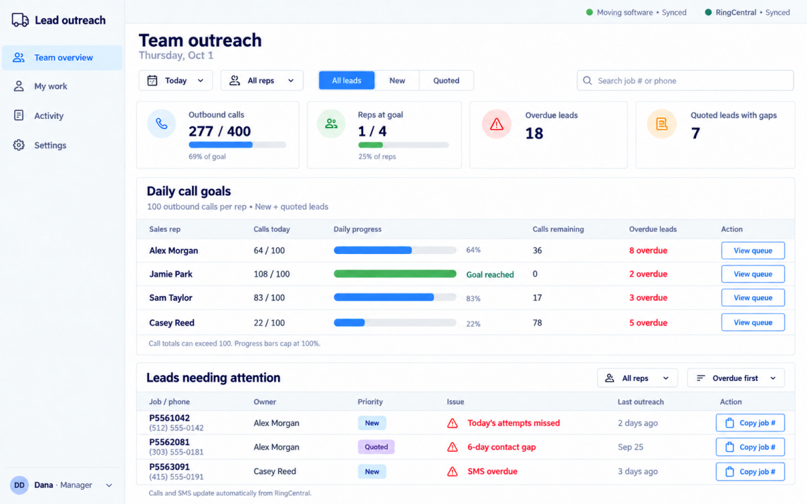
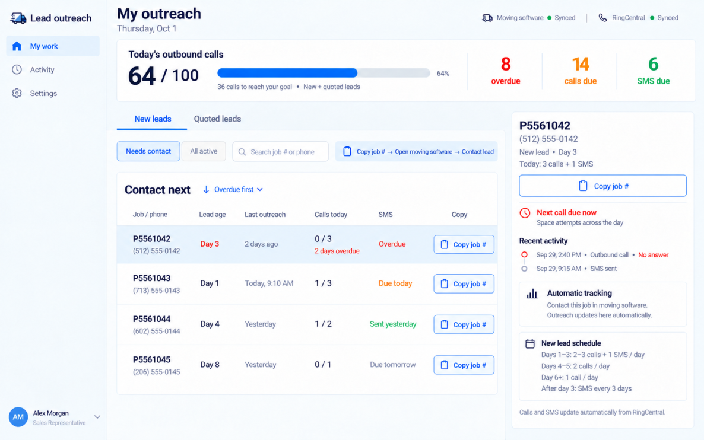
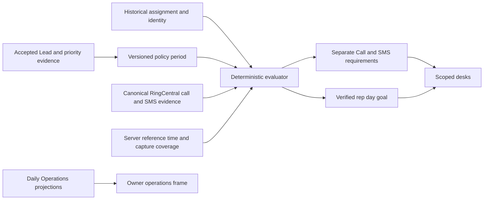

# Sales Outreach Desk — final implementation specification

Status: finalized business policy and implementation specification, October 3, 2026. Complete policy baseline adopted by the finalization instruction; runtime/provider/authorization/migration/release acceptance remains pending.

> **Post-slimming note (October 4, 2026):** business rules below are unchanged. Code reuse, collection names, the "Outreach ID", admin routes (`/outreach-desk`), the Manager role and RingCentral mechanics are re-based in [IMPLEMENTATION-PLAN.md](IMPLEMENTATION-PLAN.md), [CODE-MAP.md](CODE-MAP.md) and [RINGCENTRAL-CAPTURE.md](RINGCENTRAL-CAPTURE.md), which win where they differ.

## 1. Authority, precedence and preparation outcome

The [original Owner message and two screenshots](OWNER-REQUEST.md) are preserved as the product brief. This specification supplies the approved refinements; the source message remains available for comparison.

This packet replaces SALES-OUTREACH-DESK-SPECIFICATION-PROPOSAL.md as the implementation preparation authority. The original remains historical input. Confirmed requirements are binding. Proposed product choices below are implemented as validated, disabled policy options until explicitly approved in DECISIONS.md. The architecture, transport, persisted-control design, ownership, acceptance and end-sprint readiness plan are settled by this packet. CONTRACTS.md resolves the conceptual schemas and route choices in Sections 8 and 17; SPRINT.md resolves sequencing. No source snapshot independently overrides those contracts.

MongoDB remains authoritative; business behavior belongs in vantage-main-server. Granot Priority, derived Quoted facts and official Booking remain distinct. Retain locked identity, lifecycle, restriction and Daily Operations authority. The bundled sources/CONTEXT.md supplies vocabulary; CODE-MAP.md gives actual paths and pinned revisions.

Use docs/sales-outreach-desk/README.md as the entry point from either repository. The server packet is canonical for shared edits. The admin packet is a byte-identical release mirror, never a second editable policy source. Shared-file changes are submitted to Team A, versioned, validated and exported to both repositories together. A checkout can implement its local tasks without an inaccessible sibling clone. Sources are attributed snapshots, not runtime code or replacement Service documentation.

### Owner interview checkpoint — 2026-10-03

Questions 1–14 of the capped continuation interview are approved and integrated. The original message/screenshots remain preserved. P01, P02a–P02i, P03, P04a–P04d, P05a–P05h, P06a–P06f, P07a–P07g, P08a, P09a–P09c and P10a; D01 deterministic-only scope and V01/V02 visual requirements are current. DECISIONS.md retains exact approval provenance and historical scope; older partial-fixture approval flags do not reopen later decisions. The [final policy review](FINAL-POLICY-REVIEW.md) and [manual start](MANUAL-START.md) are finalized under the user's finalization instruction.

| Approved scope | Decision references / current rule |
| --- | --- |
| New cadence and calendar | P01, P02a–P02i, P03: two required/optional third Days 1–3; two Days 4–5; one Day 6 onward. New York calendar age; all seven working weekdays 08:00–20:00; approved first-response carry, spacing, slots, arrival allowances, fixed SMS sequence and prospective Owner closures |
| Quoted scheduling | P04a–P04d: one daily call; date deferral/opening/deadline; current Rep + Owner audited edits; today through 19:30 inclusive; closed/past rejection; later closure waiver; no-date entry defaults next working date; no extra entry-date call |
| Return from Quoted to New | P05a: retain original received-date calendar age, advancing through Quoted/closed dates; no Day 1 restart or paused age |
| Priority 3 | P05b: Rep discretion, no routine Call/SMS cadence; stop prior routine work, retain open visibility/history |
| Actual accepted unmapped priorities | P05c: no automatic cadence, raw code/No policy configured for Owner review; stop prior routine work, retain history/open state |
| Complete known-priority mapping | P05d: explicit 0/1/3/5/7/8 mapping; accepted webhook/extension/HTTP automation Lead changes share one server policy. Priority 5 and official Booking both stop/cancel cadence but remain separate facts. Existing 7 CRM bad/unusable and 8 CRM dead opportunity meanings preserved; duplicate/booked-elsewhere narrowing was not established |
| Roles and Manager capabilities | P09a–P09c: Admin means trusted Owner; Managers have team/Unassigned reads, audited assignment/Quoted/callback/prospective attendance overrides and Daily Operations. Owner-only advanced policy/roster/work schedules/history/release controls. Rep current-assignment-only; prove account binding |
| Bounded missed-work recovery | P06a: one catch-up requirement per channel; next qualifying channel contact clears it and may count toward today's quota; retain each miss, keep channels independent and SMS dates fixed |
| Call direction and attempt credit | P07a: verified actual outbound attempts count toward cadence and outbound goal; answered inbound handled by any reviewed sales rep counts toward cadence/catch-up only (P07c); missed inbound, duplicates, internal and in-progress calls have no completed credit |
| Outbound helping reps and transfers | P07b: reviewed helper can fulfill lead cadence/catch-up; initiating rep alone earns goal credit; transfer adds no extra call/goal credit; assignment/access unchanged |
| SMS status and corrections | P07d: confirmed sent/delivered counts once; queued/pending/send failure/API request only does not; later confirmed delivery failure revokes that message's credit and recomputes SMS work/catch-up |
| SMS sender and origin | P07e: deliberate sends by any reviewed sales rep, including helpers and manually sent templates, qualify; unattended automation, automatic confirmations and inbound replies do not; ambiguous shared sender pending |
| Remaining policy bundles | P05e–P05h intake/uncertainty/reentry/move-date/eligibility; P06b–P06f advisory cooldown/restrictions/assignment/callback/precedence; P07g event time/windows; P08a scheduled goals; P10a prospective cutover |
| Deterministic scope and visual parity | D01: no LLM/transcription/summary/assessment/AI suggestions in outreach; MCP stays separate. V01/V02: close reference fidelity; Admin/Manager near-identical desks with advanced capability differences |
| Late and corrected evidence | P07f: credit actual contact time and verified historical policy/identity, correct historical totals/catch-up with audit, remove disproven apparent misses but retain genuine misses; no receipt-day duplicate credit |
| Owner-declared goal and queue behavior | 100 outbound New/Quoted calls per rep; actual totals may exceed 100, bar capped at 100%; inbound/SMS excluded. Lead coverage remains independent. Needs contact defaults to overdue first then next action due. Independent Call/SMS completion/deadlines/overdue, Job Number above phone, Copy job #, read-only history and outreach performed in moving software |

All business-policy bundles and the manual-start design are finalized. No substantive Owner policy choice or final-ratification interview gate remains. Provider/runtime/authorization/configuration/migration/production evidence is still unverified and separate from policy approval. Preserve established closure/reopening authority and the explicit P05h No-Sync distinction.

Behavior values and activation controls stay persisted, editable, audited/versioned and effective after reload; no deployment-dependent environment authority. Complete-policy baseline is approved for implementation; runtime activation remains disabled and requires proven readiness and deliberate Owner release controls. S5–S7 remain reserved for migration rehearsal, backfill/catch-up, reconciliation, readiness and rollback. No runtime implementation or live operation is authorized by this checkpoint.

### Settled architecture changes from the proposal

- Use a separate app-owned sales_outreach_configuration collection with immutable versions and a revisioned active pointer. Existing CSI policy uses a strict parser and can reject new fields on rollback. Reuse its transaction/idempotency/audit mechanics, without stuffing new runtime flags into the old parser or retaining environment fallback.
- Keep /sales-intelligence and /sales-intelligence/outreach/[id] as canonical admin routes. Introduce focused ?view=team and ?view=my frames. /daily remains the existing board, accessible to the Owner and authorized Managers under P09b; the sales shell links to it and reuses its summary. No duplicate Daily Operations board or authentication system.
- Add isolated /api/v1/admin/sales-outreach read/command contracts. Preserve signed trusted actor proxying, including the explicit Manager read capability required by P09a. New Rep scope is current authoritative assignment only; legacy historical-followup/number-wide access is insufficient.
- Reuse Outreach identities, canonical call evidence, reviewed temporal rep identity, capture coverage and durable jobs. Add dedicated cadence periods/projections, a narrowly attributed outbound goal, and rep SMS metadata capture. Existing broad/per-involved-rep outbound totals and automated lead_messages are not this feature's counts.
- Fence competing planners per migrated subject before activating cadence. Preserve capture, restrictions, official closure and historical records. D01 excludes all LLM analysis, transcription, summaries and AI suggestions from outreach; retire its legacy AI admission/producers/workers across the outreach feature, including unseeded subjects. Keep the MCP server as a separate capability.
- Schema and dry-run design start early. The last three sprint stages are reserved for index/migration execution rehearsal, backfill/catch-up/reconciliation, and readiness/rollback/operational handoff. They are release gates, not optional cleanup.

No live writes, provider subscriptions, sending, deployments, commits, pushes or provisioning are authorized by this packet. This preparation adds documentation and synthetic contract material only; no model scaffold was necessary to define the collection safely. Read-only code investigation found the actual existing persisted-policy mechanism.

### Deterministic outreach scope — D01

Confirmed D01 (October 3, 2026): the Sales Outreach Desk is entirely deterministic code. Remove LLM agent analysis, transcription, summaries, assessments, extracted promises and AI suggestions from this outreach feature, including background producers and UI dependencies. Canonical provider call/SMS metadata, accepted priority facts, human commands, restrictions, assignment and audited policy drive the feature. Retain the Vantage MCP server. A future agent capability to find RingCentral call files, transcribe or summarize is separate, outside this outreach specification, and is neither implemented nor authorized here. Preserve historical evidence without creating an AI pipeline or displaying new AI suggestions. Human/provider-derived restrictions remain authoritative; runtime planner/analysis fencing must prevent legacy AI activity from creating new outreach effects for the migrated cohort.

## 2. Confirmed product requirements

- New cadence: Days 1–3, two required calls each day with an optional third (P01 approved 2026-10-02), and at least one SMS each day; Days 4–5, two calls each day; Day 6 onward, one call each day; after Day 3, one SMS every three days. Continue while the applicable priority remains active. Calendar, deadlines, spacing and arrival-date allowances are approved P02a–P02i; evidence, restrictions and transition-date treatment remain separate gates.
- Quoted cadence: one call each day. A follow-up date selector defers the next call; alerts and countdown begin from that date under the interpretation specified below.
- Daily goal: 100 outbound calls per rep across New and Quoted. Show actual totals above 100, cap the progress bar at 100%, exclude inbound calls and SMS.
- Lead coverage remains independent of the daily goal. Overdue leads remain visible after a rep reaches 100 calls.
- Call and SMS requirements have independent due times, completion and overdue indicators. One channel cannot satisfy the other.
- Default queue: Needs contact, most overdue first, then next action due.
- Search by Job Number, phone number or name. Offer a small set of priority, move-date and assignment filters and three primary sorts.
- Reps see only their currently assigned leads. The Owner and authorized Managers can view all reps and filter by rep (P09a); the Owner can find unassigned leads. P09b grants authorized Managers Unassigned visibility.
- Display Job Number prominently, with phone directly underneath. Provide Copy job # and read-only activity history. Outreach takes place in Granot and RingCentral; this application tracks it.
- An accepted priority change ends future work for the previous priority and starts the appropriate new workflow.
- Use the supplied desk screenshots as the visual reference, with modest additional controls and more honest freshness information.
- Include the requested Daily Operations categories alongside rep progress in an appropriate Owner view, without overwhelming the rep queue.
- Implementation and end-to-end execution will run in the supplied cloud environment. A preparation pass must settle contracts, models, migrations and execution setup before the cloud swarm begins.

## 3. Scope and reduction

### 3.1 Retain and reuse

Retain canonical Lead identities, Outreach subjects, Contact Numbers, reviewed temporal Rep Identity Links, accepted Granot observations, official Booking/Cancellation authority, Owner assignment precedence, deterministic attachment/review, channel restrictions, provider call finality, durable receipt capture, idempotent jobs, recovery, rate budgeting and audit history. Reuse move facts, search predicates and Daily Operations definitions where they match this contract.

Retain the invariant that all business policy lives on the main server. The admin renders decisions returned by scoped reads. MongoDB remains the system of record; neither reporting sheets nor browser state establish contact completion.

### 3.2 Remove from the focused desk

Remove AI findings, Move assessment scores, scoring/ranking controls, generated next steps, AI summaries, analysis triggers, recording/transcript panels, manual Sales attempt workflows, tracker membership toggles, compensation/earnings, assignment cost and internal messaging from these default desk frames. Detailed system administration and operational workflows may remain elsewhere when they have an independent purpose.

Rep-reported attempts, notes and Copy job # never earn verified call or SMS credit. A lightweight explicit quoted follow-up date remains an authorized planning command; activity itself is read-only.

### 3.3 Stop competing automation before removal

Inventory existing first-action deadlines, going-cold bands, quote defaults, progress plans, AI-derived commitments, cooldowns and follow-up generation. The new desk must have one routine cadence authority. Old planners must not continue writing a second set of tasks behind the new screen.

Preserve execution restrictions and explicit Owner instructions. P06e governs new explicit human callbacks. Decide legacy callback carry-forward under P10. D01 excludes extracted promises and AI suggestions entirely from this feature. P06b retains the three-unsuccessful-attempts-in-24-hours warning as advisory only. A calendar-day quota must not bypass an actual customer/channel restriction.

Hide unused UI first, detach new desk dependencies second, disable obsolete automated producers third, and delete dead code only after dependency and parity checks. Removing cards is not sufficient evidence that AI work has stopped. Retain historical data through the rollback window; broad collection deletion is outside the migration.

## 4. Application shell and view frames

**Proposed:** treat Lead outreach as a focused application within the existing admin deployment, with its own small sidebar, local navigation and consistent shell. Do not create another backend, authentication system or duplicate Lead database.

| Frame | Audience | Main purpose |
| --- | --- | --- |
| Team outreach | Owner + explicitly authorized Manager (P09a) | Rep goal progress and leads needing attention |
| My outreach | Rep; Owner/authorized Manager inspecting a rep | Assigned queue and selected-lead contact requirements |
| Daily Operations | Owner under the existing permission contract | Today's business activity and a compact team progress summary |
| Activity | Scoped Rep; Owner/authorized Manager | Read-only contact history and cadence transitions |
| Settings | Role-scoped | Owner policy/rep mapping controls; Rep preferences only |

Team outreach is the Owner's default sales frame. My outreach is the Rep's default. Daily Operations is an app-level frame, not a separate tab per event category: keep category panels, with a compact summary available in Team outreach. Preserve links to Intakes, Bookings, Cancellations and other existing workflows rather than reproduce their mutation forms.

**Role gate:** the inspected legacy runtime denied generic Admin on some Sales Intelligence and Daily Operations surfaces. P09b intentionally extends Daily Operations to explicitly trusted Managers; P09c binds Admin to Owner only for intended trusted accounts. A visual label of Manager/Admin does not grant permission. P09a approves Manager team-wide outreach reads and individual-rep filters; implementation must prove an explicit trusted Manager capability. Reps never receive company-wide Daily Operations events, customer lists or raw receipts. P09b grants Manager coordination commands, Unassigned visibility and Daily Operations access; advanced policy controls remain Owner-only.

Approved P09a (2026-10-03): Managers can view outreach across all reps and filter by individual rep, as explicitly restated in the Owner statement. This resolves the Owner-only team-read proposal conflict in favor of Manager visibility. Implement an explicit trusted Manager read capability for team progress, rep-filtered assigned lead queues and their read-only activity detail; Rep reads remain limited to current assigned leads. P09b grants reassignment, Quoted date/callback commands, prospective absence/partial-day overrides, Unassigned visibility and Daily Operations access; advanced policy controls remain Owner-only. A generic Admin label does not grant Manager capability; exact role binding is an engineering/auth contract to prove. No runtime permission has been changed.

Proposed route names are a design choice for preparation, not a mandate to create a parallel application. Establish canonical new routes or views, preserve useful old links with redirects, and avoid operating two independent desks indefinitely.

### 4.1 Admin/Owner and Manager roles

Approved P09c (October 3, 2026): Admin in this Sales Outreach Desk specification means the Owner full-authority role, not a separate intermediate permission tier. Admin/Owner has coordination tools plus advanced policy/configuration/release controls. Manager uses the near-identical team desk with P09b permissions, including Daily Operations, and without Owner-only advanced controls. Rep retains current-assignment-only desk scope. Map the intended trusted Admin/Owner accounts explicitly; do not automatically elevate all existing accounts carrying a generic Admin label. Exact runtime account/role/proxy binding remains a technical proof. This terminology clarification does not change generic Admin permissions elsewhere in the platform. No runtime authorization changed.

### Approved Manager coordination role — P09b

Approved P09b (October 3, 2026): explicitly authorized Managers may view all rep queues/activity/goals, view Unassigned leads, assign/reassign Leads with audit, set/reschedule Quoted follow-up dates and explicit callbacks with audit, and record prospective absence/partial-day goal overrides with audit. Managers may access Daily Operations (the user amended the proposed Owner-only restriction). Base goals, roster, work schedules, cadence policy, lifting contact restrictions, overriding authoritative closures, changing historical responsibility/goal settings, activation, migration and rollback remain Owner-only. Use explicit trusted Manager capability; a generic Admin label alone does not grant it. Preserve Rep current-assignment-only access and existing Owner authority. Daily Operations access does not independently authorize unrelated commands or redefine its metrics. Exact role binding/proxy/stream permissions remain implementation proofs, not policy preferences. No runtime permission changed.

## 5. Screenshot styling and data presentation

Confirmed visual requirement V01 (2026-10-03): the Owner wants the Owner/Manager Team outreach and Sales Rep My outreach desks to closely reproduce the attached reference screenshots, not merely borrow their color palette. The reattached Downloads images match the existing bundled references byte-for-byte. Preserve composition, hierarchy, spacing, sidebar, card/table geometry, restrained rounded treatment and selected-lead panel. The visual direction is soft, rounded and approachable, while remaining an operational dashboard. Approved policy and honest provider coverage determine labels/counts; screenshot sample numbers, dates, 0/3 call requirements, contact-gap labels and Synced statuses are not additional business rules.

The supplied screenshots are visual evidence, not independent business-policy instructions. The Owner's subsequently supplied rules take precedence over sample counts, sample schedules and inferred behavior in the images.

Required visual composition:

- Pale blue/near-white page background, white cards, thin cool-gray borders, restrained shadows and rounded corners.
- Bright blue active controls and broad rounded progress tracks. Soft circular icon backgrounds provide the bubbly quality without turning dense tables into decorative tiles.
- Dark navy headings, muted secondary text, generous spacing between sections and compact readable table rows.
- Blue for selection/actions, green for goal reached or completed, amber for due work and red for overdue. Always pair color with text or an icon.
- Narrow sidebar with simple icons, selected navigation pill and signed-in identity near its foot. Connection freshness sits in the page header.
- A strong horizontal goal card above the rep queue, and a four-card summary row above the manager's progress table.
- Blue-tinted selected queue row; selected-lead details in a roughly one-third-width right panel on desktop.

Initial engineering token targets: 12–16 px card radii, 8–12 px control radii, 16–24 px card padding, 44 px minimum interactive targets, 14–16 px body text and 28–32 px page titles. Tune tokens against rendered references and existing design tokens; these numeric estimates are engineering targets, not measured screenshot dimensions. Do not introduce a second uncontrolled theme.

Keep the roundness concentrated in cards, controls, icon circles, navigation selection and pill-shaped progress bars. Tables remain aligned rows with light dividers and ample breathing room, not separate oversized pills. Avoid heavy shadows, sharp/angular cards, dense decoration or a redesign that changes the reference hierarchy.

Visual acceptance: render both desktop desks at the reference dimensions (1186 × 742) for side-by-side comparison; verify header/sidebar proportions, Manager four-card row and two table sections, Rep horizontal goal summary and queue/detail split, rounded controls/progress/icon treatment, selected-row tint, typography hierarchy and muted surfaces. Keep approved policy text and independent channel states correct even where they differ from the samples. Also verify narrower layouts, keyboard/focus and update stability. V01 requires visual comparison evidence in addition to functional checks; no redesigned composition is accepted solely because it uses blue and rounded corners.

The rep table presents Job/phone, name where available, schedule day, last interaction, calls completed/required, SMS state and Copy job #. The manager attention table adds assigned rep, priority and a concise issue such as "Call overdue by 2 hours". Use absolute timestamps in tooltips/details and relative time in rows. Show unknown explicitly.

At narrower widths, keep the goal summary above the queue and open details in an accessible drawer or stacked panel. Preserve keyboard selection, visible focus, labels, reduced-motion support and a polite update announcement. Background updates must not steal focus or continuously animate/reorder the row being used. Retain selection by Outreach ID, not row position; expose when a selected row no longer matches the queue.

Confirmed V02 (October 3, 2026): Admin and Manager desks should look nearly identical except for advanced options unavailable to that role. Reuse the reference-fidelity team desk composition, spacing, rounded geometry, summary cards, queue/detail and Daily Operations access. Server capabilities control permitted commands and advanced options; do not fork a separate Manager visual design. P09c confirms Admin means the Owner full-authority role for this feature; generic Admin accounts still require explicit trusted binding.

## 6. Rep and Owner desk content

### 6.1 My outreach

The header shows the New York business date, RingCentral call/SMS freshness and moving-software observation freshness. The goal card shows actual outbound count / 100, progress, calls remaining, distinct overdue leads, remaining call attempts due today and remaining SMS sends due today. Label these units; do not compare a count of attempts with a count of leads.

Below it: All leads / New / Quoted, Needs contact / All active, search, a compact move-date control and sort. A priority dropdown can expose other observed codes without adding a row of priority tabs. No rep or unassigned selector appears for a Rep.

The selected panel shows Job Number, phone, name, current observed priority, assigned rep, New schedule day or quoted follow-up date, independent Call and SMS requirement cards, last evidence update, a compact read-only timeline and a short explanation of the applied policy. Copy job # remains the main action. Show "Job number pending" for an otherwise eligible lead lacking a Job Number; disable copying rather than hide the lead or fabricate `P556XXXX`.

Quoted leads expose the follow-up selector if the role has permission. No dialer or message composer is added. Help text explains: "Contact the customer in Granot/RingCentral. Activity appears here after provider updates."

### 6.2 Team outreach

The four primary cards show outbound calls / aggregate goal, reps at goal, distinct overdue leads and quoted leads with overdue call requirements. The denominator includes the selected roster of goal-enabled reps for that business day; inactive staff and unassigned leads do not silently add 100 to the goal. P08a resolves schedules, absences and explicit partial-day overrides.

Daily call goals table: rep, actual / goal, capped progress, remaining, overdue lead count and View queue. Include active reps at zero and separately flag incomplete attribution/coverage. Team call total must reconcile to eligible per-rep totals under the selected transfer rule.

Leads needing attention: Job/phone/name, rep or Unassigned, priority, Call and SMS issues, last interaction and Copy job #. Opening a rep queue retains rep context and the filters used by the drill. Show an unassigned count and direct drill even when all reps have reached their goals.

### 6.3 Metric scope

The rep headline remains today's goal across all eligible New/Quoted work, independent of queue search, move date or selected priority. Queue counts explicitly describe the filtered queue. The Owner headline follows its rep selection but does not shrink because a customer name is searched. Business-period selection, move-date filtering and lead-received sorting are separate controls and have different time meanings.

## 7. Search, filters and sorts

| Control | Contract |
| --- | --- |
| Search | Case-insensitive name substring, normalized Job Number exact/prefix and normalized phone digits; use existing four-digit minimum for phone substring matching |
| Priority | All leads, New (`0`), Quoted (`1`); compact options for other observed valid codes and Unknown. Never invent an unsupported code's meaning |
| Work | Needs contact default; All active alternative. An outstanding requirement due now/today or overdue qualifies; a future-only quoted follow-up appears in All active |
| Move date | Upcoming including today proposed default, Today, next 7 days, custom inclusive range, past, unknown and clear filter |
| Assignment | Owner: All reps, individual rep, Unassigned; individual and Unassigned are mutually exclusive. Authorized Manager: All reps/individual rep (P09a) and Unassigned (P09b). Rep: forced current assignment |
| Sort | Most overdue default; Lead received; Last interaction |

Move-date defaults must be visible removable chips. Unknown dates remain an explicit accessible choice and a visible excluded-count warning when applicable. Passing the move date alone does not close Outreach; the user asked for filtering, not automatic disposal.

**Most overdue:** use the oldest actionable unsatisfied Call/SMS deadline ascending, then next action due ascending for nonoverdue records, then normalized lead-received time and stable Outreach ID. This means the longest elapsed overdue duration wins. It is not an AI band or a stale-contact score.

**Lead received:** newest first by default, with an oldest-first direction toggle. **Last interaction:** oldest first by default, never-contacted records first, with a newest-first toggle. Define last interaction as the latest attributable external settled call, verified SMS send or inbound SMS receipt on the unique Outreach relationship. Priority observations, notes, copying, projection refreshes and arbitrary `updatedAt` do not reset it. An inbound message can update this sort while fulfilling no outbound requirement.

All predicates and sorting apply server-side before pagination. Bind cursor to scope, search, filters, sort, reference time and projection revision. Stable ties use Outreach ID. Do not sort just the displayed page. Reassignment must immediately revoke Rep reads on authoritative authorization, even while a projection or live notification lags.

All leads means all active priority groups in this outreach scope, not every historical Lead in the system. Closed history remains accessible through Activity or the established operational records. Leads with unavailable policy/identity have a visible warning count and an All active drill; the Owner attention frame includes those exceptions without inventing a due time. Never let Needs contact silently imply that every hidden record has a valid satisfied policy.

## 8. Domain model and persistence

Keep one authoritative Outreach subject per opportunity under existing identity rules. Phone and Job Number are evidence/display identities, not substitute primary keys. Do not create one lead record per phone or credit every lead sharing a number.

| Proposed entity | Essential information |
| --- | --- |
| Contact Frequency Policy | Immutable version, applicable workflow/priority, timezone/calendar, day bands, required counts, deadlines/spacing, SMS sequence, activation time |
| Policy period | Outreach ID, policy version, priority, start/end instants, source references, time basis/quality, cadence age anchor, end reason |
| Quoted follow-up schedule | Outreach ID and policy period, selected business date, resolved due instant, actor, revision, effective change time and audit |
| Contact evidence reference | Canonical provider call/message identity, owning mailbox where relevant, timestamps/status, reviewed rep attribution, unique opportunity association and source revision |
| Cadence projection | Current channel requirements/completion, due/overdue/catch-up state, oldest actionable deadline, next evaluation time, computed-as-of, input fingerprint/revision and coverage |
| Rep-day goal projection | Rep, New York day, goal snapshot, distinct eligible outbound count, input revision, coverage, computed-as-of |

These describe domain responsibilities. CONTRACTS.md selects exact collection names after comparison with existing models; preserve the documented reuse rather than invent parallel evidence stores. Reference canonical call evidence instead of copying calls or transcripts. Preserve auditable policy periods and schedule commands, with at most one active period per Outreach record. Derive rolling day requirements from the period rather than materialize years of future task documents.

Use unique fences for active period, policy transition source, evidence identities and rep/day projection. Use revision comparison/transactions at causal boundaries. Rerunning with identical semantic input produces no new period, audit, counter increment or projection write. Projection timestamps alone must not force a rewrite.

## 9. Time contract

### 9.1 Separate the clocks

| Timestamp | Meaning and use |
| --- | --- |
| `lead_received_at` | Normalized arrival instant; lead-age anchor and received sort |
| `source_occurred_at` | Reliable source business-event time when actually supplied |
| `provider_started_at` / message `creationTime` | Call/send event basis for day and requirement attribution |
| `provider_ended_at` | Call end and settlement-delay basis |
| `provider_modified_at` | Provider revision ordering; not a replacement for original contact time |
| `captured_at` / `received_at` | When Vantage observed/persisted source evidence |
| `applied_at` | When accepted evidence changed domain state |
| `period_started_at` | Cadence workflow transition basis with explicit provenance |
| `due_at` / `window_start` / `window_end` | UTC instants resolved from versioned policy/calendar |
| `computed_as_of` | Shared reference instant used to calculate a returned projection |
| `known_complete_through` | Channel-specific coverage boundary; not inferred from latest contact |
| `publication_revision` | Delivery/reconnect/correction ordering, independent of event time |

Store true instants as UTC dates/ISO strings. Store business dates as `YYYY-MM-DD`, with `America/New_York` explicitly attached to their interpretation. Daily boundaries are half-open `[start, next_start)` and can be 23 or 25 hours. Do not obtain tomorrow by adding 86,400,000 ms. Detail/countdown and list order must use a shared server reference, not a browser's guessed timezone or clock.

Coverage is gap-aware: preserve successful capture intervals, page-completion evidence and per-mailbox cursors alongside watermarks. A window is complete only when the union of successful coverage spans it. A newest event or high timestamp cannot certify that an intermediate interval/page was captured, or justify a zero count while a gap remains.

### 9.2 Legacy Lead timestamps

The current `Lead.timestamp` has mixed storage conventions. Most ingestion paths encode New York wall-clock components in a UTC Date; Granot-created and some legacy records hold actual instants. Reuse and verify `outreach/leadInstant.ts`, including its origin-based classification and legacy heuristic. Preserve the raw value and record adapter version/time quality for reconstructed anchors.

Do not rewrite all Lead timestamps: CPL, lead-spend and Daily Operations consumers have existing assumptions. The fall-back repeated hour loses information in wall-clock encoding; label the deterministic first-occurrence interpretation as estimated, not exact. Missing or contradictory anchors go to review rather than become a current-time receipt by convenience.

Current Daily Operations live Lead hooks also need verification for double timezone interpretation against rebuild behavior. Treat live-versus-rebuild disagreement around midnight as a correctness gate before displaying integrated counts. Any fix must maintain the existing business-date contracts and meaningful regression evidence.

### 9.3 Priority timing and late evidence

Accepted Granot winner ordering currently uses Vantage observation `captured_at`, with an ObjectId tie-breaker. Do not switch that authority to webhook arrival order or an unverified asserted timestamp. Preserve the accepted priority history and record what time basis actually establishes a period boundary. If no reliable source transition time is available, use the accepted observation's time and disclose that limitation.

Call and SMS evidence arriving late is credited to its contact event time and the applicable historical policy/assignment under that documented basis. Late evidence can correct apparent misses. A replayed or stale priority receipt does not restart cadence. Identity/assignment/attachment corrections can trigger bounded recomputation of affected records and days. Never imply that receipt ordering perfectly reconstructs an unseen real-world priority transition.

### 9.4 Approved calendar, New deadlines and arrival allowances

Current Owner approvals: P01, P02a–P02i and P03, recorded 2026-10-02 in DECISIONS.md. These are business decisions, not completed runtime implementation or activation approval. All policy values, behavior flags and activation states must remain persisted, Owner-editable and reloadable across API/job instances without deploy/restart/env fallback. Edits are audited/versioned and prospective; history is not silently rewritten.

| Policy | Approved starting behavior | Approval |
| --- | --- | --- |
| Cadence age | America/New_York calendar dates; normalized received date Day 1, advancing on all dates, including closures; never elapsed 24-hour or browser-zone age | P02a |
| Working calendar | Monday–Sunday, [08:00,20:00) New York local hours, with date-resolved DST offsets | P02b/P02c |
| New first response | One first call due after 30 working minutes from normalized receipt; after-hours starts next opening; unused minutes carry across closing/explicit closures | P02d |
| Call spacing | Initially 60 elapsed minutes between cadence-credited call starts on one Outreach record; too-close retries retain history but do not add cadence credit or reset anchor | P02e |
| New full-day calls | Days 1–5: first by 12:00, second by 20:00; Day 6 onward: one by 20:00. Days 1–3 third call optional, never overdue for its absence | P01/P02f |
| Arrival-date calls | Receipt before 18:00: two; 18:00 through 19:30 inclusive: one; after 19:30: zero before closing. First-response deadline replaces arrival-date noon; second if owed by 20:00 with spacing | P02g |
| Carryover credit | Next date retains ordinary age/quota; carried initial-response call may satisfy one of that date's ordinary calls, never an extra third obligation or duplicate provider credit | P02g |
| New SMS dates | Fixed Days 1/2/3 then 6/9/12 onward. Extra sends and misses do not shift future dates; no routine Day 4/5 SMS | P03 |
| SMS deadline/arrival | One by 20:00 on scheduled SMS dates. Arrival at/before 19:30 owes one before closing; later arrival-date SMS waived, next date ordinary one only | P02h |
| Closures | No automatic holidays, initially no closed dates. Owner can mark future dates closed; waive new routine Call/SMS quotas without misses, pause working clocks, keep age advancing, waive fixed SMS without moving sequence | P02i |

20:00 is a closing deadline, not a permitted new routine contact start. Before-opening receipt has first response at 08:30 and its ordinary arrival allowance. A waiver is not missed work. Historical misses remain after quota completion, rescheduling or calendar edits. Customer contact restrictions, incomplete coverage and P06/P07 assignment/evidence decisions remain independent; never bypass a restriction because a quota is due.

| Example (New York local time) | Approved expected outcome |
| --- | --- |
| 14:00 arrival | Two calls: first 14:30, second by 20:00, spaced one hour; SMS by 20:00; no retroactive noon miss |
| 18:00 arrival | One call by 18:30; one SMS by 20:00 |
| 19:30 arrival | One call and SMS by closing; start contact before 20:00 |
| 19:45 arrival | Arrival-date Call/SMS quotas waived; first call next opening +15 minutes (08:15); next date ordinary Day 2 quotas, not extra debt |
| 21:00 arrival | First call next opening +30 minutes (08:30); next date remains Day 2 |
| Sunday 19:45 receipt, Monday explicitly closed | First call Tuesday 08:15; Tuesday is Day 3; no closure quota penalty |
| Friday October 2 receipt | Fixed SMS dates October 2/3/4/7/10/13. Extra October 8 send does not move October 10 |
| Day 6 explicitly closed | That fixed SMS waived; next fixed SMS still Day 9 |
| Full two-call day: 13:00 and 14:00 calls | Counts completed; first 12:00 deadline miss retained in history |

Acceptance input is in contracts/fixtures/p01-call-count.json, p02a-calendar-age.json through p02i-closures.json and p03-fixed-sms.json. Earlier partial fixtures retain their historical approval scope; the current decision table wins. P05f/P06c/P06d/P07f/P07g/P10a resolve reentry, blocked/unassigned treatment, event-time corrections and cutover; calendar approval does not authorize runtime enforcement.

## 10. Frequency and overdue calculation

### 10.1 Versioned cadence

| Workflow | Schedule days | Required calls | Required SMS |
| --- | --- | --- | --- |
| New | 1–3 | Approved P01: 2 required, optional third; optional absence never overdue | At least 1 per day |
| New | 4–5 | 2 per day | Fixed sequence after Day 3 |
| New | 6 onward | 1 per day | Fixed sequence after Day 3 |
| Quoted | Active days | 1 per day | No requirement supplied |

**Approved P03 (2026-10-02):** configurable fixed New SMS sequence Days 1, 2, 3, then 6, 9, 12 onward. Extra sends and misses do not move future dates; rolling 72 hours is not the approved starting policy. Days 4/5 have no routine SMS. P02h approves SMS due by 20:00 New York and arrival-date one SMS for receipt through 19:30 inclusive, waiver afterward with no extra next-day SMS. Recovery remains P06 and evidence eligibility remains P07. Persist editable reloadable sequence, cutoff and allowance parameters; see DECISIONS.md and fixtures.

For each day/channel window, calculate required count, qualifying distinct evidence count, remaining count, current action deadline, channel blocking state and source coverage. Call slots must be generated using approved staffing/spacing rules. A failed attempt can count as an attempted call only under the agreed qualifying-call rule; a nonexistent dial/button press never counts.

### 10.2 Current work and historical misses

Yes, this system has overdue. An eligible actionable contact requirement becomes overdue when its approved deadline has passed and verified completion is insufficient. Overdue duration is `max(0, computed_as_of - oldest_actionable_due_at)`. Count distinct overdue leads across either channel; retain separate overdue action/attempt totals where displayed.

Persist or deterministically retain completed, missed, superseded and cancelled historical windows. **Do not accumulate every missed daily quota into an unlimited current-day quota.** Overnight behavior needs explicit recovery semantics.

Approved P06a (2026-10-03): earlier unmet routine windows coalesce into at most one actionable catch-up requirement per channel on the active Outreach record, retaining the oldest actionable missed deadline. Preserve each historical miss; do not stack all old Call/SMS counts into current quotas. Keep the lead overdue for that channel until the next qualifying contact clears its catch-up requirement. The same event may satisfy one applicable ordinary requirement today, without duplicate event/goal credit or retrospective on-time completion. Call catch-up cannot clear SMS catch-up and vice versa. SMS catch-up never shifts the fixed SMS sequence. Accepted priority changes/closures end previous-policy actionable work under the approved lifecycle rules while preserving history. Qualifying activity, restrictions, callbacks and migration/cutover remain separate decisions.

Example: four earlier missed calls plus two ordinary calls today produce one Call catch-up marker and today's two-call quota. The next qualifying call clears catch-up and fulfills today's first call; one ordinary call remains. All four prior misses remain recorded. A pending SMS catch-up is unaffected. Late evidence that actually occurred inside an old window corrects that old window directly; exact evidence qualification/correction remains P07. See [P06a catch-up fixtures](contracts/fixtures/p06a-bounded-catchup.json).

Completion labels are distinct: fulfilled in window, fulfilled late/catch-up, superseded by priority, cancelled by closure and evidence pending. A priority change ends actionable previous-policy debt but preserves whether previous windows were missed. An unavailable feed must not be presented as a confirmed zero.

### 10.3 Evidence uncertainty and restrictions

Approved P06b (October 3, 2026): three unsuccessful attributable outbound attempts in a rolling 24 hours produce a visible advisory warning with recent attempt history, never an automatic hard calling pause. Required routine calls, bounded Call catch-up and explicit callbacks remain actionable subject to actual customer/channel restrictions and other eligibility gates. An unsuccessful attempt means the customer was not reached; it is not a failed cadence obligation. Verified actual attempts earn outbound-goal credit under P07a/P07b regardless of answer. The approved 60 elapsed minutes between cadence-credited call starts remain a credit rule, not a hard dialing prohibition; too-close actual retries may earn goal credit but no additional cadence credit and do not reset the anchor. No maximum-attempt hard block is introduced. This decision does not approve callback scheduling mechanics, restriction deadline treatment, provider outcome mappings or remaining timing edges. All values remain persisted editable audited/versioned/reloadable; no runtime activation.

See [advisory cooldown examples](contracts/fixtures/p06b-advisory-cooldown.json).

When capture coverage is incomplete, show "Not yet verified" or "Overdue based on available activity" with the channel's coverage timestamp. The rep can still see the next required action, but incomplete data cannot establish a definitive performance failure. Keep provider settlement delay separate from a policy grace period.

Blocked leads show the blocking reason and remain visible in an appropriate queue state. Do not encourage contact contrary to channel restrictions. P06c resolves routine requirement waiver and initial-response-clock pause with an auditable effective restriction interval. Unassigned work remains visible to the Owner without charging a rep.

Approved P06c (October 3, 2026): a genuine contact restriction waives unfinished routine requirements for its affected channel when it takes effect and creates no new routine misses or catch-up debt during the prohibited interval. Preserve genuine misses from before the restriction and existing catch-up history, but do not prompt prohibited contact. Show the affected channel as blocked with its reason and release time, separately from actionable overdue work. Ordinary quotas resume on the next working date on or after release if release is at or before opening; if release is after that date's opening, ordinary quotas resume the following working date. Permitted outreach may occur immediately after release. Preserve original lead age and fixed SMS dates; blocking calls does not block SMS unless the restriction also covers SMS. An unfinished initial 30-working-minute response clock pauses its remaining minutes during the restriction and resumes when calling becomes permitted, using the approved working calendar. Actual restriction authority and resolution remain unchanged. This decision does not approve callback mechanics, unassigned treatment, cutover or provider proofs. All parameters remain persisted editable audited/versioned/reloadable; enforcement remains disabled.

See [restriction examples](contracts/fixtures/p06c-restriction-waiver-resume.json).

### 10.4 Assignment and historical responsibility

Approved P06d (October 3, 2026): assignment does not restart or extend the Lead timeline. While unassigned, applicable cadence and deadlines continue; misses remain in the Owner Unassigned queue without charging a rep. First assignment inherits remaining work and bounded catch-up; earlier unassigned misses remain attributed to Unassigned. Reassignment preserves original age, deadlines, qualifying completed contacts, spacing anchor and catch-up. Current responsibility transfers to the new assigned rep; each historical miss retains the responsible rep or Unassigned at its deadline. Show inherited overdue work separately from deadlines missed during the new rep's ownership. Outbound-goal credit stays with the reviewed initiating rep under P07b. No fresh initial-response window is granted by assignment. Preserve existing assignment authority, actual assignment history, P06c channel restrictions and current-assignment-only Rep access. This decision does not grant Manager mutation/unassigned permissions or approve callback mechanics/cutover. Persist editable audited/versioned/reloadable policy; no runtime activation.

See [assignment examples](contracts/fixtures/p06d-assignment-responsibility.json).

## 11. Quoted follow-up date

Current approvals P04a–P04c (2026-10-02) and P04d (2026-10-03) are recorded in DECISIONS.md. One call per working date remains the supplied Quoted cadence; no Quoted SMS obligation was supplied.

Approved P04d (2026-10-03): when a lead enters a new Quoted period without an explicitly selected follow-up date, automatically schedule the first call on the next working date strictly after the New York entry date. Activate at 08:00, due by configurable 20:00, then one call each subsequent working date. Skip explicitly closed dates. No additional entry-date Quoted call is required, regardless of entry time or a call already made that date. Calls before the future requirement opens do not fulfill it. Current assigned Rep + Owner + authorized Manager (P09b) may change the date under P04b/P04c. Repeated same accepted Priority 1 retains the schedule; it never restarts this default. Existing callbacks, restrictions, recovery, cutover and evidence eligibility remain separate gates.

| Choice | Approved behavior |
| --- | --- |
| No selected date on Quoted entry | Automatically use next working date after entry date; no entry-date Quoted call; same opening/deadline/daily continuation as a selected future date |
| Future date | Select a future working date; defer routine calls before it; activate at its 08:00 New York opening, one call due by configurable 20:00 |
| Continuation | One call by 20:00 each subsequent working date unless approved schedule/lifecycle changes. Early extra calls do not fulfill a future-date requirement or move its date |
| Permissions | Current assigned Rep + Owner can schedule/reschedule, including after a miss without separate Owner approval; restrictions/authoritative assignment/revision checks apply |
| Audit/history | Preserve actor, prior/new date, period and effective time; post-miss deferral visible to Owner. A date command never supplies contact credit or erases historical misses |
| Allowed dates | Future working dates, or today through configurable 19:30 New York inclusive. After cutoff require a future working date. Past/explicitly closed dates rejected with reason; never silently shifted |
| Same-day activation | Command effective time, or 08:00 if selected before opening; due by 20:00. No retrospective miss or retroactive credit for a call made while work was deferred; do not create extra ordinary calls on an already satisfied date |
| Later closure | Retain an already-selected date/audit when Owner later closes it; show closure and waive quota; ordinary cadence resumes next working date unless rescheduled |
| Reassignment/period | Retain date on reassignment, immediately revoke former Rep reads/commands. Priority change invalidates previous-period schedule; repeated same accepted priority does not restart it |

Show Scheduled for date immediately, with actionable countdown/alerts only from the requirement activation and overdue after due instant if unsatisfied under available evidence. Example: October 8 selected -> 08:00 activation/20:00 due; an October 8 11:00 call fulfills it, next ordinary call October 9 by 20:00. Today chosen at 14:00 -> activate 14:00, due 20:00; today chosen at 19:31 is rejected. A Thursday miss rescheduled Saturday remains a historical Thursday miss, while Saturday is the future schedule.

P06a approves bounded per-channel recovery, never an automatically stacked daily quota. P07 controls qualifying/goal evidence. P09b grants authorized Manager date-command authority; preserve current-assigned Rep and Owner permissions. Repeated idempotency keys are no-ops; concurrent edits conflict predictably. See contracts/fixtures/p04a-quoted-deferral.json, p04b-quoted-permissions.json and p04c-quoted-allowed-dates.json. See [P04d no-date fixtures](contracts/fixtures/p04d-quoted-no-date.json). Transition/recovery/cutover and remaining capability proofs remain activation gates.

### 11.1 Explicit timed callbacks — P06e

Approved P06e (October 3, 2026): an explicit callback deliberately entered by the current assigned Rep or Owner requires date and time displayed in New York time. Suspend unfinished routine Call requirements and Call catch-up prompts until the appointment, preserving earlier genuine misses; SMS remains independent unless restricted. On the callback date require one callback attempt and no additional routine calls; ordinary original-age cadence resumes next working date. The callback requirement opens at selected time and becomes overdue 15 elapsed minutes later. Earlier calls do not automatically fulfill it. A verified outbound attempt within that window fulfills it regardless of answer; a qualifying answered inbound within that window can also fulfill it with zero outbound-goal credit. Late qualifying contact clears the outstanding callback while retaining its genuine missed deadline. An explicit appointment outside ordinary hours permits that callback at the agreed time, but actual contact restrictions always take precedence. Rescheduling preserves audit and missed-deadline history; reassignment carries the pending callback to the new assigned rep. This is a human-command workflow with no AI suggestions. The Owner original brief specified a Quoted follow-up date selector, not exact times or a 15-minute window: these are approved interview refinements. Existing day-only Quoted scheduling remains approved separately. Manager mutation authority, legacy callback migration and complete activation remain open; all values are persisted editable audited/versioned/reloadable.

Example: Tuesday agreement for Thursday 15:00 suspends routine calls until then; applicable SMS remains due. A Thursday 15:00–15:15 no-answer attempt fulfills the appointment, with no second routine call required Thursday. Friday resumes ordinary age-based quota. See [fixture](contracts/fixtures/p06e-explicit-callback.json).

### 11.2 Schedule collisions and deterministic precedence — P06f

Approved P06f (October 3, 2026): deterministic precedence is authoritative closure, then channel restriction, then explicit human schedule, then accepted priority routine cadence; daily volume goal never overrides those rules or hides lead coverage. Closure ends routine work and pending callbacks with no implicit reopening. A restriction blocks a due callback; if it prevents the appointment, show Callback blocked—rescheduling needed with no restriction-caused missed-callback penalty, retaining earlier genuine misses. Keep one active human follow-up plan per Lead; replacement requires an explicit schedule command and audit. A nonterminal priority change replaces routine work but preserves a pending human callback, including accepted Priority 3/unmapped transitions. After an unblocked callback is missed, its overdue marker remains while ordinary cadence resumes next working date. One later qualifying call may clear that callback and fulfill one applicable ordinary requirement with one goal credit under otherwise applicable goal rules. A missed inbound remains history and creates no automatic separate callback obligation in this feature. Preserve channel independence, approved evidence/window/spacing rules and audited human authority. No runtime activation; policy remains persisted editable audited/versioned/reloadable.

See [fixture](contracts/fixtures/p06f-precedence-collisions.json).

## 12. Lifecycle transition rules

### Complete known-priority mapping — P05d (2026-10-03)

The Owner restated that changed priorities end future work for the previous priority and start the appropriate workflow. Map every known code explicitly; actual unmapped, unknown, malformed or incorrect values remain exceptional cases, not substitutes for known status changes. Accepted canonical Lead mutations from Granot webhooks, browser extension enrichment and Granot HTTP automation all feed the same server-owned mapping after existing matching, validation and provenance checks. Raw transport payloads alone cannot change cadence. Source-channel differences do not create different business rules.

| Accepted code / fact | Meaning | Routine cadence consequence |
| --- | --- | --- |
| 0 | New (runtime label Fresh) | New Call/SMS schedule; original received-date age on Quoted return (P05a); transition-day details still open |
| 1 | Quoted | End New work; one call per working date, date selector/deferral; no-date default next working date (P04); no Quoted SMS requirement supplied |
| 3 | Rep discretion | End prior routine work; no routine Call/SMS, retain open authorized visibility and history (P05b) |
| 5 | Booked in Granot | Stop routine Call/SMS and cancel outstanding routine requirements; retain distinct CRM-booked status; never create or imply an official Booking |
| 7 | CRM bad/unusable | Existing CRM-disposition closure cancels routine requirements; never infer an official Duplicate Lead/Bad Lead flag |
| 8 | CRM dead opportunity | Existing CRM-disposition closure cancels routine requirements; no supported narrower booked-elsewhere meaning established |
| Official Booking | Booked in Vantage | Authoritative closure stops routine cadence; same stop/cancel effect as accepted Priority 5, separate status/Booking evidence |
| Accepted unmapped code | Meaning not defined | Stop previous routine cadence, no new automatic cadence, raw code/No policy configured for Owner review (P05c) |
| Missing, malformed, incorrect or unvouched priority | P05e evidence-specific outcome | Native/manual fresh intake default distinct from Granot; missing Granot intake review; existing verified policy retained with uncertainty. No fabricated priority |

Superseding or cancelling tasks is not fulfillment; retain missed-window/contact/audit history. Repeated accepted same priority is a no-op for period/deadline initialization. Keep stronger official/Owner closures and existing explicit reopening/review authority; a later nonterminal priority does not implicitly reopen closed outreach. Policy values/controls remain persisted editable/reloadable. This mapping does not authorize runtime enforcement, production writes or migration. P05e/P05f/P06e/P06f define approved evidence, reentry and callback mechanics.

### Lead eligibility — P05h

Approved P05h (October 3, 2026): routine outreach applies to eligible Form/Call Leads in New/Quoted. Duplicate Leads receive no separate cadence/duplicated credit; use only a verified association to an eligible original opportunity. Preserve existing Bad Lead, official Booking/Cancellation, CRM-disposition and Owner-closure authority with no automatic reopening. Include viable No-Sync Leads if otherwise eligible: No-Sync is reporting scope, not new-desk outreach closure. This intentionally changes legacy no_sync closure eligibility; already-closed legacy records require review and authorized reopening, never silent migration reopening. Form Fill alone neither excludes a Call Lead nor merges it with another Lead. Unmatched Call Leads created only to anchor Booking have no automatic cadence. Number-only records without verified eligible Lead association remain history/review with no guessed cadence or goal credit. Shared phone numbers do not automatically merge opportunities or multiply one contact's credit across them; ambiguous association remains pending. No new identity/merge/closure invariant is invented outside this explicit eligibility change. Persist editable audited/versioned/reloadable policy; no runtime activation.

See [fixture](contracts/fixtures/p05h-lead-eligibility.json).

### Passed or unknown move dates — P05g

Approved P05g (October 3, 2026): a passed move date does not automatically stop New/Quoted cadence, close the Lead or change its priority. Show Move date passed—review with the canonical recorded date, while preserving required outreach until accepted priority change, authorized closure, explicit callback deferral or contact restriction changes it. Missing move date does not stop cadence; show Move date unknown. Correcting move date does not restart lead age or erase contact history. Preserve authoritative move-fact selection and closure/reopening rules; do not infer completed move or Booking from a date alone. Policy remains persisted editable audited/versioned/reloadable; no runtime activation.

See [fixture](contracts/fixtures/p05g-move-date-review.json).

### Intake defaults and uncertain priority — P05e

Approved P05e (October 3, 2026): fresh eligible website Form Leads, Best Relocation intake and RingCentral Call Leads start New cadence immediately using an explicit intake default when no accepted Granot priority is available. Fresh manually created Leads visibly default to New as an intake default. This selects outreach policy without writing or fabricating Granot Priority 0. Granot-created Leads use their accepted priority; missing/invalid priority at that intake yields Priority needs review with no guessed cadence. For an existing Lead, a missing/malformed/unverified update retains its last verified policy and timeline, with visible uncertainty; an actually valid accepted priority change applies the approved mapping immediately. Accepted Priority 3 intentionally ends routine cadence; accepted unmapped codes select No policy configured/Owner review, distinct from invalid evidence. Preserve authoritative closure/eligibility gates. Historical imports are governed by P10 cutover, not silently treated as fresh intake. Source-specific defaults and evidence-retention behavior remain persisted editable audited/versioned/reloadable. No runtime activation/provider chronology proof.

See [fixture](contracts/fixtures/p05e-intake-priority-uncertainty.json).

### Partial-day reentry — P05f

Approved P05f (October 3, 2026): reentry into New from Quoted, accepted Priority 3 or an accepted unmapped priority retains original received-date age. For the return date, subtract earlier qualifying same-date calls made while New or Quoted was active from the age-based daily quota; cap the remainder by return time: before 18:00 up to two, 18:00 through 19:30 inclusive up to one, after 19:30 zero. Day 6 onward remains capped at one. Return-date calls are due by 20:00 with approved spacing, without fabricating an earlier noon miss. Return-date SMS is required only on a fixed SMS sequence date and return at/before 19:30; an earlier qualifying same-date SMS fulfills it. Do not restart the initial 30-working-minute response clock; retain only a still-valid unfinished obligation, not previously superseded debt. Tomorrow resumes ordinary age-based schedule. Superseded earlier catch-up does not revive. Same-date contact reuse adjusts remaining coverage without new provider/goal credits or rewriting earlier fulfillment history. Reentry into Quoted uses the approved next-working-date default unless a human explicitly selects a follow-up date. Existing stronger closures require authorized reopening. Working calendar, restrictions and explicit callbacks still take precedence. Policy stays persisted editable audited/versioned/reloadable; no runtime activation.

See [fixture](contracts/fixtures/p05f-partial-day-reentry.json).

### Return-to-New age and transition history

P05a preserves original received-date age on accepted Quoted → New transitions. Age advances through Quoted and closed dates; no Day 1 restart or paused clock. Received October 2, Quoted October 3, returned October 11 = Day 10. Subsequent full working dates require one call by 20:00; next fixed SMS is Day 12, October 13. P05f approves partial-date quotas, earlier qualifying credit and no initial-clock restart; no retrospective deadline is inferred. An unknown received-date anchor is an evidence-quality gate, never a guessed date.

P05b/P05c supersede actionable routine work on accepted Priority 3/unmapped changes without fulfillment or historical loss. For example, a 14:00 Priority 3 change removes future routine work while preserving a missed noon deadline. Neither transition implicitly reopens closed outreach. Known closure priorities use cancellation under the existing authoritative lifecycle rules.

Acceptance examples: [return-to-New age](contracts/fixtures/p05a-return-to-new-age.json), [Priority 3](contracts/fixtures/p05b-priority-three.json), [accepted unmapped priorities](contracts/fixtures/p05c-unmapped-priority.json), and [complete mapping/Manager reads](contracts/fixtures/p05d-priority-map-manager-read.json). These are synthetic packet expectations, not runtime acceptance evidence.

| Trigger | Deterministic effect |
| --- | --- |
| Eligible Lead arrives with accepted Priority 0 | Start New period with normalized arrival anchor and policy version |
| Lead arrives without a vouched priority | P05e: fresh eligible native/manual intake uses explicit New default; Granot-created missing/invalid priority stays Priority needs review; never fabricate accepted Priority 0 |
| Priority 0 → 1 | End New period; supersede future requirements/debt; start Quoted period |
| Accepted Priority 1 → 0 | Start New period retaining original received-date calendar age (P05a); transition-date allowance/credit approved P05f |
| Same accepted priority repeated | Retain period, deadlines and schedule age |
| Active priority → another configured active priority | End previous period and start mapped period |
| Accepted active Priority → 3 | P05b: end routine cadence and supersede actionable requirements; retain history/open visibility; show No routine cadence |
| Accepted active priority → unconfigured code | P05c: supersede previous routine requirements without fulfillment; no new routine cadence; raw code/No policy configured visible for Owner review; preserve history/open state |
| Accepted Priority 7/8 | Existing dead/bad closure authority; cancel outstanding cadence requirements |
| Accepted Priority 5 | P05d: stop routine Call/SMS and cancel outstanding requirements as Booked in Granot; same cadence-stop effect as official Booking, distinct evidence; never create an official Booking |
| Official Booking/other authoritative closure | End cadence and cancel requirements using existing closure rules |
| Cancellation or nonterminal evidence after closure | Preserve existing reopening/review authority; no implicit restart |
| Reassignment | Move current visibility/responsibility; retain cadence age, schedule and prior credit |
| Policy version activated | Apply prospectively under explicit migration boundary; never silently reprice historical requirements |
| Late/corrected call/message | Recompute affected channel window and rep-day projection by contact time |
| Attachment or temporal rep identity corrected | Bounded recomputation; ambiguity revokes unsupported credit rather than guesses |

The actual `granot_priority` plus accepted provenance selects cadence. The existing `quoted` boolean can remain true after later changes and cannot by itself identify the currently active Quoted workflow. Closing or superseding work is not rep fulfillment. A real conversation satisfies one call requirement under these owner rules, not the whole cadence; a deterministic callback/priority command must establish any pause.

## 13. Qualifying provider activity and daily goal

### 13.1 Calls

Current approved call rules are P07a–P07c; exact approval provenance remains in DECISIONS.md. Capture one canonical account-scoped Call Interaction, never one credit per webhook, refresh, leg or transfer participant.

| Verified event on an eligible uniquely associated lead | Lead call cadence / Call catch-up | Outbound daily goal |
| --- | --- | --- |
| Actual external outbound attempt, answered or unanswered, by reviewed sales rep (assigned or helping) | One credit subject to approved cadence window/spacing; may clear Call catch-up | One credit to initiating reviewed rep only |
| No answer, busy, voicemail | Same actual-attempt rule | One initiating-rep credit |
| Provider-confirmed failed connection | Eligible only if actual call attempt established | Same actual-attempt rule |
| Answered external inbound handled by any reviewed sales rep | One applicable credit; may clear Call catch-up | Zero to all reps |
| Transfer/duplicate legs of that same call | Never another cadence credit | Never another goal credit |
| Missed/unanswered inbound, internal call, button/API error without call evidence, duplicate receipt, still-in-progress call | No completed credit | No completed credit |
| Ambiguous identity/opportunity association | Pending verification, no guessed credit | No guessed credit |

Lead coverage follows the actual eligible contact; assignment determines responsibility and access, not exclusive outbound or answered-inbound credit eligibility. Helping contacts never reassign the lead or broaden Rep queue/detail access. Goal credit always follows the outbound initiator; transferred/connected colleagues receive no second credit. One call fulfills at most one ordinary call requirement, not the whole day or any SMS requirement. Clearing catch-up never adds goal credit.

Examples: Bob calls Alice's assigned lead => applicable cadence +1, Bob goal +1, Alice +0. Alice calls and transfers to Bob => cadence at most +1, Alice goal +1, Bob +0. Alice's lead calls Bob => applicable cadence +1/Call catch-up cleared, both goal +0; Alice remains assigned. A too-close actual outbound can count toward goal without another cadence credit; it does not reset the cadence-spacing anchor. Two calls owed today minus one qualifying contact leaves one ordinary call.

Engineering must prove reviewed identity at contact time, initiator and answered/handling legs, terminal evidence, historical opportunity association and account-scoped dedup. Monitoring/merged/purged evidence exclusions and provider status mapping require proof; a provider-connected flag alone is not proof of human conversation and no AI inference is required by the approved attempt rule. Keep coverage/pending honest. Do not substitute legacy broad/per-involved-rep repDays counts for the approved goal.

Fixtures: [attempt/direction](contracts/fixtures/p07a-call-credit.json), [outbound helpers/transfers](contracts/fixtures/p07b-outbound-attribution.json), [inbound helpers](contracts/fixtures/p07c-inbound-helping.json). Older fixture scope flags are historical; current rules above govern.

### 13.2 Rep SMS

Capture rep customer SMS from RingCentral independently of Call Interactions and automated Lead Messages.

Approved P07d (2026-10-03): an otherwise eligible outbound SMS supplies one SMS credit when provider evidence confirms it was sent or delivered; delivery confirmation is not required when sent is confirmed. Queued/pending messages, send failures and a successful API request without confirmed sent/delivered evidence supply no credit. If later evidence confirms delivery failure, revoke that logical message's credit and recompute affected SMS windows and bounded SMS catch-up from the remaining qualifying evidence; another qualifying message may still satisfy the requirement. Calls and outbound-goal totals remain unaffected. Preserve status/correction history, event-time attribution, fixed SMS dates and prior priority/closure supersession. Exact RingCentral status/timestamp mapping and coverage are proof gates; sender/helper/origin policy is subsequently approved P07e; provider/shared-sender attribution still requires proof. This rule does not infer delivery or identity from a phone number or HTTP success.

| Message evidence (otherwise eligible) | SMS credit |
| --- | --- |
| Provider-confirmed sent, delivery unknown | One |
| Provider-confirmed delivered | One for the same logical message, never another credit |
| Queued/pending or send failure | Zero |
| API accepted request only | Zero until confirmed sent/delivered |
| Later confirmed delivery failure | Revoke that message's credit and recalculate remaining requirement/catch-up |

Example: a 14:00 confirmed sent message counts immediately. Later failure removes its credit; a separate successful qualifying message can keep the date satisfied. An old-date correction recalculates the old window and bounded catch-up without shifting future SMS dates or reviving cancelled prior-period work. See [P07d SMS-status fixtures](contracts/fixtures/p07d-sms-status-corrections.json).

Approved P07e (2026-10-03): outbound SMS deliberately initiated by any reviewed sales rep, including a helping rep not assigned to the uniquely associated lead, is eligible for one SMS cadence credit and may clear SMS catch-up, subject to approved status and applicable window rules. A rep selecting and sending a template qualifies like a typed message. Unattended automated texts, automatic confirmations and inbound customer replies do not satisfy cadence. Retain their authorized history where available, distinctly labeled; no message of any type adds outbound-call goal credit. Ambiguous shared-number sender identity stays pending/uncredited instead of guessed. Preserve actual sender/origin, one logical-message identity, fixed SMS dates, assignment and current-assignment-only Rep access. This is an origin/actor rule, not proof provider data distinguishes human-triggered and unattended sends; reviewed identity/origin/association/status evidence must be established. Automated Daily Operations metrics remain separate from rep cadence.

Examples: Bob deliberately sends a qualifying SMS to Alice's lead => one applicable SMS requirement fulfilled/one SMS catch-up cleared, Alice remains assigned. Alice chooses and sends a template => eligible like typed text. Automatic form confirmation or inbound customer reply => no cadence/goal credit. Uncertain shared sender => pending, no guessed credit. See [P07e sender/origin fixtures](contracts/fixtures/p07e-sms-sender-origin.json).

Start deduplication with provider account + owning extension/mailbox + message ID. Prove shared inbox/cross-mailbox copies and multipart behavior before claiming team deduplication; one logical message is not one credit per segment, recipient copy or notification. A business phone mapping alone may not establish which rep actually sent a shared-number message. Ambiguity remains uncredited and visible.

Inbound replies update read-only interaction history and may affect Last interaction sort, but never count toward outbound SMS or the 100-call goal. Message body ingestion is unnecessary for cadence; retain only the metadata needed for evidence unless a separate content-view requirement is approved.

### 13.3 Late evidence and historical correction

Approved P07f (2026-10-03): late or corrected verified activity is credited to actual contact time, using verified lead policy and reviewed rep identity at that time, not capture/arrival time. Correct affected historical cadence/goal totals and derived catch-up, retaining an audit trail and preventing duplicate current-day credit. On-time activity discovered late removes an apparent miss that the evidence disproves; activity that actually missed its deadline retains that genuine miss even after count completion. A corrected initiating-rep identity moves the single outbound-goal credit instead of adding a second credit. SMS failure corrections retain P07d semantics. Preserve channel independence, fixed SMS dates, priority/closure supersession and source-quality safeguards; never fabricate a timestamp/identity or rewind current lifecycle state from an old receipt.

Examples: Friday October 2 11:00 outbound captured Saturday October 3 credits Friday's goal/cadence, removing an apparent noon miss if evidence proves it was satisfied; Saturday receives zero receipt-day credit. An actual Friday 13:00 call against noon still preserves the noon miss. Corrected initiator Alice → Bob moves one credit with audit; total credit stays one. A late SMS correction recalculates its actual-date window and bounded SMS catch-up, not today's fixed SMS sequence. See [P07f correction fixtures](contracts/fixtures/p07f-late-evidence.json).

### 13.4 Goal formulas

`actual = distinct qualifying outbound calls for rep and New York day`; `goal = 100` by default; `remaining = max(0, goal - actual)`; `progress = min(1, actual / goal)`; `goal_reached = actual >= goal`. Any goal override must be effective-dated and audited. Snapshot each day's denominator and roster policy so mid-day edits do not quietly rewrite history.

Dirty `(rep, business_day)` recomputation must include corrections to older days, not just today/yesterday. A changed record can remove credit as well as add it. Do not increment an unguarded counter from every receipt. Use bounded deterministic recomputation with a revision fence; avoid whole-day delete/reinsert loops for every call.

### 13.4 Scheduled roster, goals and absences — P08a

Approved P08a (October 3, 2026): the daily-goal roster explicitly selects active sales reps and includes scheduled reps at zero calls. Each rep has a configured work schedule, initially 100 outbound calls per scheduled working day. The Owner may record effective-dated exceptions: zero for absence or an explicit reduced goal for a partial day. Team goal is the sum of applicable individual goals, never 100 times all staff. Preserve actual counts on zero-goal days and label the rep No goal today rather than Goal achieved. Absence does not pause assigned Lead cadence; flag the workload for reassignment. Changes are prospective; historical corrections require an explicit audited edit. Existing actual totals above 100 and progress-bar cap remain approved. Roster/schedules/overrides remain persisted editable audited/versioned/reloadable, with reviewed rep identities and honest attribution/coverage. Manager goal-edit authority remains a separate permission choice. No runtime activation.

Example: three reps at 100, one partial-day rep at 50 and one absent rep at zero produce a team goal of 350. Zero-goal rows retain actuals but are not Goal achieved rows. See [fixture](contracts/fixtures/p08a-roster-goals.json).

### 13.5 Activity time, hours and initial inbound — P07g

Approved P07g (October 3, 2026): outbound calls use verified start time; answered inbound uses the time a reviewed rep actually answers/handles the call; SMS uses confirmed sent time, not later delivery-confirmation time. Final verified call evidence is still required. Apply the approved 60 elapsed-minute cadence spacing to inbound as well as outbound; too-close contact adds no further cadence credit and does not reset the anchor. Otherwise eligible outbound goals cover the full New York calendar date, including outside ordinary operating hours; a call crossing midnight belongs to its start date. Ordinary cadence credit requires an open requirement and permitted ordinary contact hours; after-hours contact cannot prepay tomorrow's quota. Explicit callbacks use their approved appointment window. Qualifying after-hours channel contact may clear existing channel catch-up or satisfy an unfinished initial response, without fulfilling tomorrow's routine quota. A verified reviewed-rep answered inbound that created a uniquely associated Call Lead satisfies initial response and may satisfy one applicable arrival-date ordinary call, rather than forcing a redundant immediate callback. Outbound contact contrary to an active contact restriction stays in history with zero goal/cadence credit. Preserve verified historic policy/identity/association, actual assignment responsibility and channel independence. No runtime activation or provider timestamp/handling proof.

Examples: 19:59 outbound ending 20:10 may fulfill that date's ordinary requirement. 23:58 Friday outbound ending Saturday contributes Friday goal only, not Saturday quota. A same-day originating answered inbound may fulfill one arrival call and initial response when proven, without outbound goal credit. See [fixture](contracts/fixtures/p07g-event-time-windows.json).

## 14. Daily Operations integration

Reuse existing Daily Operations projections/event definitions, extending access to explicitly trusted Managers under P09b. The summary and panels distinguish business action units rather than add unrelated numbers into one "activity" total.

| Requested item | Owner-facing definition |
| --- | --- |
| Leads | Existing Form/Call Lead received counts, excluding duplicates and Unmatched Call Leads under the existing contract |
| Texts sent | Automated form-creation Lead Message confirmations requested here; explicitly labelled automated. If broader existing Lead Message sources are included, expose the source scope rather than imply all are form confirmations |
| Duplicates | Existing duplicate Lead facts, separate from the Leads received count |
| Granot Receipts | Existing webhook-channel receipt captures, separate from accepted changes, Leads created or observations from extension/HTTP automation |
| Intakes | Opened during the selected business day, plus current Waiting for you shown as a different measure |
| Bookings | Official Booking creations in the activity day, distinct from reports grouped by Book Date |
| Cancellations | Official Cancellation creations in the activity day, distinct from reports grouped by Cancel Date |
| Rep progress | Today's verified New/Quoted outbound goal totals, overdue lead coverage and source freshness |

Team outreach includes a compact Operations today strip or expandable summary below the primary goal cards. Daily Operations provides the full category panels and a compact rep-progress table that drills to Team outreach. Do not show seven additional large cards above the rep queue. Preserve Exceptions, where the current board provides them, as secondary diagnostics rather than remove the mechanism because it was not named in the short list.

P07e excludes automatic Lead Message confirmations and unattended automated texts from rep SMS cadence. Keep labels, aggregates and evidence sources separate even if both channels eventually use RingCentral. Reuse event links and facts without copying the Intakes confirmation workflow into a contact panel.

Daily Operations closed-day count behavior and live cursors differ from outreach correction needs. Existing closed days can reject late metric increments; live delivery uses business-event time ordering. Do not reuse those semantics to lose late/corrected outreach evidence. If displaying older Operations days, use the source's actual capabilities and identify rebuild/correction limitations.

Two additional implementation findings require verification and focused repairs before integrated counts are certified. Granot-created Leads may bypass the canonical ingestion finalizer/after-commit Daily Operations hook; verify and repair that seam rather than increment Leads on `granot.minted`, which would duplicate creation counting. Scheduled confirmation messages created overnight and sent the next day can differ between live status-time counting and a rebuild selected by message `createdAt`/acceptance time. Prove sent-day reconstruction with source evidence; label unreconstructable history instead of shifting it silently.

## 15. RingCentral capture and scheduling

### 15.1 Actual repository configuration inspected

These are checked-in schedules, not proof of the currently deployed configuration or achieved latency. Vercel cron expressions are UTC.

| Existing route/work | Cadence |
| --- | --- |
| Account telephony session webhook | Provider event-driven, all directions |
| Per-session authoritative Call Log refresh | Scheduled approximately 90 seconds after hang-up; bounded retry |
| All-direction Call Log reconcile | Every 5 minutes, offset (`3-59/5 * * * *`) |
| Authoritative Call Log sweep | Daily (`40 7 * * *`) |
| Outreach ensure / durable job recovery | Every minute |
| Full Attention snapshot publication | Every 3 minutes |
| Overview rep-day refresh | Every 5 minutes |
| Legacy qualified Call Lead sync | Every 30 minutes; distinct ingestion path |
| Directory sync | Daily (`20 5 * * *`) |
| Subscription maintenance | Daily (`15 6 * * *`) |
| Daily Operations close | Hourly at minute 5; handler resolves New York yesterday |

Preserve provider provisional-versus-final classification and the existing overlap/safety/reconciliation machinery. The first provider Call Log snapshot is not necessarily final. Never reduce settlement delay merely to make a progress bar move faster.

### 15.2 Required subscriptions

Retain account-wide telephony sessions without an inbound-only or recording-required filter. Add extension-specific message-store notifications for authorized rep mailboxes: `.../extension/{extensionId}/message-store?type=SMS&direction=Outbound`, or `?type=SMS` if inbound history is included. Notification changes/new counts are hints to synchronize a mailbox, not contact evidence themselves.

The saved September 14 capability report establishes HTTP 200 and `ReadMessages` for the authenticated user's SMS store only. **Open technical gate:** read/sync and subscribe to every intended rep mailbox, including shared number behavior. Do not infer team access from being an account administrator or having account-wide call visibility. Choose appropriate account permissions or per-user authorization only after proving access.

Persist a minimal durable notification receipt and coalesced sync intent before acknowledging. Run per-mailbox full/incremental Message Sync, preserve cursor/coverage and fetch records needed to establish sent status. Renew/repair only subscriptions owned by this application. Do not delete or overwrite foreign subscriptions. Detect expired/missing subscriptions and surface channel-specific degraded health.

### 15.3 Proposed execution cadence

| Work | Proposed behavior |
| --- | --- |
| Canonical call/SMS revision | Event-driven cadence evaluation and dirty rep-day update after commit |
| Dirty work / due boundary recovery | Every minute, indexed due/dirty selection, bounded pages |
| Call settlement / repair | Retain approximately 90-second delayed refresh and 5-minute all-direction reconciliation |
| SMS notifications | Event-driven, coalesced per mailbox rather than one sync per notification |
| SMS recovery | Every 5 minutes, staggered across authorized mailboxes, budget permitting |
| Recent provider-history verification | Bounded daily sweep; horizon and retention established during preparation |
| Desk projection | Per-record changed-row upserts and clock evaluation; avoid full-corpus publication each minute |
| Rep-day metrics | Changed rep/day recomputation; minute recovery; low-frequency consistency verification |
| Subscription health | Every 5 minutes proposed health/expiry check with renewals before actual expiry; prove API budget and ownership |

Do not modify the legacy qualified-call sync to meet desk latency without verifying Lead ingestion effects. No GET performs provider reads, runs a model or starts a backfill.

### 15.4 Provider budgets

The current shared Heavy gate records a provider response of 10 requests per minute, with defaults reserving eight/minute for high-priority and four/minute reach for low-priority work. Call Log list/sync/by-ID and recording reads share this budget. Message-store operations currently fall into `other`, which lacks proactive per-minute admission.

Measure SMS API group limits, extend admission as needed, honor Retry-After, stagger mailboxes and coalesce changes. Capacity planning must include rep count, sync pagination, ordinary call traffic, settlement refreshes, retries and historical work. Backfill uses spare capacity; live capture/recovery wins. Faster cron invocation does not create more provider capacity.

## 16. Live updates and measurable freshness

Use event-driven projection refresh plus scoped SSE invalidation and authoritative refetch. Reuse current 250 ms coalescing, approximately 240-second stream lifetimes and full resnapshot on connection/reconnection where appropriate. The current Sales Intelligence transport sends topic hints, not customer/provider bodies. Rep streams and reads must enforce self scope. Recheck access on reconnect and revoke promptly on reassignment.

Use a committed publication revision or monotonic ingestion cursor for late/corrected evidence; never use only contact event time as the live delivery cursor. Keep business time separate from delivery order. Source/change-stream failures must close/reconnect safely and refetch, including if an oplog resume token is no longer available. Do not falsely replay counts as new activity.

**Proposed targets, subject to cloud and production measurement:**

| Measurement | Healthy-system objective |
| --- | --- |
| Committed evidence/projection to visible browser | p95 no more than 10 seconds |
| Call hang-up to confirmed goal metric | p95 no more than 3 minutes, subject to provider settlement |
| Available SMS change notification to visible evidence | p95 no more than 60 seconds, subject to measured quotas |
| Missed webhook recovery | Within 10 minutes when provider is available and admitted capacity is sufficient |
| Visible-page fallback refetch | Every 30 seconds; pause unnecessary work while hidden |

Show source event time, last successful capture, computed-as-of and channel coverage separately in diagnostics. Header can remain compact: "Calls updated 20 seconds ago", "SMS delayed" and "Granot observed 4 minutes ago". A green dot must reflect healthy capture/coverage, not simply the existence of a recent SSE connection. A webhook-first service cannot guarantee instant source truth.

At New York midnight, resolve the new goal day, refresh all scoped summaries and resubscribe as needed. Preserve an in-progress call across midnight but credit its confirmed activity under the chosen start-time day rule. Countdown rendering may interpolate from a server reference; business status and ranking remain server-computed. Periodic clock refreshes must not rewrite every Mongo row.

The 30-second fallback above applies to outreach, not an automatic acceleration of Daily Operations. Preserve the board's five-minute visible snapshot refresh, focus refresh after at least 240 seconds hidden and New York midnight reset. Reuse one Daily Operations EventSource across its mounted panels, count each event ID/metric touch once and do not add the same change again from an aggregate metrics frame. Avoid duplicate streams for the board and its summary within the same mounted shell.

## 17. API and query contracts

Exact target paths and their permissions are frozen in CONTRACTS.md. Keep a small read model: desk capabilities, scoped queue, scoped selected-lead detail/history, rep-day metrics, team summary and policy configuration. Quoted follow-up scheduling is an explicit versioned/idempotent command; Owner assignment uses existing authority.

Responses include `as_of`, projection revision, scope, applied filters, timezone, nullable metrics, per-channel coverage, priority provenance and pending/stale reasons. Queue rows include independent Call/SMS facts, normalized received/last-interaction sort keys and selected policy explanation. Capabilities tell clients which filters and commands are actually deployed.

A team response may include Unassigned; a Rep response never does. Validate foreign rep filters and direct IDs rather than filter forbidden data only in the UI. A stale cursor returns a defined resnapshot response. Missing projection means pending, not zero or empty-ready. Error states retain the last good display where authorized and explain freshness.

## 18. Deterministic migration and backfill

### 18.1 Desired result

Transform eligible existing opportunities into explainable policy periods and current projections without replaying AI, sending customer messages, fabricating activity, reopening closed records or rewriting official domain facts. Reconcile verified historical activity only to the extent source coverage and temporal identity actually support it.

Use a versioned algorithm, fixed reference instant, policy versions and immutable input watermarks for each manifest. The same inputs must produce the same expected periods, counts and projection fingerprints. Record changed inputs requiring reconciliation rather than pretend a moving source corpus is one frozen snapshot.

### 18.2 Dry-run inventory and historical limits

Inventory open eligible Leads/Outreach, accepted priorities, assignment provenance, Contact Number/Job associations, time quality, existing future explicit follow-ups, restrictions, duplicates/disqualification, closure and provider coverage. Partition candidates into deterministic ready, unassigned, ambiguous identity, unsupported priority, missing timestamp, missing activity coverage and terminal/excluded.

**Approved cutover P10a:** Approved P10a (October 3, 2026): enforce the new policy prospectively from a fixed recorded activation boundary per migrated cohort. Preserve reliable original received-date age; missing/unreliable age goes to review. Create no new-policy misses or catch-up debt before activation; preserve existing history and original provenance. Existing New Leads use approved partial-day activation allowances with verified qualifying same-date activity subtracted, no retroactive noon miss and no fresh initial 30-minute response clock. Existing Quoted Leads preserve verified human-selected future dates; already-active schedules may owe one activation-date call if activation is at/before 19:30, due 20:00. Without a verified selected schedule, use next-working-date default. Preserve verified pending human-entered callbacks and active restrictions; past-due legacy callbacks go to review without automatic new-policy penalties. Do not migrate AI plans/summaries/suggestions into actionable work. Activation-date outbound goals use that date's verified calls; a reduced launch-day goal requires explicit override. Persist boundary so retries do not change what was enforceable. All behavior/activation/migration values remain persisted editable audited/versioned/reloadable; approval of this cutover design is not live activation/apply authorization. Missing evidence remains review/pending, never guessed. Reconstruct historical periods only where accepted evidence supports them; label current-priority baselines as observed history, not an invented transition date. See [fixture](contracts/fixtures/p10a-prospective-cutover.json).

P10a applies P05f partial-day allowances to New, with age retained and verified same-date coverage subtracted. Quoted schedule selection follows the explicit cutover rules above. No preactivation slot is labeled missed. Persist the activation boundary so retries cannot retroactively impose a full-day quota.

P05h explicitly defines Duplicate/Bad/No-Sync/Form Fill/Unmatched/number-only eligibility below; legacy closed records still require authorized reopening.

### 18.3 Manual pilot and automatic intake

Approved P10b launch-design baseline (October 3, 2026, adopted by finalization instruction): manually select approximately 20 current eligible Leads across two or three reps; report/preview exact starting facts and expected work; reconcile shadow behavior for one working date; prefer fixed 08:00 New York cohort activation; verify one full working date afterward; then enable prospective automatic eligible intake and expand remaining existing Leads in reviewed bounded cohorts. Preserve full approved daily-goal scope or explicit pending/partial coverage. Pilot size and observation controls are editable starting choices; selected IDs, policy/input versions and cohort/intake boundaries are fixed audited manifest inputs. Seeding builds current outreach state for existing canonical Leads without replacing them, resetting age or creating preactivation debt. P10a governs actual cutover. No production execution is performed or separately scheduled here.

Use [manual start](MANUAL-START.md). Automatic intake admission is distinct from historical migration pause/cohort activation; it enrolls only prospective eligible intake at its audited effective boundary/watermark. Unselected existing/historical Leads remain in reviewed migration/review partitions. Goal metrics retain full approved eligible daily scope for roster reps, rather than silently using pilot-only counts.

### 18.4 Batch mechanics

1. Generate a read-only manifest with scope, algorithm/policy versions, cutoff, input watermarks, expected counts, timestamp assumptions, skip reasons and projected write/byte estimates.
2. Build required indexes before enabling writers; verify query plans and unique fences. Apply no new writer without its unique prerequisites.
3. Canary a small deterministic cohort spanning New, Quoted, Unassigned, closure, late data and ambiguous identity. Compare dry-run expectations to resulting projections.
4. Use stable keyset pages (not growing offset pagination), one bounded batch lease, per-record revision checks and idempotent semantic keys. Re-read current closure/assignment/priority before writing.
5. **Initial persisted tuning:** 25 records per batch, single writer, 100-record ceiling, 10-second inter-batch admission interval and a configurable byte/time budget. These are conservative starting values, not proof of safety.
6. Checkpoint only after successful committed writes. On retry, replay the same page safely. Record skipped/raced/failed IDs and input revisions without customer content.
7. Upsert changed projections only. Avoid replace-all, large fan-out transactions, whole-day delete/insert, routine audit rows for no-op records or unbounded writes to ancient history.
8. Give live work priority and preserve a catch-up queue for changes after the manifest watermark. Fence stale writes so a backfill cannot overwrite newer live state.
9. Validate count reconciliation, channel completion and explainability after each cohort. Finalize only after catch-up crosses the recorded live watermark and acceptance checks pass.

Rate-limit provider history separately from Mongo writes. Provider backfill and Mongo projection backfill are different budgets and checkpoints. Do not rerun the older backfill path that invokes media/transcription/analysis as part of this deterministic migration.

### 18.5 Oplog and replication safeguards

Before applying, measure actual oplog retention window, recent write-byte rate, replication lag, change-stream consumer lag, storage/CPU, job backlog and ordinary daily traffic. A record-count limit alone is inadequate: new inserts, update size, audit writes and deleted/reinserted snapshots all consume headroom.

The cloud runbook must set a minimum acceptable oplog window, maximum replication/consumer lag, maximum batch bytes/time and maximum incremental write rate from the measured baseline. **No arbitrary universal threshold is approved here.** Configure an early-warning band above the hard floor. Pause before the hard floor is crossed; back off when the projected window is shrinking or live queues are growing. Resume only after health recovers and the same manifest remains valid.

The minimum window must exceed the maximum intended consumer outage/lag plus recovery margin, including the longest batch/restart scenario. Account for retained old snapshots' writes already occupying the oplog; expiring/deleting documents does not restore that window and creates additional operations. Adaptive pacing must be based on measurements, not an assumption that sleep guarantees safety.

On unavailable required telemetry, fail closed for migration admission while keeping live service running. On resume-token loss, use scoped authoritative resnapshot and the migration manifest to reconcile; do not restart by flooding the database. Migration must be interruptible and resumable after any batch.

## 19. Rollout and rollback

Deploy compatible readers and new models/indexes with behavior disabled. Introduce separately controlled rollout gates for deterministic cadence, rep SMS capture, event-driven metrics and the new desk. Register these controls in the persisted configuration registry in CONTRACTS.md. Operational gates and policy values MUST NOT be environment variables. Only actual secrets and infrastructure/bootstrap settings belong in environment inventories.

Run shadow calculation without new enforcement, compare against sampled source evidence and retain mismatches. Prove SMS mailbox scope and rate budgets. Enable capture/metrics, canary cadence, batch backfill, run live catch-up, then enable the new desk for a limited roster before broader rollout. Switch off competing automated plan producers at the documented boundary. Ensure the new UI's source metrics agree before removing old UI routes.

Rollback changes flags/readers/producers using a tested sequence; it does not delete history. Never re-enable a previous AI planner merely because the deterministic desk was hidden without reviewing its resulting task generation. Additive fields and new policy schemas must remain readable by rollback code or be isolated from old strict parsers. If legacy Attention snapshots are reused, publish a compatible snapshot before routing old readers to it.

No automatic production deployment is implied. The preparation packet must specify approved targets, account ownership, deployment authority and production gates. Repository remotes identify these services as the user's `jbell-rusty-vantage` work repositories.

## 20. Cloud preparation and swarm execution

The local deliverable is this final specification, contracts, execution workspace and bundled source references. Implementation, databases, browsers, test workloads and backfills run in the supplied cloud environment. No local Docker stack or sustained worker swarm is required.

Before delegation, one preparation pass must:

- Pin server/admin repository SHAs and verify remotes; inventory uncommitted/divergent work and current deployed capabilities rather than assume local feature docs mean production rollout.
- Resolve the activation decisions in Section 22 using DECISIONS.md and produce approved policy/calendar/transition tables with example timelines; implementation preparation proceeds while enforcement remains disabled.
- Compare actual schemas/services against Section 8, decide reuse and indexes, register persisted operational controls and justify only infrastructure/secret environment variables; supply secrets only through the cloud secret mechanism.
- Use this self-contained packet with its bundled glossary/ADRs, screenshots, applicable service references and imported Daily Operations authority. The root is a multi-repo workspace, so a server-only clone does not contain these automatically.
- Restore or supply the missing server `docs/knowledge/environment.md` inventory; it was absent from the inspected checkout. Do not infer unknown credential names from implementation searches.
- Supply a replica-set test database, isolated fixtures, provider mocks, browser/E2E tooling, approved read-only provider proofs and production telemetry access where required.
- Produce migration dry-run design, index inventory, flag/deploy/rollback order, removal map, route/auth capability matrix and acceptance test matrix.
- Establish file/interface ownership so agents cannot independently change priority, attribution, timestamp or cadence invariants.

Suggested slices after shared interfaces land: policy/evaluator; provider SMS and event/metrics integration; migration and reconciliation; rep shell/queue/details; team and Daily Operations framing; independent E2E/latency verification. Parallelize only disjoint work, integrate continuously and have a coordinator resolve shared contracts. The test agent validates the integrated behavior, not separate screenshots of each slice.

Run applicable repository quality checkpoints at the end of meaningful implementation work, including required `pnpm finish-work --provider codex` or the environment-equivalent provider path. Use actual cloud tooling capabilities when writing launch instructions; this specification does not assume that every platform has identical swarm orchestration.

## 21. Acceptance evidence

Acceptance requires server proofs, replica integration and end-to-end browser evidence using isolated data. Screenshot similarity alone does not prove time or contact correctness.

| Scenario | Required result |
| --- | --- |
| New Day 1/3/4/5/6 boundaries | Correct approved call/SMS counts and schedule age |
| Days 6/9 SMS, extra SMS on Day 7 | Fixed schedule remains fixed under the approved sequence |
| Missing required deadline configuration | Policy cannot activate |
| Calls completed, SMS missing | SMS remains outstanding/overdue |
| SMS completed, calls missing | Calls remain outstanding/overdue |
| Answered outbound conversation | One call credit, no inferred priority or full-cadence completion |
| Quoted future follow-up | No premature call alert; correct activation and resumed daily requirement |
| Quoted reschedule/reassignment | Audited schedule preserved; previous misses not erased |
| Priority 0 → 1 and repeated Priority 1 | New work superseded once; quoted clock not restarted by repeats |
| Dead/bad/Booking closure | Requirements cancelled, not credited as completed |
| Priority 5 and official Booking | Existing distinction and closure authority preserved |
| Accepted Priority 3 | Rep discretion; No routine cadence, zero required routine Call/SMS, open visibility/history retained (P05b) |
| Accepted unmapped priority | P05c: no routine cadence; raw code/No policy configured for Owner review, history and open visibility retained |
| Missing/uncertain priority provenance | P05e native/manual intake default distinct from accepted priority; Granot missing intake review; retain existing verified policy with visible uncertainty; no fabricated priority |
| Rep reaches 108 calls | 108/100, capped bar, zero remaining, overdue leads still visible |
| Inbound call and SMS send | Neither increases daily outbound-call goal |
| Transfer/multiple legs/duplicate receipts | Approved once-only goal attribution |
| Call in progress/provisional Call Log | No premature confirmed credit |
| Queued/failed/multipart/shared mailbox SMS | No unsupported or duplicate SMS credit |
| Automated form confirmation | Operations Texts sent only, no rep cadence fulfillment |
| Two leads share a phone | No automatic double fulfillment |
| Missing Job Number | Visible eligible lead with honest pending identity |
| Rep requests foreign ID/rep filter | Server denies; no payload leakage |
| Reassignment during open detail | Former rep loses access; cache removed on denial |
| Late call/message for prior day | Historical attribution/correction, no arrival-day credit |
| Old priority receipt after newer winner | No cadence rewind or reset |
| Wall-clock and real-instant legacy leads | Correct adapter; ambiguity recorded |
| Midnight, DST spring/fall, Sunday/late arrival | Approved calendar semantics and no hidden timezone shifts |
| Daily Operations live vs rebuild near midnight | Matching approved day/count interpretation |
| Granot-created Lead and replayed minted event | Canonical creation counted once through the proper after-commit hook |
| Confirmation created overnight, sent next day | Correct sent-day/hour live and rebuild agreement; no creation-day premature credit |
| Search, filters and sorts over multiple pages | Full result set order, stable ties and correct scope |
| Old missed windows and current contact | Approved bounded catch-up, historical misses preserved |
| SSE disconnect/expired resume token/out-of-order business time | Resnapshot/correction delivered without duplicated counts |
| Provider throttling/subscription expiry | Honest degraded health and bounded recovery |
| Backfill replay/crash/racing live edit | No duplication, checkpoints correct, newer state preserved |
| Oplog/lag threshold or telemetry failure | Migration pauses and resumes without disrupting live capture |
| AI and old plan producers disabled | Desk remains functional; no model work or competing tasks generated |
| Responsive/focus/accessibility walk | Screenshot-inspired design remains usable during live changes |

Record actual p50/p95/max latency, provider availability, quota waits, count reconciliation and source/projection revision references. Synthetic timing validates logic, not production provider grants or hosting performance.

## 22. Critical decisions and proof gates

### Finalized Owner policy

P01, P02a–P02i, P03, P04a–P04d, P05a–P05h, P06a–P06f, P07a–P07g, P08a, P09a–P09c and P10a; D01 deterministic-only scope and V01/V02 visual requirements are approved. Questions 1–14 resolve all remaining substantive policy bundles; [FINAL-POLICY-REVIEW.md](FINAL-POLICY-REVIEW.md) presents the finalized consolidated outcome. DECISIONS.md is provenance, and operative Sections 4–13/18 define mechanics. No previously settled calendar, evidence, restriction, roster, role or cutover choice is reopened by historical notes.

Final policy ratification is recorded by the user's finalization instruction. Runtime activation, live migration, deployment, provider changes and customer sending remain unauthorized. Controls stay false; migration stays paused; no runtime model or live behavior was changed here.

### Engineering gates

11. Prove per-rep RingCentral SMS store/sync/subscription access, source timestamps, delivery-status semantics, shared-mailbox identity and actual rate limits.
12. Verify arrival-time adapter, accepted priority chronology and available assignment/attachment history; quantify ambiguous/unreconstructable records.
13. Reconcile Daily Operations live/rebuild time behavior and requested automated-form-text scope; preserve canonical metric units.
14. Inventory existing planners, cooldowns, explicit follow-ups, feature flags and production capabilities; approve the exact supersession/removal map.
15. Measure database/oplog/consumer headroom and set migration admission thresholds before any production batch applies.
16. Measure event-to-browser latency and authorization under the supplied cloud hosting; confirm the proposed objectives or revise them with evidence.

These gates do not prevent implementation preparation or an approved prototype. They prevent guessed business rules and unproven provider access from becoming production enforcement.

## 23. Sources and inspected limits

See CODE-MAP.md and sources/PROVENANCE.json for inspected paths, pinned repository SHAs and bundled reference hashes. The full shared glossary, Mongo authority ADR, root tracker contracts, hidden Daily Operations specification and screenshot references are included inside both packets. SOURCE-LIMITS.md records historical reference limitations. Existing code and Service documents remain authoritative for unchanged runtime behavior.

The original preparation could not retrieve “Model sales outreach rules” (01a0fcfc-fc1f-70e0-a972-225a67154391). This Owner interview retrieved it through the supported read_thread tool; explicit user requirements were checked separately from advisory replies. No restricted transcript paths were read. Current approvals/provenance are in DECISIONS.md; original source snapshots remain historical. RingCentral provider URLs are historical reference pointers from the proposal, not fresh proof of production grants; Team C must check official documentation and prove authorized mailbox scope before activation.

### Finalized manual-start design — P10b

Approved P10b launch-design baseline (October 3, 2026, adopted by finalization instruction): manually select approximately 20 current eligible Leads across two or three reps; report/preview exact starting facts and expected work; reconcile shadow behavior for one working date; prefer fixed 08:00 New York cohort activation; verify one full working date afterward; then enable prospective automatic eligible intake and expand remaining existing Leads in reviewed bounded cohorts. Preserve full approved daily-goal scope or explicit pending/partial coverage. Pilot size and observation controls are editable starting choices; selected IDs, policy/input versions and cohort/intake boundaries are fixed audited manifest inputs. Seeding builds current outreach state for existing canonical Leads without replacing them, resetting age or creating preactivation debt. P10a governs actual cutover. No production execution is performed or separately scheduled here.

[MANUAL-START.md](MANUAL-START.md) is the detailed launch runbook. [END-TO-END-RUN.md](END-TO-END-RUN.md) separates tomorrow's implementation/rehearsal checks from measured production shadow/activation and full-day observation. [POLICY-APPROVAL.json](POLICY-APPROVAL.json) records documentation approval with runtime controls disabled.

### Final handback

See [FINAL-HANDBACK.md](FINAL-HANDBACK.md) for the continuation decision map and faithful finalization provenance. Business policy is finalized; engineering/runtime proof remains pending.
