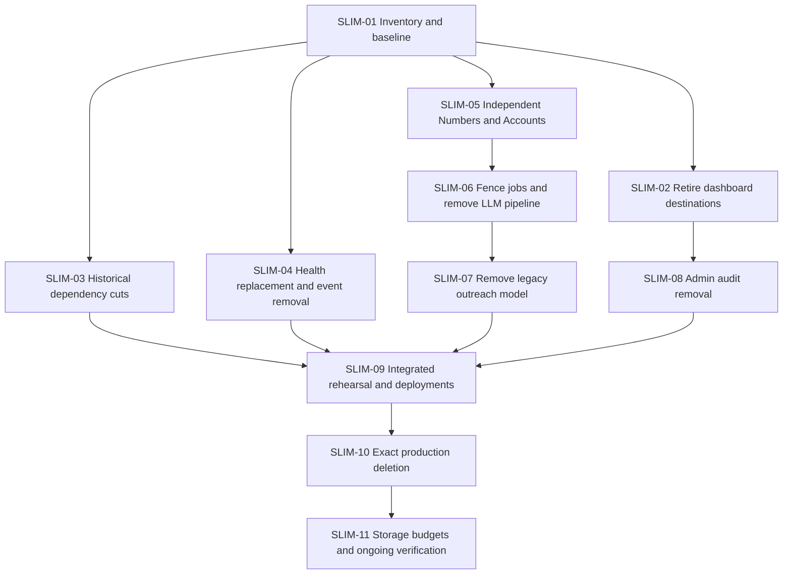

# Ordered implementation and release plan

Status: work packages ready for implementation planning. None has been implemented or certified. Follow [SPECIFICATION](SPECIFICATION.md), [CODE-MAP](CODE-MAP.md) and [DATA-AND-STORAGE](DATA-AND-STORAGE.md). Work packages below are vertical changes with concrete acceptance evidence; they are not GitHub issues created by this task.

## 1. Ordering

SLIM-03/04/05 can be implemented independently after baseline, but shared files (`v1.routes`, SI routers/config/schema, Admin auth/proxy/nav/query helpers, `vercel.json`) require coordinated integration. This document does not launch agents or prescribe simultaneous edits to shared files. Implement smaller reviewable changes, each with exact caller cuts and preservation checks. Do not rely on a merge order that briefly exposes unsafe queries or background work.

## 2. Work packages

### SLIM-01 — Pin scope, inventory and preserve the baseline

Deliverables:

- Record current branches, dirty state, remotes, exact source/deployed SHAs and effective runtime/config ownership without logging secret values. Preserve existing user changes and local hidden Daily Operations pack in any isolated checkout.
- Build the read-only namespace/object/caller/job-stage inventory required by the deletion runbook. Include the exact historical DB, runtime/custom/test collections, configured Admin auth DB, indexes, counts, storage/index bytes and largest payloads.
- Capture representative retained-workflow fixtures, health DTOs, Daily board snapshot/events and replay/idempotency contracts. Pin test inputs, expected outputs and timing; use synthetic/isolated replicas for execution.
- Restore the missing server environment inventory and record which configured names become obsolete; never delete shared secrets before all kept consumers are mapped.
- Inspect sibling MCP, extension and clients callers for retired routes. Separate retired MCP history/analysis tools from retained canonical data tools. Record expected capability retirement and deployment coordination.
- Produce the human-fact disposition report: suppression/restriction authority, Owner instructions/callbacks, assignments, reviewed Number attachments, message uncertainty, and any deployed tracker domain collections not represented by this HEAD.

Acceptance: every planned collection has exact database/name, owner, producers/readers, decision (keep/drop/migrate/unknown), and a reason. Unknown namespaces are excluded from deletion. Baseline proves the Daily Operations code/config/model boundary and captures trusted role behavior. Production inventory is read-only; this planning turn has not run it.

### SLIM-02 — Remove dashboard destinations and their exclusive transports

Deliverables: remove all requested route trees/navigation/title/permission/query/preload/link entries; Health becomes Granot default; remove receipt-search and Live Events GET transports and Admin live BFF. Keep lifecycle requeue and processing. Remove Customer/Agent browse/search entries, dedicated Agent Sales Report and exclusive export routes only after catalog/form caller proof. Keep contextual CSV and Reporting destinations.

Interim SI UI switch should be shipped with SLIM-05/06 readiness; do not mount a two-view facade that still polls Attention or transcription. Old SI view/query links normalize to Numbers; Rep behavior either retains explicit subject scope or shows a truthful unavailable interim surface. Do not let Rep access become an unscoped Numbers browser.

Acceptance: removed direct URLs and BFF GETs unavailable/redirected as specified, zero hidden queries for removed surfaces, Health accessible to its current roles, retained navigation works for Owner/Admin and restricted Rep. In-context CSV succeeds and no longer claims audit persistence. Retained list related panels do not navigate to Customers/Agents/old SI.

### SLIM-03 — Eliminate historical reads and imports

Deliverables: production-only server browse/search/facets/filter catalogs/Analytics/export, delete historical models/merge modules/commands and unused schema branches; remove Admin scope state/selector/persistence/read-only copy. Keep historical_shadow and production record provenance. Retire any scheduled historical import/recreation jobs discovered in deployment.

Acceptance: omitted/production scope works, explicit historical/combined rejects with 400, old browser state is normalized without ID reinterpretation. Pagination, duplicate filters, contact search, source granularity and Analytics reconciliation match the production baseline. A driver spy/instrumented isolated test proves zero `useDb('vantagemovershistorical')` calls. Historical DB is not dropped yet.

### SLIM-04 — Replace Granot Health dependencies and remove OperationalEvents

Deliverables: implement narrow bounded health state and DTO parity, migrate direct activation/requeue provenance, route kept diagnostics to logger/metrics, extract required shared invitation-email transport/config, remove event/incident/report/notification persistence plus Observational HTTP registrations/digest scheduling/config/models and instrumentation-only dependencies.

Acceptance in isolated replica with OperationalEvents family absent:

- Receipt capture/process/retry/dead letter/requeue and activation still commit with replay/revision safeguards; failures roll back correctly.
- Health latest queue/cron run, capture failure, claim recovery and per-code conflicts remain accurate for their lookbacks; fresh empty differs from unknown/stale. Seed/window switch cannot double-count.
- Alerts fire/recover with the established thresholds and restarts/two instances preserve aggregate health state.
- Lead/Booking/Cancellation, Sheet Sync, Reporting delivery/failure scan and invitations work without any OperationalEvent collection appearing. Expected diagnostics exist in the chosen logger/metric sink.
- Daily Operations baseline snapshot, Arrivals, SSE, close and fact timings are unchanged; its independent data is not reclassified.

An event-recorder no-op shim may exist only in an intermediate commit that never reaches the final purge gate. Completion requires no active module/model/producer dependencies.

### SLIM-05 — Make Numbers and RingCentral Accounts independent

Deliverables: new deterministic metadata read facade/DTOs detached from outreach/analysis/conversation, batched canonical Lead/Booking state via retained attachments, clean list/detail UI, direct directory/identity commands and optional directory-context messaging. Split shared schemas/import graph, simplify SI live watch topics and existing freshness/coverage controls. Extract independent Lead-to-number/attachment nominations with durable recovery.

Acceptance with **all exclusive legacy AI/outreach collections absent**:

- Number search/list/detail/call pages work for no Lead, one reviewed Lead, ambiguous multiple Leads, Form/Call, duplicate/bad/no-sync, official Booked/Cancelled and restricted numbers.
- Inbound/outbound/internal/withheld/malformed/provisional/settled calls and later provider revisions retain canonical merge/alias and rollup semantics. No form submission is counted as a call.
- Form Lead creates/phone changes and Granot apply trigger Number/attachment refresh once after commit; duplicate events/no-op observations do not create redundant work. Watermark recovery repairs a missed wakeup.
- Directory freshness/coverage/rep effective dates and reviewed-Agent attach remain truthful. Scoped roles/signatures and Owner command idempotency pass. Accounts sends, if retained, never target a customer and uncertain sends never retry automatically.
- No query reads Outreach, conversations, assessments, Attention or analyses; no old background nomination occurs as a side effect of reads. SSE reconnect refetches retained data only.

### SLIM-06 — Stop and remove server AI/media processing

Deliverables: first enforce producer and dispatcher retirement; revoke/fence leased legacy work, nominations, runtime scoped-run authorization and submit/apply paths. Then remove extraction/application/transcription/media/assessment/AI budget code, internal routes, exports, replay/reanalysis commands, six retired schedules and runnable operations tasks. Keep shared SI queue/capture/recovery. Remove unused dedicated vendor dependencies/env names after full import proof.

Acceptance: enqueue matrix exercises provider capture, terminal call settle, Lead create/update, Granot apply, attachment change, rep change, backfill, rebuild, recovery, cron and direct Owner commands. None can nominate or execute a retired stage. Deliver a late old queue message and attempt old run submission during/after fencing: no vendor call, application effect, resend, collection recreation or active lease. Retained stage workers still progress. Stub vendors and count zero calls under a full representative kept-workflow run. AI packages cannot enter the production import graph through shared Job/model DTOs.

Leased jobs require a real global fence; switching environment flags or cron schedules alone does not stop warm isolates already running. Cancel/revoke with lease epoch checks and require commit-time retirement validation for old submit/apply. Old deployed code must be drained/expired/disabled before purge.

### SLIM-07 — Purge legacy model dependencies and stage human facts

Deliverables: remove old Attention/Closed/ensure/derive/planner/overview/followup modules, schemas and exclusive routes; sanitize retained Number fields/rollups and shared metadata histories using exact field/stage/reference migration. Transfer or inertly preserve required human/provider facts per reviewed disposition; remove legacy AI suggestions without replay. Trim backfill/retention/rebuild to metadata only. Update new-desk coordinator with explicit contract deltas and old URL mapping decision.

Acceptance: no legacy model imported by a kept module; no background effect from an AI-derived promise or old planner. Restrictions remain enforceable even after source transcript removal; human instructions/callbacks are accounted for, not lost silently. New desk remains disabled until its own readiness/approval gates pass. Physical drops occur in SLIM-10, not this code package.

### SLIM-08 — Remove Admin Audit Log storage

Deliverables: remove AdminAuditLog page/API/model and auth/proxy writers/helpers/copy, retain auth users/refresh sessions/invites and signed forwarding.

Acceptance with `admin_audit_logs` absent: Owner/Admin/Rep login, refresh/revoke/logout, expired-token handling, invite flow and role-denied requests retain behavior; command idempotency and signed actor headers forward unchanged; CSV works; no audit collection is recreated. Protect `entity_changes`, Registry Changes and domain/CSI command replay.

### SLIM-09 — Integrated rehearsal and compatibility deployment

Deliverables: apply migrations/deletions to a restored isolated dataset; run retained-workflow acceptance and old-request/late-queue negative tests; capture storage and latency/write-rate comparison; review source and deployment diff. Document exact retained namespace whitelist and exclusive drop manifest. Run server prescribed `pnpm finish-work --provider codex` for meaningful implementation, plus Admin appropriate typecheck/lint/test/build and integrated checks. Record failures and skipped required checks honestly.

Acceptance: retired collections do not exist and remain absent during synthetic cron/queue replay; preserved invariants and roles pass; restored production shape has no dangling operational references; retention cannot erase protected evidence. Daily Operations behavior proof is required, not a sidebar screenshot. Manifest backup restore is demonstrated.

### SLIM-10 — Execute physical deletion

Deliverables: follow [runbook](DATA-AND-STORAGE.md) exactly, using the current approved manifest and deployed revisions. Drop exact historical database, exclusive main DB collections, configured Admin audit collection and exclusive objects. Record count/size/namespace/hash and operator timestamps. Verify no recreation over the observation window.

Acceptance: all authorized targets absent, all protected namespaces present, storage reclaim measured honestly, kept workflows healthy, no retired traffic/provider activity/writes, object inventory reconciled. The execution task provides authorization and final target evidence; no destructive script is generated or run in this planning task.

### SLIM-11 — Bound retained storage for years

Deliverables: enforce retention/index/bounded-payload policies in DATA-AND-STORAGE, publish capacity dashboard/alerts through existing operational infrastructure, document maintenance/restore ownership, certify new-desk storage contract before enabling it. These controls are part of completion, not an optional follow-up after deleting old data.

Acceptance: measured workload with 3-year forecast + burst headroom fits an explicitly chosen tier/budget; retention sweeps are bounded/idempotent/restartable and preserve pending work and referenced evidence; log/object backup retention works; alarms detect growth/failure/freshness loss without resurrecting Mongo OperationalEvents.

## 3. Deployment/cutover sequence

1. **Compatibility server release:** add independent Number/Account reads, health state/provenance, retained nomination path and new auth/DTO support. Keep data intact. New front-end contract can be versioned/additive until Admin is deployed. Health warmup/seed has a fence and explicit coverage.
2. **Slim Admin release:** delete removed surfaces and pollers; two SI tabs; Health default; production-only scope and audit writers removed. Existing server still supports kept calls during rollout. Verify active user sessions and retained direct paths.
3. **Retirement server release:** disable/revoke old effects at producer and commit/dispatcher boundaries, remove old endpoints/crons/imports and complete health switch. Coordinate MCP capability retirement. Inspect actual deployed schedules/triggers and old preview/rollback deployments; code deletion in a checkout is insufficient.
4. **Quiesce and observe:** record cutover instant; no leased/runnable legacy stage, zero old writes/provider calls, all late deliveries safe. Observe at least 48 hours spanning daily schedules and reconnects; explicitly replay/rehearse any less-frequent path rather than assuming silence proves it safe. Keep retained capture/subscriptions/recovery on.
5. **Backup + exact purge:** verify protected baseline and separately back up historical DB and Admin audit (current main DB job does not cover either). Final data/object manifests, dry-run rehearsal evidence and deployed SHAs agree. Execute explicit deletion task.
6. **After purge:** observe another 48 hours or longer if traffic is too low to exercise preserved workflows; force synthetic safe cron/queue negative cases. Retired collections stay absent; capacity report and acceptance ledger complete.
7. **New desk:** implementation can proceed against retained contracts earlier, but enforcement/activation follows its separate packet and data-readiness gates. It must not recreate the legacy model or depend on purged AI history.

## 4. Rollback limits

Before physical purge, rollback may restore code/UI while keeping retired producer fences on; do not resume AI jobs automatically. If the Health replacement fails, retain event storage until repaired and delay purge. If Numbers needs a removed module, repair the independent projection instead of shipping a hidden dependency.

After purge, rolling back to old code is unsafe: it can recreate collections, fail on missing models or resume LLM/media jobs. Prefer a forward fix with retired fences. Data recovery requires verified isolated restoration followed by selective explicit restore under maintenance fencing. Never overwrite newer kept Leads/Bookings with a pre-purge full-database restore. Restoring removed evidence is a separate decision and does not enable old producers. Snapshot/backup lifecycle remains finite and reviewed.

## 5. Retained-workflow acceptance matrix

| Scenario | Required proof |
| --- | --- |
| Public Form Lead, duplicate and bad lead | Ingestion/origin/contact snapshots, duplicate classification, CRM post ordering, Sheet Sync and confirmation SMS unchanged |
| Qualified inbound Call Lead + polling fallback | Answered ≥120s qualification, idempotent ingest, source routing, CPL and duplicate behavior unchanged |
| Granot webhook + extension + HTTP Automation | Capture/dedupe/retry/decision/apply and scoped contact update unchanged; receipts exist without browse UI |
| Intake finalization, Release review, requeue, No Action | Owner gates/revision conflict/idempotency; official records created/updated only through canonical commands |
| Manual create, exact-job Employee/Owner Booking, Leadless Booking connect | Optional Customer linkage/upsert, reconciliation, no-sync routing, lead attachment and official mirrors unchanged |
| Booking update/delete, Cancellation create/delete | Agent allocations, refunds, active Record Link release and unwind unchanged |
| Daily snapshot/events/live/Arrivals/solo lane/close | Same stored fact counts/metrics/provenance/colours; reconnect/backfill/NY rollover; untouched domain hooks |
| Job Timeline | EntityChange/provenance/official lifecycle chain retained without links to removed pages |
| Analytics/Overview | Production scoped totals/Agent attribution match baseline; historical/combined refused |
| Reporting/Registry/Ingestion/Extension | Definitions/revisions/delivery/retry, catalogs/CPL corrections, ingress fencing and login/session invalidation unchanged |
| Numbers/Accounts | Metadata/attachments/restrictions/coverage work with deleted schemas; effective-date identities and rate gate remain |
| Auth/CSV/invitations | No Admin audit writes, trusted role/signature/session/replay behavior preserved; retained download/email works |
| Legacy cron/job/queue/run submission | Explicit retired response/ack with no effect and no recreated namespace/object/vendor call |

Acceptance evidence for implementation belongs in `docs/server-admin-slimming/evidence/` with per-package revision, environment, inputs, outputs, executed/skipped checks and limitations. No empty “passed” ledger is created in this planning task.
