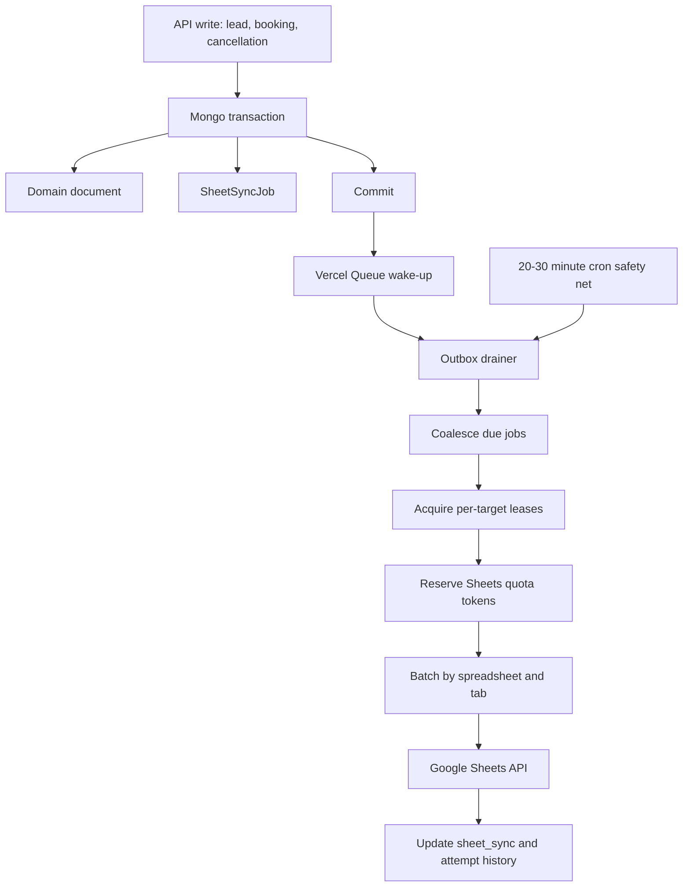

# Sheet Sync Queue Batching Architecture

**Status:** implemented (all 7 phases) in `vantage-main-server`. Ships dormant:
`SHEET_SYNC_MODE` defaults to `legacy` in code, so deploying changes nothing
until production sets `SHEET_SYNC_MODE=queued`. See the Rollout and Emergency
Fallback sections below.

## Purpose

Google Sheets sync currently runs as an immediate side effect of lead, booking,
and cancellation writes. Most create/update paths schedule work through Vercel
`waitUntil`, while several delete paths still call the Sheets delete functions
inline. This keeps the API response fast in the happy path, but it does not give
the sync work durable state, and it still performs many small Google Sheets API
requests during bursts.

The target architecture makes MongoDB the real-time source of truth and treats
Google Sheets as an eventually consistent projection. API writes persist the
domain change plus durable sync intent in MongoDB, then Vercel Queues wake a
worker that drains, coalesces, rate-limits, and batches Google Sheets writes.

## Current Problem Shape

The current scheduler in `api/services/sheetSync/sheetSyncCoordinator.ts` uses
`waitUntil` to run `runFullSheetSyncProcess(job)` after the API response:

```ts
waitUntil(
  runFullSheetSyncProcess(job).catch((error) => {
    logger.error(...);
  }),
);
```

That design is vulnerable to three failure modes:

- The background invocation is still bounded by serverless execution limits.
- Retry sleeps happen inside the same invocation.
- Each document sync expands into several per-target Google Sheets requests.

`api/services/googleSheets/retry.ts` already retries `429`, quota, and `503`
errors with exponential backoff. That is useful for short transient failures,
but it cannot solve quota pressure caused by bursts. A single lead sync can
touch master and source sheets, verify or scan rows, update headers, append or
update rows, and persist row metadata. Retrying each individual request inside
one function only makes the invocation longer.

Delete paths are also inconsistent with the desired async model:

- `api/services/leads/formLead.service.ts` calls `deleteFormLeadFromSheets`
  inline before deleting the form lead.
- `api/services/leads/callLead.service.ts` calls `deleteCallLeadFromSheets`
  inline before deleting the call lead.
- `api/services/bookings/bookedLead.service.ts` calls
  `deleteBookedLeadFromSheets` inline before deleting the booking.
- `api/services/cancellations/cancelledLead.service.ts` calls
  `deleteCancelledLeadFromSheets` inline and then directly syncs booking/source
  state in the delete flow.

## Goals

- Keep MongoDB as the only real-time source of truth for dashboard/API behavior.
- Make all Google Sheets sync work durable, retryable, observable, and
  eventually consistent.
- Batch by spreadsheet/tab to reduce Google API request volume.
- Enforce Google Sheets API quota budgets proactively before receiving `429`.
- Preserve the existing `scheduleFullSheetSyncProcess` API as a compatibility
  and emergency fallback boundary.
- Support local development safely without touching production sheet IDs.
- Add admin visibility for sync health, failed jobs, runs, attempts, and retry.
- Build the foundation that a later Heal button and reconciliation cron can
  reuse.

## Non-Goals For Phase One

- Do not build the Heal button yet.
- Do not perform full DB-to-sheet reconciliation yet.
- Do not dual-write legacy and queued sync paths to live sheets.
- Do not replace MongoDB dashboard reads with Google Sheets reads.
- Do not move CRM submission into the sheet-sync outbox in this phase.
- Do not add a permanent row-index collection unless later profiling proves the
  batch tab-map strategy is too slow.

## Core Decisions

- MongoDB is the source of truth; Google Sheets may lag.
- Use a MongoDB outbox as durable job state.
- Use Vercel Queues as a wake-up signal, not as the primary job store.
- Keep queued jobs domain-level and reload current Mongo state when processing.
- Coalesce create/update jobs into latest-state upserts.
- Let delete tombstones win over older pending upserts.
- Coalesce booking and cancellation chain jobs by root entity.
- Use a 10-30 second normal debounce window.
- Target 30-60 second normal sheet freshness.
- Allow 5-15 minute burst lag when Google quota is saturated.
- Use one queue topic and one central outbox drainer.
- Use per-spreadsheet/tab Mongo leases for limited parallelism.
- Use a Mongo-backed read/write quota limiter.
- Keep document-level `sheet_sync` metadata.
- Add job, run, and attempt history from the start.
- Persist target-level outcomes and retry failed targets where possible.
- Use targeted Mongo transactions for domain write plus outbox write.
- Publish the Vercel Queue wake-up only after transaction commit.
- Keep Google Sheets calls and queue publishing outside Mongo transactions.
- Add `SHEET_SYNC_MODE=queued|legacy|disabled`.
- Treat `queued` as the intended production default after deployment.
- Keep `legacy` as emergency fallback.

## Target Flow



## Queue Topology

Use one Vercel Queue topic, for example `sheet-sync-events`, with environment
scoping:

- Production: `sheet-sync-events`
- Preview/development/test: `sheet-sync-events-dev` or an equivalent
  environment-prefixed name

The message payload should be intentionally small:

```json
{
  "kind": "sheet_sync_wakeup",
  "reason": "domain_write",
  "run_hint": null
}
```

The queue does not decide which lead or booking to process. The consumer only
wakes the Mongo outbox drainer. MongoDB decides which jobs are due, which jobs
coalesce, what priority they have, and whether enough quota budget exists.

This keeps quota enforcement centralized. Separate domain queues would not
increase the Google Sheets quota and could create multiple competing workers
that accidentally recreate the current rate-limit storm.

## Durable Outbox Model

Add a `SheetSyncJob` collection for durable work.

Core fields:

- `_id`
- `status`: `pending | retrying | processing | synced | failed | cancelled`
- `priority`: numeric priority for sorting
- `resource`: `source_lead | booked_lead | booking_chain | cancellation_chain | delete_source_lead | delete_booked_lead | delete_cancelled_lead`
- `operation`: original operation label, such as `form_lead.create`
- `entity_model`: `FormLead | CallLead | BookedLead | CancelledLead`
- `entity_id`
- `coalescing_key`
- `target_hints`: optional array of expected target identifiers
- `tombstone`: optional delete metadata
- `due_at`
- `leased_until`
- `lease_owner`
- `attempts`
- `last_error`
- `last_error_at`
- `created_by`: `api | cron | admin | script`
- `run_id`
- timestamps

Suggested indexes:

- `{ status: 1, due_at: 1, priority: -1, createdAt: 1 }`
- `{ coalescing_key: 1, status: 1 }`
- `{ leased_until: 1 }`
- `{ entity_model: 1, entity_id: 1, status: 1 }`
- Partial unique index for active coalescing keys where `status` is
  `pending`, `retrying`, or `processing`, if Mongoose/Mongo behavior is clean
  enough for the final implementation.

Add `SheetSyncRun` for drainer-level history:

- `_id`
- `trigger`: `queue | cron | admin | script`
- `status`: `running | completed | partial_failure | failed`
- `started_at`
- `finished_at`
- `claimed_job_count`
- `synced_job_count`
- `failed_job_count`
- `deferred_job_count`
- quota summary
- error summary

Add `SheetSyncAttempt` for target/batch-level history:

- `_id`
- `run_id`
- `job_id`
- `target`
- `spreadsheet_id`
- `tab_name`
- `action`: `lookup | update | append | delete | ensure_headers`
- `status`: `synced | failed | deferred`
- `row_number`
- `google_operation`
- `google_status`
- `google_reasons`
- `request_count_estimate`
- `payload_bytes_estimate`
- `error`
- timestamps

Add lease/rate-limit records:

- `SheetSyncLease` keyed by spreadsheet/tab or other target scope.
- `SheetSyncQuotaBucket` keyed by quota scope and operation class.

The exact collection names can follow existing model naming conventions during
implementation.

## Coalescing Rules

Jobs stay domain-level and should not store the primary sheet row payload.
Workers reload the latest Mongo state immediately before building sheet rows.

Coalescing keys:

- Form lead: `source_lead:FormLead:<id>`
- Call lead: `source_lead:CallLead:<id>`
- Booked lead only: `booked_lead:<id>`
- Booking chain: `booking_chain:<bookingId>`
- Cancellation chain: `cancellation_chain:<cancellationId>` plus booking-chain
  linkage as needed
- Delete source lead: `delete_source_lead:<model>:<id>`
- Delete booked lead: `delete_booked_lead:<id>`
- Delete cancellation: `delete_cancelled_lead:<id>`

Rules:

- Multiple pending creates/updates for the same source lead collapse into one
  latest-state upsert.
- Lead update jobs caused by enrichment or form-fill detection collapse into the
  same source-lead coalescing key.
- Booking changes collapse into a booking-chain job because the booked row and
  source lead row can both need refresh.
- Cancellation changes collapse into a cancellation-chain job because the
  cancellation row, booking row, and source lead row can need refresh.
- Delete tombstones supersede pending upsert jobs for the same entity.
- Target-level failures remain retryable without rewriting already successful
  targets unless the source document changes again.

## Priority Order

The drainer should sort due jobs by priority and then age.

Recommended priority:

1. Delete tombstones.
2. Booking chains.
3. Cancellation chains.
4. New lead creates.
5. Lead updates and enrichment-style refreshes.

This prevents large lead update bursts from starving deletes, bookings, and
cancellations.

## Transaction Boundaries

Use targeted Mongo transactions for domain write plus outbox write on the
sheet-writing paths:

- form lead create/update/delete
- call lead create/update/delete
- RingCentral call lead creation
- booking create/upsert/update/delete
- referral booking sheet sync scheduling
- cancellation create/update/delete
- duplicate/form-fill call lead updates that schedule sync
- booked-call-lead reconciliation updates that schedule sync
- call lead enrichment updates that schedule sync

The transaction should include only MongoDB state:

- domain document changes
- mirrored lead/booking/cancellation flags
- outbox job/tombstone creation
- any source-document state required for the write path

The transaction must not include:

- Google Sheets API calls
- Vercel Queue publishing
- CRM HTTP calls
- long sleeps or retries

Failure behavior:

- If the Mongo transaction fails before commit, neither the domain write nor the
  outbox job exists. The API should return an error.
- If the transaction commits but queue publish fails, the outbox job remains
  pending and the cron safety net can recover it.
- If a worker crashes after claiming jobs, leases expire and the jobs become
  eligible again.
- If Google rate-limits the worker, jobs move to `retrying` with a
  `next_attempt_at`/`due_at` based on the quota budget and backoff.
- If max attempts are exhausted, jobs become `failed` but remain visible and
  admin-retryable.

## CRM Ordering

Form lead CRM submission is adjacent to, but not part of, the sheet-sync
transaction.

Normal form lead create sequence:

1. Validate request.
2. Create form lead and sheet outbox job in a Mongo transaction.
3. Commit.
4. Publish queue wake-up.
5. Submit CRM using the committed form lead, including Mongo ID.
6. Log or persist CRM result using the existing response shape.

The Mongo ID still propagates to CRM, but CRM latency/failure does not hold open
or roll back the transaction.

Adjacent future requirement:

- If lead creation fails after route validation, attempt degraded CRM submission
  from the request payload without Mongo ID and log it as `no_mongo_id`.

That degraded CRM fallback should be documented as adjacent work and should not
block phase-one sheet queue implementation.

## Delete Tombstones

Hard deletes require durable tombstones because the worker cannot reload a
deleted Mongo document later.

Before deleting a domain document, create a tombstone job in the same Mongo
transaction. Tombstone payload should include:

- entity type
- entity id
- source company, if relevant
- duplicate flag, if relevant
- previous `sheet_sync` entries with target, tab, spreadsheet ID, and row number
- linked booking/cancellation/source lead ids, if relevant
- enough target hints to recompute fallback delete targets when row numbers are
  stale

Worker behavior:

1. Group delete tombstones by spreadsheet/tab.
2. Prefer known row numbers from tombstone metadata.
3. Validate that the row still contains the Mongo ID when feasible.
4. Build a tab map when row numbers are missing or stale.
5. Delete rows in descending row-number order to avoid row-shift corruption.
6. Record target-level outcomes.

Queued mode should not preserve inline Google Sheets deletes.

## Google Sheets Quota Policy

Google Sheets API limits to encode in config documentation:

- 300 read requests per minute per project.
- 300 write requests per minute per project.
- 60 read requests per minute per user/service account.
- 60 write requests per minute per user/service account.
- Recommended maximum payload of 2 MB.
- 180 second maximum request processing timeout.

Service account calls count against one account, so the per-user/service-account
budget is the binding constraint for this app.

Implementation should define documented constants for the Google limits and
separate operational budgets that are env-overridable. Conservative starting
budgets should reserve headroom, for example:

- `SHEET_SYNC_READS_PER_MINUTE_BUDGET=45`
- `SHEET_SYNC_WRITES_PER_MINUTE_BUDGET=45`
- `SHEET_SYNC_PROJECT_READS_PER_MINUTE_BUDGET=250`
- `SHEET_SYNC_PROJECT_WRITES_PER_MINUTE_BUDGET=250`
- `SHEET_SYNC_MAX_PAYLOAD_BYTES=1500000`

The exact defaults can be tuned during implementation, but the worker should
never assume it can use the entire documented quota.

Quota limiter behavior:

- Track read and write budgets separately.
- Track service-account/user and project scopes separately where practical.
- Reserve tokens before making Google calls.
- Count each Google API call and batch subrequest according to Google quota
  behavior.
- Defer work when budget is exhausted instead of sleeping inside one function.
- Use `Retry-After` and truncated exponential backoff when Google returns
  `429`, quota, or `503`.

Keep `withSheetsRetry` or equivalent short retries for brief transient errors,
but durable retry/backoff belongs in outbox state.

## Batching Strategy

Batch by `spreadsheetId + tabName`.

Use the right Google API method for each shape:

- `spreadsheets.values.batchGet` to read needed ranges for one or more tabs.
- `spreadsheets.values.batchUpdate` for known-row updates.
- `spreadsheets.values.append` with multiple rows for grouped inserts.
- `spreadsheets.batchUpdate` for grouped deletes, tab creation, and structural
  requests.

Row lookup:

- Keep `Mongo ID` as the canonical sheet identity.
- Continue storing row numbers in each document's `sheet_sync` metadata.
- In each batch, trust known row numbers only after lightweight validation when
  needed.
- For missing/stale row numbers, read the tab once and build a Mongo ID to row
  number map.
- Do not scan the full tab per entity.

Header/tab handling:

- Keep normal hot-path header ensures minimal.
- Prefer provisioning or explicit maintenance jobs for full tab/header repair.
- Avoid rewriting headers during every row sync.

Payload and atomicity:

- Split batches below the configured payload byte cap.
- Split batches so one invalid request does not fail too much unrelated work.
- Remember that Google batch requests are atomic per request.

## Worker Algorithm

High-level drain loop:

1. Create a `SheetSyncRun`.
2. Query due `pending`/`retrying` jobs ordered by priority and age.
3. Claim a bounded number of jobs with leases.
4. Coalesce jobs by coalescing key.
5. Resolve each coalesced job into one or more target operations by reloading
   current Mongo state or reading tombstone data.
6. Group operations by spreadsheet/tab.
7. Acquire per-spreadsheet/tab leases.
8. Reserve read/write quota tokens.
9. Build tab-level row maps where needed.
10. Split operations by payload/request limits.
11. Execute batch reads/writes/deletes.
12. Update document `sheet_sync` metadata for successful targets.
13. Record `SheetSyncAttempt` rows.
14. Mark jobs `synced`, `retrying`, `failed`, or partially complete.
15. Release leases and complete the run summary.

Config-driven guardrails:

- max jobs claimed per drain
- max coalesced entities per drain
- max rows per spreadsheet/tab batch
- max write subrequests per API call
- max payload bytes
- max run duration
- lease duration
- debounce window
- max attempts

## Local And Test Safety

Vercel Queues can be used under `vercel dev` when available, but local/dev must
never target production sheets.

Rules:

- Queue topic names must be environment-scoped.
- Sheet target resolution must honor test/dev sheet env vars.
- `TEST_MODE` and selected Mongo database must be visible in logs.
- If Vercel Queue credentials/runtime are unavailable locally, the queue adapter
  may no-op after saving the outbox job or directly invoke the drainer in tests.
- Tests and scripts should be able to call the drainer directly.

Use an adapter such as `sheetSyncQueue.service.ts`:

- production: publish to Vercel Queue
- development with queue available: publish to dev/test topic
- test/local fallback: no-op or direct drain, depending on test needs

## Admin And Cron Surface

First admin endpoints should be protected under the existing `/api/v1/admin`
surface in `api/routes/v1.routes.ts`.

Suggested endpoints:

- `GET /api/v1/admin/sheet-sync/health`
- `GET /api/v1/admin/sheet-sync/jobs`
- `GET /api/v1/admin/sheet-sync/runs`
- `GET /api/v1/admin/sheet-sync/runs/:id`
- `POST /api/v1/admin/sheet-sync/retry`

The first implementation should expose health, recent runs/attempts,
pending/failed jobs, and retry. It should not implement full Heal orchestration.

Add a lightweight cron in `vercel.json` every 20-30 minutes. Its route should
wake or directly invoke the drainer for due pending/retry jobs. The cron is
required because queue publish failures must not lose work.

## Rollout

Roll out with `SHEET_SYNC_MODE=queued` as the intended production default after
deployment. Keep `SHEET_SYNC_MODE=legacy` as emergency fallback and
`SHEET_SYNC_MODE=disabled` for explicit suspension.

Avoid true shadow writes because dual-writing to Sheets can create duplicates or
conflicting row metadata. If shadowing is needed, shadow job creation/logging
only, not live sheet writes.

Operational rollout checklist:

1. Deploy models, queue adapter, drainer, admin endpoints, and cron.
2. Confirm env-scoped queue topic and sheet target config.
3. Confirm queued mode is active.
4. Watch sync health, run summaries, quota deferrals, and failed jobs.
5. Use admin retry for failed jobs.
6. Use legacy mode only as emergency fallback.

If `legacy` is used after queued tombstone jobs exist, operators need clear
guidance because legacy direct-delete behavior cannot replay already-created
tombstones.

### Emergency Fallback Runbook

If queued mode misbehaves in production:

1. **Flip the flag.** Set `SHEET_SYNC_MODE=legacy` (or `disabled` to fully
   suspend) in the Vercel project env and redeploy/redeploy-promote. The switch
   point is `getSheetSyncMode()`; every domain write path and both the cron and
   queue consumer honor it immediately. Legacy restores the original
   `waitUntil`/inline-delete behavior with zero schema migration.
2. **Drain the in-flight backlog first (preferred).** Before flipping, let the
   outbox finish: trigger the cron route
   `POST /api/cron/sheet-sync-drain` (header `x-cron-secret: $CRON_SECRET`) or
   the queue consumer until `GET /api/v1/admin/sheet-sync/health` shows
   `pending: 0`. Jobs left `pending` when you flip to legacy are NOT replayed by
   legacy code; they remain in `sheet_sync_jobs` and resume if you flip back to
   queued.
3. **Inspect.** Run
   `node --env-file=.env ./node_modules/tsx/dist/cli.mjs scripts/google_sheets/inspect-sheet-sync-queue.ts`
   for a quick CLI snapshot (status counts, oldest live job, recent failures,
   recent runs), or use the admin endpoints
   (`/api/v1/admin/sheet-sync/health|jobs|runs|runs/:id`).
4. **Retry failures.** `POST /api/v1/admin/sheet-sync/retry` re-queues `failed`
   jobs (default) or an explicit `job_ids[]` list back to `pending` and publishes
   a wake-up. It never deletes or force-writes rows.
5. **Caveat on delete tombstones.** Any `delete_*` jobs already created while in
   queued mode will only be applied by a queued-mode drain. If you stay in legacy
   long-term with outstanding tombstones, either briefly flip back to queued to
   drain them or perform the row deletions manually.

Structured log lines to watch (all JSON `msg` fields): `*.sheet_sync.queued`,
`sheet_sync.outbox.enqueued`, `sheet_sync.outbox.tombstone_enqueued`,
`sheet_sync.queue.published`/`publish_failed`, `sheet_sync.drain.claimed`,
`sheet_sync.drain.quota_deferral`, `sheet_sync.drain.run_summary`,
`sheet_sync.drain.run_failed`, and `sheet_sync.consumer.drained`.

## Phase Two: Heal Button And Reconciliation

The Heal button should reuse the same worker primitives:

- target resolution
- tab-level Mongo ID maps
- batch update/append/delete
- quota limiter
- leases
- run/attempt history
- admin status polling

Phase-two Heal flow:

1. Admin starts a scoped heal run.
2. System reads Mongo source-of-truth rows.
3. System reads target sheet rows by Mongo ID.
4. System diffs expected vs actual sheet state.
5. System creates repair jobs or directly feeds the batcher under the same quota
   and lease controls.
6. Admin UI polls run status.

Daily or every-other-day reconciliation should use the same engine. It should
not be a second sync implementation.

## Implementation Plan

### Phase 1: Models And Config

- Add sheet sync job, run, attempt, lease, and quota bucket models.
- Add sync mode and queue/topic config under `api/config/`.
- Add documented Google Sheets quota constants and env-overridable operational
  budgets.
- Add tests for coalescing keys, priority ordering, quota config parsing, and
  retry classification.

### Phase 2: Queue Adapter And Scheduler Boundary

- Add a queue adapter around Vercel Queue publishing.
- Preserve `scheduleFullSheetSyncProcess`.
- In queued mode, make scheduler calls create/upsert outbox jobs and publish one
  wake-up after commit.
- In legacy mode, preserve the current `waitUntil` behavior.
- In disabled mode, log and mark sync intent according to the final operational
  decision.

### Phase 3: Targeted Transactions

- Add a small transaction helper.
- Thread sessions through the sheet-writing domain paths touched by phase one.
- Ensure domain write plus outbox write commits atomically.
- Keep CRM and queue publish after commit.
- Add transaction failure tests around representative create/update/delete paths.

### Phase 4: Drainer And Batcher

- Implement the central outbox drainer.
- Add coalescing, leases, quota reservation, and run/attempt history.
- Implement tab-level row maps.
- Implement batch update, multi-row append, and descending batched deletes.
- Update document `sheet_sync` metadata from target-level outcomes.
- Add tests using mocked Google Sheets clients.

### Phase 5: Delete Tombstones

- Replace inline delete sync calls in queued mode with tombstone jobs.
- Capture prior sheet metadata before hard delete.
- Handle booking/cancellation/source lead chains.
- Add tests for descending row deletes and stale row-number fallback.

### Phase 6: Admin And Cron

- Add protected admin read/retry endpoints under `/api/v1/admin/sheet-sync`.
- Add validation schemas for list/retry inputs.
- Add a 20-30 minute cron route and `vercel.json` entry.
- Add tests for admin service methods and cron drainer invocation.

### Phase 7: Rollout And Observability

- Add structured logs for queue publish, job claim, coalescing, quota deferral,
  target success/failure, and run summaries.
- Add scripts or docs for inspecting pending/failed jobs.
- Document emergency fallback to legacy mode.
- Monitor production quotas and tune operational budgets.

## Acceptance Criteria

- API create/update/delete paths no longer depend on Google Sheets completing in
  request or `waitUntil` execution when queued mode is active.
- A Mongo transaction either commits both the domain write and outbox job or
  commits neither.
- Queue publish failure leaves recoverable pending work.
- Worker coalesces repeated updates for the same entity.
- Worker batches by spreadsheet/tab.
- Worker enforces configured Google Sheets read/write budgets.
- Worker records target-level success/failure.
- Document `sheet_sync` metadata continues to update for successful targets.
- Deletes use durable tombstones and process rows in descending order.
- Admin endpoints show health, jobs, runs, attempts, and allow retry.
- Cron safety net drains due work every 20-30 minutes.
- Local/dev queue behavior uses dev/test topics and test sheet IDs or falls back
  safely without touching production sheets.

## References

- `api/services/sheetSync/sheetSyncCoordinator.ts`
- `api/services/sheetSync/sheetSyncSourceLookup.ts`
- `api/services/sheetSync/sheetSyncPersistence.ts`
- `api/services/googleSheets/googleSheets.service.ts`
- `api/services/googleSheets/syncRows.ts`
- `api/services/googleSheets/deleteRows.ts`
- `api/services/googleSheets/rowLookup.ts`
- `api/services/googleSheets/tabs.ts`
- `api/services/googleSheets/retry.ts`
- `api/services/leads/formLead.service.ts`
- `api/services/leads/callLead.service.ts`
- `api/services/leads/duplicateLead.service.ts`
- `api/services/bookings/bookedLead.service.ts`
- `api/services/cancellations/cancelledLead.service.ts`
- `api/routes/v1.routes.ts`
- `vercel.json`
- [Vercel Queues](https://vercel.com/docs/queues)
- [Google Sheets API limits](https://developers.google.com/workspace/sheets/api/limits)
