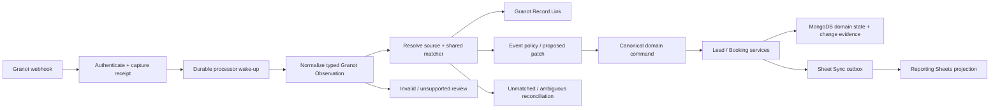

# Granot webhook domain and service model

> **Status vs code:** capture + security (Units 02–03) and callable Observation normalization/persistence (Unit 04) are implemented. Capture does not invoke normalization. The processor is **not** live. Current capture: [`.cursor/businesslogic/granotLifecycle.capture.md`](../../.cursor/businesslogic/granotLifecycle.capture.md). Current normalization: [`.cursor/businesslogic/granotLifecycle.normalization.md`](../../.cursor/businesslogic/granotLifecycle.normalization.md).

Status: architecture recommendation based on repository code and a read-only profile of `vantagemovers.granot_webhook_receipts` on 2026-08-13. This document proposes boundaries and rollout steps; it does not mean webhook-driven mutations are enabled.

## Executive recommendation

Keep the current webhook collection as an immutable inbox, normalize each receipt into a typed **Granot Observation**, resolve it through one shared matching service, persist a durable **Granot Record Link**, and apply allowed changes through the existing lead/booking services and Sheet Sync outbox.

Do not make a webhook route directly update a Lead, create a Booking, or write Reporting Sheets. The route should only authenticate and durably capture. A retryable processor should own normalization, matching, policy, domain commands, and processing outcomes.

The most important modeling distinction is:

| Dimension | Example | Meaning |
| --- | --- | --- |
| Source system | `granot` | Where the observed business state lives |
| Observation Channel | `granot_webhook`, `browser_extension`, `granot_http_automation` | How Vantage learned about the state |
| Actor | Granot system, extension Owner, automation initiator | Who initiated the Vantage command, when known |
| Cause | receipt ID, automation run/action, HTTP request | Why this particular command ran |
| Domain change | quoted/cubic/location/receiver update | What changed in MongoDB |
| Projection | Sheet Sync job | What must eventually reflect the MongoDB change |

The extension, HTTP automation, and webhook are three Observation Channels for the same source system. Treating each channel as a different authority will create avoidable last-write-wins bugs.

## Verified live-data profile

The production database and collection were reached successfully with a read-only script using the Mongo connection configured for the Vantage Movers MCP server. The script emitted field names, types, counts, matching coverage, and safe enum-like values; it did not print customer values.

### Collection inventory

`vantagemovers` exists and includes the expected core collections (`form_leads`, `call_leads`, `booked_leads`, `domain_command_executions`, `sheet_sync_jobs`, and others). `granot_webhook_receipts` existed with 133 documents:

| Route-derived event type | Count | Receipt range | Processing state |
| --- | ---: | --- | --- |
| `lead_created` | 58 | 2026-08-10 through 2026-08-13 | all `received` |
| `priority_updated` | 58 | 2026-08-10 through 2026-08-13 | all `received` |
| `booking_status_changed` | 17 | 2026-08-10 through 2026-08-13 | all `received` |

All payloads were objects whose leaf fields were strings. There were no exact duplicate payloads in this sample, but that does not establish a provider idempotency guarantee.

### Payload facts that affect the model

- All three event classes carry a broad lead/job snapshot: `job_no`, `ref_no`, contact fields, origin/destination fields, `est_cf`, `service_type`, and source.
- The schema has already drifted: one payload used `Source` instead of `source`, and one used `Move date` instead of `move_date`.
- The priority payload additionally carries `priority`, `estimate`, `user`, `rep`, and occasionally `payment`/`balance`.
- The booking payload carries `priority`, `estimate`, `payment`, `balance`, `user`, and `rep`.
- The route-derived type and payload type are not the same concept. One receipt accepted on the `priority_updated` route had payload `event_type: "Booked"`.
- Booking payload `event_type` values observed were `Booked`, `booked`, and `Releas`. There is no separate, stable booking-status field yet.
- No provider event ID, source occurrence time, or source revision was observed. `received_at` is Vantage transport time, not proof of Granot event order.
- `user`/`rep` must not be assumed to be the person who changed the record. Existing code interprets these fields as receiver/sales-rep identity.

### Granot priority is not a 0-5 enum

Observed priority values were:

| Priority | Count in `priority_updated` |
| --- | ---: |
| `0` | 1 |
| `1` | 17 |
| `2` | 2 |
| `3` | 1 |
| `5` | 6 |
| `7` | 10 |
| `8` | 18 |
| `9` | 3 |

Current extension and HTTP automation rules understand only `0`, `1`, and `5`, and only `1`/`5` authorize quote/cubic updates. Priorities `2`, `3`, `7`, `8`, and `9` must remain raw Granot Priority values and be blocked from mutation until their business meanings are confirmed.

### Current matching coverage

Every receipt had a non-empty `job_no`, but none of those job numbers matched current `call_leads` or `booked_leads` by `job_no`/`normalized_job_no`. Job number should become the strongest Granot identity after a safe first match, but it is not currently populated enough to solve initial matching.

For `lead_created`:

| Granot source | Receipts | Unique exact Form Lead `ref_no` | No current candidate |
| --- | ---: | ---: | ---: |
| Top10 Forms | 7 | 7 | 0 |
| TBM Forms | 10 | 10 | 0 |
| TBM Forms Prime | 1 | 1 | 0 |
| Best Relocation Forms | 12 | 0 | 12 |
| Paid Overflow | 25 | 0 | 25 |

Across all event classes, exact Form Lead `ref_no` matching was productive for Top10/TBM form sources, while inbound sources were more likely to have a source-compatible Call Lead phone candidate. This supports channel-aware matching rather than one global lead query.

The receipt sequence also cannot be modeled as a complete event stream: only 13 Granot identities had a captured `lead_created` followed by `priority_updated`, while 39 had a priority observation without an earlier lead-created receipt in the current collection.

### Header-capture security finding

The current denylist removes `authorization`, `cookie`, and `x-api-secret`, but stored receipts include infrastructure headers such as `x-vercel-oidc-token`, proxy signatures, forwarded IPs, and location headers. Header capture should switch to a small allowlist (for example content type, user agent, provider delivery ID when added, and a safe request correlation ID). Existing sensitive headers should not be exposed through admin APIs or logs; any purge/retention action needs an explicitly approved operational plan.

## Current code seams worth preserving

The repository already has most of the hard primitives:

- `granot_webhook_receipts` is a durable inbox and routes return `202` only after capture.
- Form matching already uses exact provider `ref_no`, historical Mongo `_id` compatibility, and source-gated contact fallback.
- The browser extension Form Lead sync sends an expected field snapshot; the server applies a conditional update and preserves fill-only location rules.
- Granot HTTP automation stores plans, checks drift, fences work with a lease, records per-action outcomes, and recognizes already-applied state.
- Call Lead Enrichment matches by job/phone with source compatibility and persists Sheet Sync intent transactionally.
- RingCentral has cross-path idempotency through the unique `ringcentral.telephony_session_id` index.
- Canonical domain commands already persist `domain_command_executions` with checksum, provenance, entity references, and an idempotency key.
- Lead and Booking services already own Sheet Sync scheduling. Calling those services preserves Mongo-as-System-of-Record behavior.

There are also gaps to close rather than duplicate:

- Canonical command origins currently allow only `external_sheet_ingestion` and `vantage_admin`.
- Existing enrichment paths do not all enter the canonical command seam or record the same provenance dimensions.
- HTTP automation uses `extension_crm_username_match` as receiver provenance even though the channel is HTTP automation; this conflates the data derivation rule with the Observation Channel.
- The raw receipt's single `processing_status` cannot express normalization, matching, policy, application, and projection independently.

## Proposed domain model

### 1. Granot Webhook Receipt: immutable transport evidence

Continue to store the authenticated request before acknowledging it, but treat the raw envelope as immutable evidence rather than the processing aggregate.

```ts
type GranotWebhookReceipt = {
  receipt_id: ObjectId;
  provider: "granot";
  route_event_type:
    | "lead_created"
    | "priority_updated"
    | "booking_status_changed";
  received_at: Date;
  safe_headers: Record<string, string>;
  raw_payload: unknown;
  payload_hash: string;
  provider_event_id?: string; // request Granot to add this
};
```

`payload_hash` is useful evidence and a diagnostic duplicate signal, but it must not be the sole permanent idempotency key. The same snapshot may legitimately be reported again later.

### 2. Granot Observation: normalized provider statement

Create one normalized record per receipt, uniquely indexed by `receipt_id`. Preserve unknown fields in the raw receipt; expose only typed normalized fields to matching and policy services.

```ts
type GranotObservationBase = {
  observation_id: ObjectId;
  receipt_id: ObjectId;
  schema_version: number;
  kind: "lead_created" | "priority_snapshot" | "booking_status_snapshot";
  provider_event_type?: string; // payload value, separate from route type
  observed_at: Date;            // Vantage receipt time
  occurred_at?: Date;           // unavailable until provider supplies it
  provider_revision?: string;   // unavailable until provider supplies it
  source_label?: string;
  identity: {
    job_no?: string;
    ref_no?: string;
    normalized_phone?: string;
    normalized_email?: string;
  };
  lead_snapshot: {
    first_name?: string;
    last_name?: string;
    move_date?: string;
    service_type?: string;
    estimated_cubic_feet?: number;
    origin?: { city?: string; state?: string; zip?: string };
    destination?: { city?: string; state?: string; zip?: string };
  };
};
```

The variants add only their event-specific state:

```ts
type GranotLeadCreatedObservation = GranotObservationBase & {
  kind: "lead_created";
};

type GranotPrioritySnapshot = GranotObservationBase & {
  kind: "priority_snapshot";
  granot_priority: string;
  estimate?: MoneyLikeString;
  payment?: MoneyLikeString;
  balance?: MoneyLikeString;
  assigned_user?: string;
  assigned_rep?: string;
};

type GranotBookingStatusSnapshot = GranotObservationBase & {
  kind: "booking_status_snapshot";
  raw_booking_status: string;
  granot_priority?: string;
  estimate?: MoneyLikeString;
  payment?: MoneyLikeString;
  balance?: MoneyLikeString;
};
```

Normalization outcomes should be `normalized`, `unsupported_schema`, or `invalid`, with structured issues. Do not coerce unsupported priorities or contradictory route/payload event classes into accepted domain facts.

### 3. Granot Record Link: durable cross-system identity

A first match can be probabilistic; later matches should not be. Persist the relationship that was established and the evidence that established it.

```ts
type GranotRecordLink = {
  provider: "granot";
  external_kind: "job";
  normalized_job_no: string;
  lead_ref?: { model: "FormLead" | "CallLead"; id: ObjectId };
  booking_ref?: { id: ObjectId };
  state: "active" | "disputed" | "superseded";
  established_by_match_decision_id: ObjectId;
  established_at: Date;
  last_observed_at: Date;
};
```

Use a unique index on `(provider, external_kind, normalized_job_no)`. A conflict against an active link is a durable reconciliation case, not permission to silently repoint the link.

### 4. Match Decision: evidence, not only a selected ID

Persist enough evidence to explain why an observation was or was not linked:

```ts
type GranotMatchDecision = {
  observation_id: ObjectId;
  outcome: "matched" | "unmatched" | "ambiguous" | "invalid";
  target?: { model: "FormLead" | "CallLead" | "BookedLead"; id: ObjectId };
  method?:
    | "granot_record_link"
    | "form_ref_no_exact"
    | "historical_mongo_id"
    | "call_job_no_exact"
    | "booking_job_no_exact"
    | "source_scoped_contact";
  source_scope?: {
    source_company: string;
    source_granularity_key?: string;
    channel: "form" | "call";
  };
  candidates: Array<{ model: string; id: ObjectId; reasons: string[] }>;
  policy_version: string;
  decided_at: Date;
};
```

Do not persist raw contact values again in Match Decision. Reference the receipt and store reason codes, candidate IDs, normalized source scope, and safe scores.

### 5. Domain change provenance

An embedded `last_updated_by` field is useful as a projection but insufficient as history. Use an append-only change record as the authority, with an optional `last_change` summary on the Lead/Booking for fast UI reads.

```ts
type EntityChange = {
  change_id: ObjectId;
  entity: { model: "FormLead" | "CallLead" | "BookedLead"; id: ObjectId };
  command: {
    name: string;
    command_id: string;
    idempotency_key: string;
    payload_checksum: string;
  };
  provenance: {
    source_system: "granot" | "ringcentral" | "vantage";
    observation_channel:
      | "granot_webhook"
      | "browser_extension"
      | "granot_http_automation"
      | "ringcentral_webhook"
      | "ringcentral_poll"
      | "site_form"
      | "admin";
    actor_type: "system" | "owner" | "admin";
    actor_id?: string;
    receipt_id?: ObjectId;
    observation_id?: ObjectId;
    run_id?: string;
    request_id?: string;
  };
  changed_fields: string[];
  revision_before: number;
  revision_after: number;
  applied_at: Date;
};
```

This answers both “what changed this Lead last?” and “what last changed `quoted`?” by querying the latest change for the entity or field. Sensitive before/after values should be selectively stored or redacted; field names, revisions, and causal references are usually enough.

The existing `domain_command_executions` model can remain the idempotency authority. Extend its origin/actor vocabulary and emit Entity Change evidence from the same transaction instead of creating a second command-execution system.

## Shared matching policy

Matching must be centralized and reused by webhook processing, the browser extension server endpoints, and Granot HTTP automation.

### Resolve source scope before identity fallback

Use the Operations Registry/source catalog to map the exact Granot source label to Source Company, Source Granularity, and Lead Channel. Unknown labels are `unmatched_source`, not permission to search globally.

The observed labels include Forms and Inbounds variants, `Paid Overflow`, `Referral`, and test labels. These need explicit policy. A string containing “Forms” or “Inbounds” is useful for diagnostics but should not be the production classifier.

### Form Lead ladder

1. Active Granot Record Link by normalized job number.
2. Exact non-duplicate `FormLead.ref_no === observation.ref_no`.
3. Historical compatibility: if `ref_no` is an ObjectId, match non-duplicate Form Lead `_id`.
4. Source-scoped contact fallback using normalized phone/email/name.
5. If zero candidates, remain unmatched and retry when this observation may have arrived before Form Lead Ingestion completed.
6. If multiple candidates or exact identity contradicts an existing Granot Record Link, create a conflict; never choose by arrival order.

### Call Lead ladder

1. Active Granot Record Link by normalized job number.
2. Exact source-compatible `CallLead.normalized_job_no`.
3. Exact Source Granularity + normalized phone within a bounded business-time window.
4. Broader Source Company + phone may be presented as owner-review evidence, but should not auto-link when multiple granularities exist.
5. Never use a form candidate for an Inbounds source merely because the phone matches.

The current live data makes the retry window important: a Granot lead-created webhook may arrive before the RingCentral polling safety net promotes the qualified call. “Unmatched now” is not always “unmatchable.”

### Booking ladder

1. Active Granot Record Link with a Booking reference.
2. Unique `BookedLead.normalized_job_no`.
3. Booking attached to the safely matched Lead, if its job identity is compatible.
4. Otherwise create or update a reconciliation work item; do not synthesize a Booking.

## Event-specific behavior

### `lead_created`: synchronization evidence, not a second ingestion path

For a Form Lead, Vantage Form Lead Ingestion should already have happened before WordPress posts to Granot. The event should:

1. Normalize and resolve source scope.
2. Match the existing Form Lead.
3. Establish/update the Granot Record Link.
4. Record that Granot observed the lead.
5. Emit an Operational Event and a Synchronization Decision of `already_current` unless some independently authorized snapshot fields should be filled.

For a Call Lead, RingCentral Call Qualification remains the authority for normal Call Lead Ingestion. A Granot webhook lacking RingCentral call evidence must not bypass qualification. If it cannot yet match:

- keep it in `pending_match` and retry after the RingCentral webhook/cron race window;
- then classify it as unmatched/ambiguous for owner review;
- only create a Granot-origin Call Lead if a separate, explicit source policy and duplicate/CPL rule is approved.

This makes the webhook a synchronization check: expected Granot records can be confirmed, missing Vantage records become visible, and duplicate creation is avoided.

### `priority_updated`: apply a Granot Lead Snapshot through domain commands

The payload is a current-state snapshot, not a single-field delta. Processing should:

1. Normalize and validate Granot Priority without inventing meanings.
2. Resolve a Lead using the shared matcher/link.
3. Derive a proposed field patch using the same rules as extension/HTTP automation.
4. Compare against an expected entity revision or expected field snapshot.
5. Execute one idempotent domain command.
6. Persist the Entity Change and Sheet Sync intent in the same transaction where queued mode permits.
7. Publish the Sheet Sync wake-up after commit.

Safe initial policy:

| Granot signal | Initial Vantage action |
| --- | --- |
| Priority `1` | Set `quoted=true`; accept parseable cubic feet; fill only missing compatible locations; fill receiver only when empty and uniquely mapped |
| Priority `5` | Same safe Lead enrichment as priority `1`; additionally open/refresh a Granot Booking Intake Case |
| Priority `0` | Do not push `quoted=false` or placeholder cubic feet until downgrade semantics and stale-event protection are explicit |
| Priority `2`, `3`, `7`, `8`, `9` | Store raw observation; block mutation as unsupported policy |
| Unsupported/malformed snapshot | Invalid Synchronization Decision; no domain write |

A jump from 0 to 5 may imply both quoted and booked in Granot, but it cannot create a valid Vantage Booking from this payload alone. Current Booking invariants require at least agent allocations, total binder, deposit, merchant, and source/lead linkage. Priority 5 should therefore enrich the Lead and open/refresh a Granot Booking Intake Case. The owner may change its Suggested Booking Lead, then Confirm Granot Booking with the official details. Granot estimate remains display-only.

All database changes must go through the existing lead/booking service seam so Sheet Sync behaves exactly as it does for extension and automation updates. Do not call Google Sheets from the webhook processor.

### `booking_status_changed`: normalize and link first

Until Granot defines stable statuses and transition semantics:

- store a typed Booking Status Snapshot with the raw value;
- match/link it to the Lead and, when possible, Booking;
- record whether Vantage has a corresponding Booking;
- open a Granot Booking Intake Case for `Booked` when official Booking details are missing;
- open a Granot Cancellation Intake Case for `Releas` when an active Booking exists;
- open a Granot Cancellation Discrepancy for `Releas` with no Booking, a mismatched Record Link, or `Booked` after an official Cancellation;
- do not create, cancel, release, or financially mutate a Booking from the snapshot.

The observed value `Releas` may be a truncated external value; it must not be mapped to a Cancellation by guesswork. Official Refund and Cancel Date still come from Confirm Granot Cancellation.

## Idempotency, retries, and ordering

Idempotency has three separate scopes:

| Scope | Key/behavior |
| --- | --- |
| Transport receipt | Always durably capture authenticated attempts; use unique provider event ID when Granot supplies one |
| Normalization | Unique `receipt_id` ensures one normalized observation per captured receipt |
| Domain effect | Canonical command idempotency plus expected revision/field snapshot; already-current desired state is a no-op |

Until Granot supplies a stable event ID, occurred time, and revision:

- do not permanently dedupe solely by payload hash;
- process each receipt once, but make the resulting state command idempotent;
- store repeated snapshots as observations even when they produce no change;
- prefer conditional writes and `already_current` outcomes over last-received-wins;
- let a later HTTP automation scan act as reconciliation for webhook gaps.

The provider contract should be extended with:

```json
{
  "event_id": "stable-provider-id",
  "occurred_at": "RFC-3339 timestamp",
  "event_type": "stable-enum",
  "record_revision": "monotonic-version-or-token",
  "job_no": "stable Granot job identity"
}
```

Without `occurred_at`/revision, Vantage cannot prove that a late delivery is fresher than a browser-extension or HTTP-automation observation.

## Processing state model

Do not overload `GranotWebhookReceipt.processing_status` with every concern. Track stages independently:

```text
receipt:       captured
normalization: normalized | invalid | unsupported_schema
matching:      pending | matched | unmatched | ambiguous
decision:      no_op | ready | blocked | stale | conflict
application:   pending | applied | already_applied | failed
projection:    not_required | queued | completed | failed
```

Each retry attempt should record attempt number, lease/fence token, start/end time, error category, and next retry time. Terminal invalid/ambiguous outcomes should remain queryable rather than cycling forever.

## Service boundaries



Recommended modules:

- `granotWebhooks/capture`: transport-only, header allowlist, immutable receipt.
- `granotWebhooks/normalization`: schema-versioned discriminated payload parsers.
- `granotIdentity`: shared source resolution, match ladder, Granot Record Links, Match Decisions.
- `granotSynchronization`: event policy and proposed domain commands.
- `domainCommands`: extend canonical origins/actors and add Granot snapshot commands.
- existing `leads`, `bookings`, and `sheetSync`: authoritative mutation and projection behavior.

The extension and HTTP automation should call the same identity and command services at the server boundary. Client-side preview can remain, but the server must make the final match and policy decision.

## Options considered

| Option | Benefit | Cost/risk | Recommendation |
| --- | --- | --- | --- |
| Embed only `last_updated_by` on Lead/Booking | Smallest change, fast UI | Loses history, field-level cause, retries, and prior channels | Insufficient alone |
| Raw receipts + append-only change evidence + current-state projection | Explains history, supports replay/reconciliation, fits existing services | Adds collections and command plumbing | Recommended |
| Full event sourcing of Leads/Bookings | Complete reconstruction | Large rewrite; current code/models are state-oriented | Not justified |
| One collection per Granot event kind | Strong schemas per collection | Splits processing queries and shared lifecycle | Prefer one normalized collection with discriminated variants initially |
| Create Leads directly from `lead_created` | Fast apparent synchronization | Bypasses Form/RingCentral ingestion, qualification, CPL, duplicate rules | Reject as default |

## Rollout

### Phase 0: contract and safety

- Replace header denylist with allowlist.
- Confirm priority meanings for every observed value and stable booking statuses.
- Ask Granot for event ID, occurred time, and record revision.
- Preserve the resolved `FormLead.ref_no` → Granot `leadno`/`ref_no` identity contract and Mongo `_id` compatibility fallback.
- Add indexes only after profiling cardinality and running an index plan against production-sized data.

### Phase 1: normalization and shadow matching

- Normalize all new receipts without mutations.
- Backfill normalized observations from existing receipts.
- Run shared matching in shadow mode and expose matched/unmatched/ambiguous counts by source.
- Persist links only for unambiguous exact matches at first; review contact-based proposals.

### Phase 2: synchronization checks

- Enable `lead_created` confirmation/linking and delayed unmatched retries.
- Add admin visibility for missing Vantage Lead, missing Granot confirmation, and disputed link.
- Continue capture-only behavior for unsupported priority and booking values.

### Phase 3: safe priority application

- Enable priority `1` Lead enrichment through canonical commands.
- Enable priority `5` Lead enrichment plus a dashboard-only Granot Booking Intake Case; measure Suggested Booking Lead quality before enabling Confirm Granot Booking or optional email.
- Verify Entity Change provenance and Sheet Sync completion end to end.
- Reconcile webhook results with HTTP automation; both channels should converge to no-op.

### Phase 4: booking policy

- Define complete Booking Status semantics and required financial/agent data.
- Decide whether events update existing Bookings, create reconciliation cases, or can ever create a complete Booking.
- Enable one transition at a time with replay fixtures and rollback/repair procedures.

## Required decisions and unresolved contradictions

1. What do Granot priorities `0`, `1`, `2`, `3`, `5`, `7`, `8`, and `9` mean operationally? Which are snapshots versus transitions?
2. Does `Booked`/`booked`/`Releas` come from a stable booking-status enum, and what is the full value behind `Releas`? Captured `booking_status_changed` receipts show `Booked` and `Releas` each pairing with Priority `0`, `1`, and `5`. They are not one field. `Booked` + Priority `0` is not proven unbooked. `Releas` + Priority `5` is not proven still booked. Comparing to a Lead's last stored Priority `5` is context, not authority. Ask the Granot developer. See `scripts/prototypes/granot-lead-lifecycle/GRANOT-CANCELLATION-INTAKE-PROTOTYPE.md`.
3. Which source labels are Forms, Inbounds, referral, or non-Vantage inventory? `Paid Overflow` and Best Relocation unmatched traffic need explicit ownership policy.
4. May a Granot-created inbound ever create a Call Lead without RingCentral Call Qualification? If yes, it needs its own ingestion origin, duplicate rule, and CPL rule.
5. What retry window should allow a Granot webhook to wait for RingCentral polling or Form Lead Ingestion?
6. Which fields are Granot-authoritative, fill-only, Vantage-authoritative, or owner-only?
7. Is Granot `user`/`rep` only the receiver Agent, or can Granot provide the actual change actor separately?
8. **Resolved by the final Granot Lead Lifecycle specification:** server CRM Posting sends persisted `FormLead.ref_no` as `leadno`, which Granot exposes as `ref_no`. Match exact `FormLead.ref_no` first; only after that misses may a valid ObjectId-shaped value use Mongo `_id` compatibility. Older Mongo-ID-as-current-posting guidance is superseded.

## Acceptance scenarios for implementation planning

1. A site Form Lead is saved, WordPress creates the Granot row, and `lead_created` arrives twice. Both receipts remain; one link is established; no second Form Lead is created; the second domain decision is already current.
2. A qualified RingCentral call is still waiting for cron promotion when the Granot event arrives. The observation remains pending, later matches the new Call Lead by source-scoped phone, then records job linkage.
3. A phone matches Leads in two Source Granularities. No automatic link or write occurs; candidate evidence is recorded for reconciliation.
4. Priority goes directly from 0 to 5. The Lead becomes quoted through one command, Sheet Sync is queued, and a Granot Booking Intake Case is opened; no incomplete Booking is fabricated. The owner can change the Suggested Booking Lead and only official Confirm Granot Booking details create the Booking Chain.
5. Priority 8 arrives. The raw and normalized observation remain queryable, but policy blocks the mutation until priority 8 has an approved meaning.
6. The browser extension writes the same Granot snapshot before the webhook processor. The webhook sees already-current state, records a no-op decision, and does not enqueue redundant domain effects.
7. An older webhook arrives after a newer HTTP automation update. A provider revision/occurred time makes it stale; without that metadata, policy does not assume receipt order proves freshness.
8. A booking event resolves to a Lead but no Booking. It creates/updates reconciliation work and does not set the Lead's booked reference directly.
9. An exact `ref_no` points to a Lead whose source conflicts with the Granot source label. The system surfaces a conflict/warning and never silently changes Source Company.
10. A webhook contains an unexpected payload key or casing. Raw capture succeeds, normalization either aliases an explicitly supported legacy spelling or records an unsupported-schema issue without dropping evidence.
