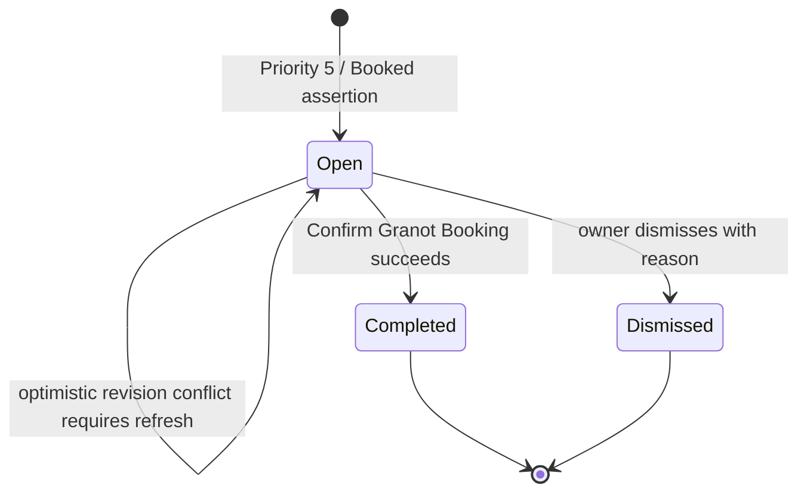

# Granot Booking Intake prototype

Status: executable domain prototype and production design recommendation. No
live systems, database, email, dashboard, or Sheet Sync are invoked.

## Question being prototyped

When Granot reports Priority `5`, how can Vantage notify the owner and make
booking fast without treating incomplete Granot values as an authoritative
Booking, exposing routine pre-booking Lead synchronization, or forcing the
owner through a generic reconciliation workflow?

The answer tested here is a dedicated **Granot Booking Intake Case** followed by
one explicit owner operation: **Confirm Granot Booking**.

Run the owner-facing terminal prototype:

```powershell
pnpm prototype:granot-lifecycle
```

Run the executable scenario assertions:

```powershell
pnpm prototype:granot-lifecycle -- --scenarios
```

In the terminal, press `p` to receive the masked Priority 5 example and `b` to
confirm it. Confirmation asks whether to keep the Suggested Booking Lead or use
the alternative, then asks for official binder, deposit, and merchant.

## Exact names

| Name | Meaning | Not the same as |
| --- | --- | --- |
| **Granot Booking Intake Case** | Durable work item saying “Granot credibly reports a booked job; official Vantage Booking details are still required” | Booking, discrepancy, generic reconciliation |
| **Suggested Booking Lead** | Highest-ranked eligible Lead presented for convenience | An attached Lead or automatic authority |
| **Confirm Granot Booking** | Owner command that chooses the Lead and supplies official booking facts | Accepting a webhook or approving a match |
| **Booking Intake Notification** | Optional dashboard/email delivery pointing to an open intake case | The intake case itself |
| **Granot Booking Discrepancy** | Conflict with an already-existing Vantage Booking or established link | Merely missing official booking details |

The split matters. Missing binder/deposit/merchant/allocations is expected work,
not an error. A discrepancy should mean two durable truths conflict.

## Supplied payload, safely represented

The executable fixture preserves the supplied field shape while replacing
customer identifiers and the Job Number with prototype-only values:

```ts
{
  event_type: "priority_update",
  job_no: "PROTO-5562372",
  service_type: "Long Distance",
  source: "BestRelocation Inbounds",
  ref_no: "",
  priority: "5",
  user: "ROY",
  rep: "ROY",
  first_name: "Sara",
  last_name: "Example",
  phone_number: "(555) 010-2372",
  email: "sara.booking@example.test",
  move_date: "08/28/2026",
  est_cf: "390",
  from_city: "Owens Cross Roads",
  from_state: "AL",
  from_zip: "35763",
  to_city: "Walnut Creek",
  to_state: "CA",
  to_zip: "94597",
  estimate: "2400.00",
}
```

### What each value may do

| Payload fact | Authorized use | Forbidden use |
| --- | --- | --- |
| `job_no` | Anchor the Granot Record Link and intake case | Silently repoint an existing conflicting link |
| `source` | Resolve exact Source Company, Source Granularity, and call channel before matching | Global phone search |
| phone/email/name | Rank source-scoped Lead candidates | Automatically override the owner's selected Lead |
| `priority=5` | Enrich the matched Lead under existing rules and open/refresh an intake case | Create a Booking |
| `user=ROY` / `rep=ROY` | Suggest active Agent `Roys` when the Operations Registry resolves exactly | Create an official Agent Allocation without owner confirmation |
| `estimate=2400` | Display as Granot context | Become Binder or Deposit |
| `est_cf=390` and move fields | Apply approved enrichment and prefill read-only context | Satisfy Booking financial invariants |
| move date | Display/prefill context | Automatically become official Book Date without confirmation |

The observed Granot estimate is intentionally not copied into Binder in the
scenario. The owner confirms Binder `625`, Deposit `800`, Agent `Roys`, and
Merchant `Cardpointe`; those are the values committed to the Booking.

## Owner-hidden policy

Routine pre-booking activity stays automated:

```text
Granot receipt
  → normalize observation
  → resolve source scope
  → match/link Lead
  → apply authorized enrichment or no-op
  → record synchronization decision and Entity Change when needed
  → no owner screen
```

The owner is surfaced only when a policy deliberately promotes the observation:

```text
Priority 5 or understood Booked assertion
  + credible source-scoped Lead candidate
  + no complete Vantage Booking
  → open/refresh Granot Booking Intake Case
  → expose dashboard item
  → optionally queue one deduplicated email
```

Unmatched or ambiguous ordinary enrichment does not automatically become owner
work. A policy can promote selected cases—for example an aging Priority 5 with
no safe candidate—but that is a separate, explicit rule. This keeps “owner
attention” scarce and meaningful.

## Seamless owner operation

```mermaid
sequenceDiagram
    participant G as Granot
    participant P as Observation Processor
    participant I as Granot Booking Intake Module
    participant N as Notification Projection
    participant O as Owner
    participant C as Canonical Booking Command
    participant M as MongoDB
    participant S as Sheet Sync Outbox

    G->>P: Priority 5 snapshot
    P->>P: normalize, source-scope, match, enrich
    P->>I: openOrRefresh(observation, match decision)
    I->>M: persist open intake case
    I->>N: dashboard visible; optional email queued
    N-->>O: booking needs completion
    O->>I: open case
    I-->>O: Granot context + Suggested Booking Lead + blank official fields
    O->>I: Confirm Granot Booking(selected Lead, official details, revision)
    I->>C: createBookingFromLead
    C->>M: Booking + Lead mirror + command/change evidence
    C->>S: Booking Chain intent
    I->>M: mark case completed; notifications acted; correct Record Link if Lead changed
    I-->>O: Booking created
```

### Owner form

The intake screen should be narrower than the generic Precise Booking Form.

Read-only Granot context:

- Job Number, customer, source, move route/date/type, estimated cubic feet;
- Granot estimate clearly labeled “context only”;
- latest observation time and channel.

Editable selection:

- Suggested Booking Lead, confidence, and reason;
- “Change Lead” search restricted to eligible Leads and showing warnings;
- chosen Lead must be revalidated at submit time.

Required official fields:

- official Book Date;
- one or more Agent Allocations;
- total Binder equal to allocation sum;
- Deposit;
- active Merchant.

There should be one primary button: **Confirm Granot Booking**.

## State model



An intake case has no `booking` state before confirmation. `Completed` means a
real `BookedLead` exists and its ID is recorded on the case.

## Portable prototype interface

The existing pure interface remains:

```ts
advanceLeadLifecycle(
  current: LifecycleWorld,
  action: LifecycleAction,
  catalog: PrototypeCatalog,
): LifecycleResult
```

The booking-specific action binds the generic lifecycle interface to a clear
operation:

```ts
type ConfirmGranotBookingAction = {
  kind: "confirm_granot_booking";
  command_id: string;
  actor_id: string;
  booking_intake_case_id: string;
  expected_case_revision: number;
  selected_booking_lead: {
    lead_ref: string;
    lead_model: "FormLead" | "CallLead";
  };
  official_booking_details: {
    booking_id: string;
    book_date: string;
    agent_allocations: Array<{
      agent: string;
      agent_name_snapshot: string;
      binder_amount: number;
    }>;
    total_binder_amount: number;
    deposit_amount: number;
    merchant: string;
  };
};
```

The owner never sends observed customer/source fields back as authoritative
booking data. The Module loads the case, revalidates the selected Lead, and uses
the case's established Job Number and Source Scope.

## Production Module interface

Use a specifically named **Granot Booking Intake Module** with two callers:
the observation processor opens/refreshes cases, and the owner route confirms
or dismisses them.

```ts
export interface GranotBookingIntakeModule {
  openOrRefreshFromObservation(input: {
    observation_id: string;
    synchronization_decision_id: string;
  }): Promise<{
    case_id: string;
    outcome: "opened" | "refreshed" | "already_completed" | "conflict";
  }>;

  confirmGranotBooking(input: {
    case_id: string;
    expected_revision: number;
    selected_booking_lead: {
      lead_model: "FormLead" | "CallLead";
      lead_id: string;
    };
    official_booking_details: {
      book_date: string;
      agent_allocations: Array<{
        agent_name: string;
        binder_amount: number;
      }>;
      total_binder_amount: number;
      deposit_amount: number;
      merchant: string;
    };
    owner: DurableActor;
    idempotency_key: string;
  }): Promise<{
    outcome: "booked" | "already_booked" | "conflict";
    booking_id?: string;
  }>;
}
```

The Module owns:

- intake-case idempotency by normalized Job Number;
- the Suggested Booking Lead snapshot and match evidence;
- owner selection revalidation;
- owner-authorized Granot Record Link correction, with previous identity and
  actor evidence, when the selected Lead differs from the suggestion;
- case optimistic concurrency;
- official-field validation;
- invocation of the canonical `createBookingFromLead` command;
- case completion and notification state.

It does not reimplement Booking creation, Agent allocation, customer upsert,
Lead mirrors, Entity Changes, or Sheet Sync. Those remain behind the canonical
booking command seam.

## Proposed routes

```text
GET  /api/v1/admin/granot-booking-intakes?state=open
GET  /api/v1/admin/granot-booking-intakes/:case_id
POST /api/v1/admin/granot-booking-intakes/:case_id/confirm
POST /api/v1/admin/granot-booking-intakes/:case_id/dismiss
```

The confirm route accepts only owner choices and official booking fields. It
does not accept source scope, Granot estimate, customer snapshot, or arbitrary
Lead patches.

Dashboard exposure is the open-case query. Email is optional configuration and
should use a dedupe key such as:

```text
granot-booking-intake:{case_id}:opened
```

A failed email must not block or close the dashboard case. Email delivery is a
projection; the intake case is the durable owner work item.

## Production collection shape

The detailed Mongoose sketch is in
[`SUGGESTED-DOMAIN-MODELS-AND-PROVENANCE.md`](./SUGGESTED-DOMAIN-MODELS-AND-PROVENANCE.md).
The core shape is:

```ts
type GranotBookingIntakeCase = {
  normalized_job_no: string;
  state: "open" | "completed" | "dismissed";
  revision: number;
  opened_by_observation_id: ObjectId;
  last_observation_id: ObjectId;
  source_scope: SourceScopeSnapshot;
  observed_booking_context: GranotBookingContextSnapshot;
  suggested_booking_lead?: SuggestedBookingLeadSnapshot;
  selected_booking_lead?: EntityReference;
  suggested_agent?: AgentSuggestionSnapshot;
  completed_booking_id?: ObjectId;
  resolution?: OwnerResolution;
};
```

The case copies the small context required for a stable owner task. It does not
copy the complete Lead, receipt, or observation.

## Scenario verdicts

The executable prototype establishes these results:

1. Priority 5 may enrich a Lead and open an intake case, but creates no Booking.
2. Dashboard exposure and optional email are deduplicated notification effects.
3. Granot user `ROY` may suggest active Agent `Roys`, but no Agent Allocation is
   created until the owner confirms.
4. Granot estimate `2400` stays display-only; it does not become Binder or
   Deposit.
5. The owner may replace the Suggested Booking Lead with another eligible Lead
   in the same Source Scope.
6. Missing allocations or inconsistent official details leave the case open and
   create no Booking.
7. Successful confirmation creates one Booking, links the owner-selected Lead,
   corrects the Granot Record Link when necessary, completes the case, marks
   notifications acted, records the Entity Change, and requests the Booking
   Chain.
8. Ordinary Lead synchronization remains absent from the owner-facing terminal.

## Cases that should reach the owner

Recommended default promotion policy:

| Situation | Owner exposure |
| --- | --- |
| Priority 0/1 enrichment applied or already current | Hidden |
| Priority 5 with one credible eligible Lead | Granot Booking Intake Case |
| Priority 5 with no Lead during short ingestion race | Hidden while retrying; promote only after policy timeout |
| Priority 5 with several plausible Leads | Intake case with no preselected authority, candidates shown |
| Unsupported priority | Hidden operational decision unless explicitly promoted |
| Source label unresolved | Registry/operations work, not booking intake |
| Granot assertion conflicts with an existing Vantage Booking/link | Granot Booking Discrepancy |
| Booking exists but its Lead attachment is wrong | Booking Lead Reconciliation Case |

## Production implementation order

1. Persist normalized observations and synchronization decisions in shadow mode.
2. Add `GranotBookingIntakeCase` and open it only for understood Priority 5 or
   Booked assertions with approved Source Scope.
3. Add dashboard list/detail routes; do not expose the general pre-booking Lead
   timeline in the primary owner workflow.
4. Add the narrow Confirm Granot Booking route through canonical
   `createBookingFromLead` and optimistic case revision.
5. Add optional deduplicated email after dashboard behavior is proven.
6. Review cases and only then define which unmatched/ambiguous observations are
   worth owner attention.

## Remaining owner choices

- Should email be immediate, digest-only, or disabled by default?
- Should a medium-confidence Suggested Booking Lead be preselected or require
  one explicit click?
- May the owner confirm a Lead outside the resolved Source Scope, or must that
  require an explicit override reason?
- Is Granot `move_date` a safe default for Book Date, or should Book Date always
  start blank/today?
- Should dismissing an intake case require a reason such as “not actually
  booked,” “duplicate Granot job,” or “handled elsewhere”?

These choices change ergonomics, not the core invariant: only Confirm Granot
Booking with official details creates and Sheet-Syncs a Vantage Booking.
