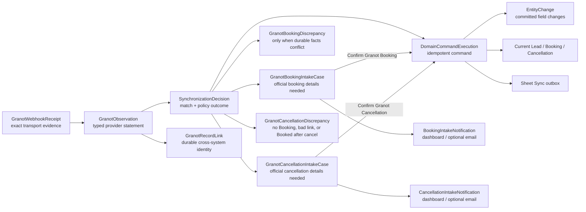
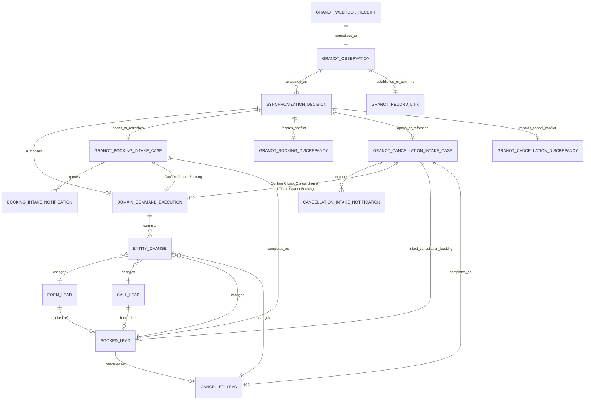

# Suggested lead-lifecycle domain models and provenance

Status: design recommendation for advancing the prototype into a production
shadow slice. This document proposes model shapes and placement; it does not
enable Granot-driven mutations or change a production schema.

Related material:

- [`README.md`](./README.md)
- [`NOTES.md`](./NOTES.md)
- [`scenarios.ts`](./scenarios.ts)
- [`vantage-granot-lifecycle-handoff.md`](./vantage-granot-lifecycle-handoff.md)
- [`GRANOT-BOOKING-INTAKE-PROTOTYPE.md`](./GRANOT-BOOKING-INTAKE-PROTOTYPE.md)
- [`GRANOT-CANCELLATION-INTAKE-PROTOTYPE.md`](./GRANOT-CANCELLATION-INTAKE-PROTOTYPE.md)
- [`Cancellation-flow-handoff.md`](./Cancellation-flow-handoff.md)
- [`../../../docs/lead-lifecycle-paths-and-projected-granot-webhooks.md`](../../../docs/lead-lifecycle-paths-and-projected-granot-webhooks.md)
- [`../../../docs/granot-lifecycle-prototype-and-implementation-seams.md`](../../../docs/granot-lifecycle-prototype-and-implementation-seams.md)

## Recommendation in one sentence

Keep the latest authoritative business state on the existing Lead, Booking, and
Cancellation documents, while storing external observations, identity links,
synchronization decisions, and committed changes as separate append-only
evidence records.

This is **not full event sourcing**. It is a current-state domain model with an
audit/evidence ledger. That is the appropriate depth for Vantage now.

## Direct answer: should every step store a complete Lead snapshot?

No. There are two different things that are easy to call a “snapshot”:

1. A **Granot Lead Snapshot** is what Granot said at a point in time. Preserve
   that statement once as a normalized `GranotObservation`, with the exact raw
   delivery retained once in `GranotWebhookReceipt`.
2. A **Vantage domain change** is a decision Vantage made after applying its
   own rules. Update the current Lead/Booking/Cancellation and append a compact
   `EntityChange` describing what changed, why, and from which evidence.

Copying the complete Vantage Lead document on every transition would repeatedly
store names, phone numbers, addresses, Sheet Sync metadata, and unchanged
fields. It increases privacy exposure, produces unclear diffs, and still does
not explain *why* a transition was accepted. A raw snapshot alone is evidence;
it is not a decision.

The useful provenance chain is:



This chain answers:

- What did Granot send?
- How did Vantage receive it?
- Which Lead or Booking did Vantage believe it concerned, and why?
- Which policy version interpreted it?
- Was it applied, already current, stale, ambiguous, or blocked?
- What fields actually changed?
- Which user or system caused the change?
- Which projection work followed?

## The right depth

### Store as authoritative current state

Continue to use the existing production aggregates:

- `FormLead` and `CallLead` hold the current source-opportunity facts.
- `BookedLead` holds the complete sale facts.
- `CancelledLead` holds the cancellation facts.
- `FormLead.booked` remains set after cancellation.
- `FormLead.cancelled` or `CallLead.cancelled` is additive.
- `BookedLead.cancelled` points to the Cancellation.

Do not replace these relationships with a single status enum. `Booked` and
`Cancelled` are facts backed by records, while quoted/enriched/duplicate/bad
are independent dimensions. A single enum cannot accurately represent legal
combinations such as “booked, then cancelled, then later enriched from Granot.”

### Store as append-only evidence

Add these production models in `vantage-main-server/src/models/`, not in
`vantage-admin/server/models/`:

| Model | Purpose | Mutable? |
| --- | --- | --- |
| `GranotWebhookReceipt` | Exact authenticated request envelope | No, except separate processing claim/status fields during migration |
| `GranotObservation` | Versioned normalized statement from Granot | No |
| `GranotRecordLink` | Durable Granot Job Number → Vantage identity | State may become disputed/superseded; identity is never silently repointed |
| `SynchronizationDecision` | Explainable match and policy outcome | Append a new decision per processing attempt or policy re-evaluation |
| `EntityChange` | Committed domain mutation and causal provenance | No |
| `GranotBookingIntakeCase` | Granot credibly reports booked, while official owner Booking details are still missing | Stateful until owner confirms or dismisses |
| `BookingIntakeNotification` | Optional dashboard/email delivery pointing to an intake case | Delivery state is mutable; it is never booking authority |
| `GranotBookingDiscrepancy` | Granot conflicts with an existing Vantage Booking or established link | Stateful work item with append-only resolution evidence |
| `GranotCancellationIntakeCase` | Granot reports Release for an existing Booking; the owner may cancel, update that Booking, or dismiss | Stateful until owner confirms, updates, dismisses, or a later Release reopens |
| `CancellationIntakeNotification` | Optional dashboard/email delivery pointing to a cancellation intake case | Delivery state is mutable; it is never cancellation or booking-update authority |
| `GranotCancellationDiscrepancy` | `Releas`/`Release` with no Booking, a mismatched Record Link, or Granot `Booked` after an official Cancellation | Stateful work item with append-only resolution evidence |

The admin app should consume a main-server lifecycle read endpoint. Its local
Mongoose models currently represent admin users and admin audit logs; putting
business lifecycle records there would create a second system of record.

### Do not store

- An unbounded `history[]` array inside each Lead.
- A complete copy of the Lead in every `EntityChange`.
- Raw customer contact values again in match decisions.
- A synthesized Vantage Booking from Granot Priority `5` or `Booked`.
- An automatically attached Suggested Booking Lead; it remains a changeable
  owner convenience until Confirm Granot Booking succeeds.
- Granot `estimate` copied into official Binder or Deposit.
- An inferred cancellation from `Releas` / `Release`. Granot Release is a CRM
  button action (changes or customer cancel), not Vantage Cancellation
  authority.
- A second Vantage Booking when Granot sends another `Booked` for the same
  Job Number.
- A generic lifecycle `status` field that callers can mutate independently of
  Booking and Cancellation records.

## Suggested collection relationships



Mongo polymorphic references are needed for the Lead variants, but queries
should always include both `model` and `id`. A bare ObjectId is not a complete
domain identity.

## Concrete production model shapes

The following are implementation-grade sketches using the codebase's Mongoose,
snake-case, and explicit-index conventions. They are intentionally shown in one
document; production should place each schema in its own focused model file.

### Shared references and provenance

```ts
import { Schema } from "mongoose";

export const EntityReferenceSchema = new Schema(
  {
    model: {
      type: String,
      required: true,
      enum: ["FormLead", "CallLead", "BookedLead", "CancelledLead"],
    },
    id: { type: Schema.Types.ObjectId, required: true },
  },
  { _id: false },
);

export const CausalProvenanceSchema = new Schema(
  {
    source_system: {
      type: String,
      required: true,
      enum: ["vantage", "granot", "ringcentral"],
    },
    observation_channel: {
      type: String,
      enum: [
        "site_form",
        "admin",
        "granot_webhook",
        "browser_extension",
        "granot_http_automation",
        "ringcentral_webhook",
        "ringcentral_poll",
      ],
    },
    actor_type: {
      type: String,
      required: true,
      enum: ["system", "owner", "admin"],
    },
    actor_id: { type: String, trim: true },
    initiator_id: { type: String, trim: true },
    receipt_id: { type: Schema.Types.ObjectId, ref: "GranotWebhookReceipt" },
    observation_id: { type: Schema.Types.ObjectId, ref: "GranotObservation" },
    decision_id: { type: Schema.Types.ObjectId, ref: "SynchronizationDecision" },
    run_id: { type: String, trim: true },
    request_id: { type: String, trim: true },
  },
  { _id: false },
);
```

`source_system`, `observation_channel`, and actor are separate axes. For
example, an owner using the extension produces source system `granot`, channel
`browser_extension`, and actor type `owner`.

### `GranotObservation`

```ts
const NormalizationIssueSchema = new Schema(
  {
    code: { type: String, required: true, trim: true },
    path: { type: String, trim: true },
    severity: { type: String, required: true, enum: ["warning", "error"] },
  },
  { _id: false },
);

const GranotObservationSchema = new Schema(
  {
    receipt_id: {
      type: Schema.Types.ObjectId,
      ref: "GranotWebhookReceipt",
      required: true,
      unique: true,
    },
    schema_version: { type: Number, required: true },
    kind: {
      type: String,
      required: true,
      enum: ["lead_created", "priority_snapshot", "booking_status_snapshot"],
      index: true,
    },
    normalization_status: {
      type: String,
      required: true,
      enum: ["normalized", "unsupported_schema", "invalid"],
      index: true,
    },
    provider_event_type: { type: String, trim: true },
    observed_at: { type: Date, required: true, index: true },
    occurred_at: { type: Date },
    provider_revision: { type: String, trim: true },
    source_label: { type: String, trim: true },
    identity: {
      job_no: { type: String, trim: true },
      normalized_job_no: { type: String, trim: true, index: true },
      ref_no: { type: String, trim: true },
      normalized_phone: { type: String, trim: true },
      normalized_email: { type: String, trim: true, lowercase: true },
    },
    lead_snapshot: {
      first_name: { type: String, trim: true },
      last_name: { type: String, trim: true },
      move_date: { type: String, trim: true },
      service_type: { type: String, trim: true },
      estimated_cubic_feet: { type: Number },
      origin: {
        city: { type: String, trim: true },
        state: { type: String, trim: true, uppercase: true },
        zip: { type: String, trim: true },
      },
      destination: {
        city: { type: String, trim: true },
        state: { type: String, trim: true, uppercase: true },
        zip: { type: String, trim: true },
      },
    },
    granot_priority: { type: String, trim: true },
    raw_booking_status: { type: String, trim: true },
    payment: { type: Number },
    balance: { type: Number },
    estimate: { type: Number },
    assigned_user: { type: String, trim: true },
    assigned_rep: { type: String, trim: true },
    normalization_issues: { type: [NormalizationIssueSchema], default: [] },
  },
  {
    collection: "granot_observations",
    timestamps: true,
    strict: true,
  },
);

GranotObservationSchema.index({ "identity.normalized_job_no": 1, observed_at: -1 });
GranotObservationSchema.index({ source_label: 1, kind: 1, observed_at: -1 });
```

This collection is a typed projection of the raw receipt, not a second raw
payload store. Unknown fields stay only on the receipt. The normalized record
contains the stable vocabulary that domain policy may inspect.

### `GranotRecordLink`

```ts
const GranotRecordLinkSchema = new Schema(
  {
    provider: { type: String, required: true, enum: ["granot"] },
    external_kind: { type: String, required: true, enum: ["job"] },
    normalized_job_no: { type: String, required: true, trim: true },
    lead_ref: { type: EntityReferenceSchema, required: true },
    booking_ref: { type: EntityReferenceSchema },
    state: {
      type: String,
      required: true,
      enum: ["active", "disputed", "superseded"],
      default: "active",
      index: true,
    },
    established_by_decision_id: {
      type: Schema.Types.ObjectId,
      ref: "SynchronizationDecision",
      required: true,
    },
    established_at: { type: Date, required: true },
    last_observation_id: {
      type: Schema.Types.ObjectId,
      ref: "GranotObservation",
      required: true,
    },
    last_observed_at: { type: Date, required: true },
    owner_correction_history: [{
      booking_intake_case_id: {
        type: Schema.Types.ObjectId,
        ref: "GranotBookingIntakeCase",
        required: true,
      },
      previous_lead_ref: { type: EntityReferenceSchema, required: true },
      selected_lead_ref: { type: EntityReferenceSchema, required: true },
      actor_id: { type: String, required: true, trim: true },
      request_id: { type: String, required: true, trim: true },
      corrected_at: { type: Date, required: true },
    }],
  },
  { collection: "granot_record_links", timestamps: true },
);

GranotRecordLinkSchema.index(
  { provider: 1, external_kind: 1, normalized_job_no: 1 },
  { unique: true },
);
GranotRecordLinkSchema.index({ "lead_ref.model": 1, "lead_ref.id": 1 });
```

The unique job identity gives later observations a deterministic route. If new
evidence conflicts with an active link, set it to `disputed` and open work for
an owner; never silently repoint it. Confirm Granot Booking is the explicit
exception: an owner-selected replacement Lead may correct the link in the same
successful operation, with the previous and selected identities appended to
`owner_correction_history`.

### `SynchronizationDecision`

Use one decision collection rather than separate “match result” and “processing
result” collections. Matching is a major part of the synchronization decision,
and combining them gives the admin timeline one explainable record without
losing depth in the processing Module.

```ts
const CandidateEvidenceSchema = new Schema(
  {
    target: { type: EntityReferenceSchema, required: true },
    reason_codes: { type: [String], required: true, default: [] },
  },
  { _id: false },
);

const SynchronizationDecisionSchema = new Schema(
  {
    observation_id: {
      type: Schema.Types.ObjectId,
      ref: "GranotObservation",
      required: true,
      index: true,
    },
    attempt: { type: Number, required: true, min: 1 },
    outcome: {
      type: String,
      required: true,
      enum: [
        "applied",
        "linked",
        "already_current",
        "stale",
        "pending_match",
        "ambiguous",
        "conflict",
        "blocked",
        "invalid",
        "dependency_failed",
      ],
      index: true,
    },
    reason_code: { type: String, required: true, trim: true },
    target: { type: EntityReferenceSchema },
    match_method: {
      type: String,
      enum: [
        "granot_record_link",
        "form_ref_no_exact",
        "historical_mongo_id",
        "call_job_no_exact",
        "booking_job_no_exact",
        "source_scoped_contact",
      ],
    },
    source_scope: {
      source_company_id: { type: Schema.Types.ObjectId, ref: "LeadSourceCompany" },
      source_granularity_id: { type: Schema.Types.ObjectId },
      source_company_label_snapshot: { type: String, trim: true },
      source_granularity_label_snapshot: { type: String, trim: true },
      channel: { type: String, enum: ["form", "call"] },
    },
    candidate_evidence: { type: [CandidateEvidenceSchema], default: [] },
    proposed_fields: { type: [String], default: [] },
    policy_version: { type: String, required: true, trim: true },
    command_execution_id: {
      type: Schema.Types.ObjectId,
      ref: "DomainCommandExecution",
    },
    next_attempt_at: { type: Date, index: true },
    decided_at: { type: Date, required: true, index: true },
  },
  { collection: "synchronization_decisions", timestamps: true },
);

SynchronizationDecisionSchema.index(
  { observation_id: 1, attempt: 1 },
  { unique: true },
);
SynchronizationDecisionSchema.index({ "target.model": 1, "target.id": 1, decided_at: -1 });
```

Candidate evidence stores IDs and reason codes, not copies of names, phones, or
emails. The source observation and receipt already contain the customer
evidence under the system's retention controls.

### `EntityChange`

```ts
const FieldChangeSchema = new Schema(
  {
    path: { type: String, required: true, trim: true },
    value_mode: {
      type: String,
      required: true,
      enum: ["stored", "hashed", "reference_only"],
    },
    before: { type: Schema.Types.Mixed },
    after: { type: Schema.Types.Mixed },
    before_hash: { type: String, trim: true },
    after_hash: { type: String, trim: true },
  },
  { _id: false },
);

const EntityChangeSchema = new Schema(
  {
    entity: { type: EntityReferenceSchema, required: true },
    command_execution_id: {
      type: Schema.Types.ObjectId,
      ref: "DomainCommandExecution",
      required: true,
      index: true,
    },
    command_name: { type: String, required: true, trim: true },
    provenance: { type: CausalProvenanceSchema, required: true },
    fields: { type: [FieldChangeSchema], required: true },
    revision_before: { type: Number, required: true, min: 0 },
    revision_after: { type: Number, required: true, min: 1 },
    applied_at: { type: Date, required: true, index: true },
  },
  { collection: "entity_changes", timestamps: true },
);

EntityChangeSchema.index({ "entity.model": 1, "entity.id": 1, revision_after: 1 }, { unique: true });
EntityChangeSchema.index({ "entity.model": 1, "entity.id": 1, applied_at: -1 });
EntityChangeSchema.index({ "fields.path": 1, applied_at: -1 });
```

Use an allowlist for `value_mode`:

- Store before/after values for low-risk lifecycle facts and relationships,
  such as `quoted`, `booked`, `cancelled`, `cubic_feet`, and receiver Agent ID.
- Hash or store reference-only evidence for contact and address values.
- Never copy complete documents into this collection.

Persist `EntityChange`, the aggregate write, `DomainCommandExecution`, and Sheet
Sync outbox intent in the same Mongo transaction. Otherwise the history can
claim a change that did not commit, or the domain can change without evidence.

### `GranotBookingIntakeCase`

Priority `5` or an understood Granot `Booked` assertion is not a discrepancy
merely because Vantage still needs official booking details. It opens a
purpose-built intake case instead.

```ts
const SuggestedBookingLeadSchema = new Schema(
  {
    lead_ref: { type: EntityReferenceSchema, required: true },
    confidence: {
      type: String,
      required: true,
      enum: ["high", "medium", "low"],
    },
    match_method: {
      type: String,
      required: true,
      enum: [
        "granot_record_link",
        "form_ref_no_exact",
        "call_job_no_exact",
        "source_scoped_contact",
      ],
    },
    reason_codes: { type: [String], required: true, default: [] },
    display_snapshot: {
      name: { type: String, trim: true },
      phone_number: { type: String, trim: true },
      email: { type: String, trim: true, lowercase: true },
      source_granularity_label: { type: String, trim: true },
    },
  },
  { _id: false },
);

const GranotBookingIntakeCaseSchema = new Schema(
  {
    normalized_job_no: { type: String, required: true, trim: true },
    state: {
      type: String,
      required: true,
      enum: ["open", "completed", "dismissed"],
      default: "open",
      index: true,
    },
    revision: { type: Number, required: true, default: 1, min: 1 },
    opened_by_observation_id: {
      type: Schema.Types.ObjectId,
      ref: "GranotObservation",
      required: true,
    },
    last_observation_id: {
      type: Schema.Types.ObjectId,
      ref: "GranotObservation",
      required: true,
    },
    opened_by_decision_id: {
      type: Schema.Types.ObjectId,
      ref: "SynchronizationDecision",
      required: true,
    },
    source_scope: {
      source_company_id: {
        type: Schema.Types.ObjectId,
        ref: "LeadSourceCompany",
        required: true,
      },
      source_granularity_id: { type: Schema.Types.ObjectId, required: true },
      source_company_label_snapshot: { type: String, required: true, trim: true },
      source_granularity_label_snapshot: { type: String, required: true, trim: true },
      crm_source_label_snapshot: { type: String, required: true, trim: true },
      channel: { type: String, required: true, enum: ["form", "call"] },
    },
    observed_booking_context: {
      job_no: { type: String, required: true, trim: true },
      service_type: { type: String, trim: true },
      customer_name: { type: String, trim: true },
      phone_number: { type: String, trim: true },
      email: { type: String, trim: true, lowercase: true },
      move_date: { type: String, trim: true },
      estimated_cubic_feet: { type: Number },
      granot_estimate: { type: Number },
      assigned_username: { type: String, trim: true },
    },
    suggested_booking_lead: {
      type: SuggestedBookingLeadSchema,
      default: undefined,
    },
    selected_booking_lead: { type: EntityReferenceSchema },
    suggested_agent: {
      agent_id: { type: Schema.Types.ObjectId, ref: "Agent" },
      agent_name_snapshot: { type: String, trim: true },
      evidence: { type: String, trim: true },
    },
    completed_booking: { type: Schema.Types.ObjectId, ref: "BookedLead" },
    resolution: {
      action: { type: String, enum: ["confirm", "dismiss"] },
      actor_id: { type: String, trim: true },
      request_id: { type: String, trim: true },
      notes: { type: String, trim: true },
      occurred_at: { type: Date },
    },
  },
  {
    collection: "granot_booking_intake_cases",
    timestamps: true,
    optimisticConcurrency: true,
  },
);

GranotBookingIntakeCaseSchema.index(
  { normalized_job_no: 1 },
  {
    unique: true,
    partialFilterExpression: { state: "open" },
  },
);
GranotBookingIntakeCaseSchema.index({ state: 1, createdAt: -1 });
GranotBookingIntakeCaseSchema.index({
  "suggested_booking_lead.lead_ref.model": 1,
  "suggested_booking_lead.lead_ref.id": 1,
  createdAt: -1,
});
```

The Suggested Booking Lead, when confidence is sufficient, is a snapshot of the
current best answer. An ambiguous promoted case may intentionally have no
suggestion. A suggestion does not attach the Lead. `selected_booking_lead` is written only during owner work,
and the selected Lead must be revalidated before the Booking transaction. If
the owner selects a different eligible Lead, successful confirmation also
corrects the Granot Record Link while preserving the prior Lead identity,
intake-case ID, owner actor, and correction time as evidence.

`observed_booking_context.granot_estimate` is explicitly display-only. It is
never a default for Binder or Deposit.

### `BookingIntakeNotification`

Dashboard exposure is naturally produced by querying open intake cases. If
dashboard read/dismiss state or optional email needs durable delivery evidence,
use a narrowly named notification model:

```ts
const BookingIntakeNotificationSchema = new Schema(
  {
    booking_intake_case: {
      type: Schema.Types.ObjectId,
      ref: "GranotBookingIntakeCase",
      required: true,
      index: true,
    },
    channel: { type: String, required: true, enum: ["dashboard", "email"] },
    state: {
      type: String,
      required: true,
      enum: ["visible", "queued", "sent", "failed", "acted", "dismissed"],
      index: true,
    },
    dedupe_key: { type: String, required: true, trim: true, unique: true },
    attempt_count: { type: Number, required: true, default: 0 },
    last_attempt_at: { type: Date },
    next_attempt_at: { type: Date, index: true },
    sent_at: { type: Date },
    error_code: { type: String, trim: true },
  },
  { collection: "booking_intake_notifications", timestamps: true },
);

BookingIntakeNotificationSchema.index({ channel: 1, state: 1, createdAt: -1 });
```

Email failure cannot block the intake case. The existing `NotificationDelivery`
model is scoped to Workflow Observational; either broaden it intentionally with
a typed business purpose and intake-case reference, or keep this booking
delivery model separate. Do not disguise a booking task as an Operational
Incident.

### `GranotBookingDiscrepancy`

Reserve this model for actual conflict with an existing Booking or established
Granot Record Link:

```ts
const GranotBookingDiscrepancySchema = new Schema(
  {
    normalized_job_no: { type: String, required: true, trim: true },
    lead_ref: { type: EntityReferenceSchema, required: true },
    conflicting_booking_ref: { type: EntityReferenceSchema, required: true },
    reason: {
      type: String,
      required: true,
      enum: [
        "granot_booking_conflicts_with_vantage_booking",
        "granot_record_link_conflict",
      ],
    },
    state: {
      type: String,
      required: true,
      enum: ["open", "resolved", "dismissed"],
      default: "open",
      index: true,
    },
    opened_by_observation_id: {
      type: Schema.Types.ObjectId,
      ref: "GranotObservation",
      required: true,
    },
    resolution: {
      outcome: { type: String, trim: true },
      actor_id: { type: String, trim: true },
      request_id: { type: String, trim: true },
      resolved_at: { type: Date },
      notes: { type: String, trim: true },
    },
  },
  { collection: "granot_booking_discrepancies", timestamps: true },
);
```

The owner-work models now have non-overlapping starting conditions:

- `GranotBookingIntakeCase`: no official Booking exists yet.
- `GranotBookingDiscrepancy`: an existing Booking/link conflicts with Granot.
- `BookingLeadReconciliationCase`: a valid Booking exists but its Lead
  attachment needs correction.
- `GranotCancellationIntakeCase`: an active Booking exists and Granot reports
  Release (`Releas` alias). Official cancellation or booking-update facts are
  still missing; the owner is not required to act.
- `GranotCancellationDiscrepancy`: `Releas`/`Release` has no Booking, the
  Record Link conflicts, or Granot reports `Booked` after an official
  Cancellation.

### `GranotCancellationIntakeCase`

A `booking_status_changed` Observation whose payload `event_type` is `Releas`
or `Release` is a Granot Booking Action, not a Vantage Cancellation. Granot
confirmed the CRM button meaning: Release happens when the Rep needs to make
changes or when the customer cancels. A job can have many Release actions and
many later Booked actions. Vantage stays idempotent on normalized Job Number.

The observation opens a purpose-built intake case when a current eligible
Booking exists. The case offers Confirm Granot Cancellation, Update Granot
Booking, and Dismiss. None is required.

Keep `Releas` and `Release` as aliases of the same action. Do not treat other
spellings as Release.

```ts
const LinkedCancellationBookingSchema = new Schema(
  {
    booking_ref: { type: Schema.Types.ObjectId, ref: "BookedLead", required: true },
    lead_ref: { type: EntityReferenceSchema, required: true },
    job_no: { type: String, required: true, trim: true },
    book_date: { type: Date, required: true },
    deposit_amount: { type: Number, required: true },
    merchant: { type: String, trim: true },
    source: { type: String, trim: true },
  },
  { _id: false },
);

const GranotCancellationIntakeCaseSchema = new Schema(
  {
    normalized_job_no: { type: String, required: true, trim: true },
    state: {
      type: String,
      required: true,
      enum: ["open", "completed", "dismissed"],
      default: "open",
      index: true,
    },
    revision: { type: Number, required: true, default: 1, min: 1 },
    opened_by_observation_id: {
      type: Schema.Types.ObjectId,
      ref: "GranotObservation",
      required: true,
    },
    last_observation_id: {
      type: Schema.Types.ObjectId,
      ref: "GranotObservation",
      required: true,
    },
    opened_by_decision_id: {
      type: Schema.Types.ObjectId,
      ref: "SynchronizationDecision",
      required: true,
    },
    linked_cancellation_booking: {
      type: LinkedCancellationBookingSchema,
      required: true,
    },
    offered_owner_paths: {
      type: [String],
      required: true,
      enum: ["confirm_cancellation", "update_booking"],
      default: ["confirm_cancellation", "update_booking"],
    },
    observed_release_context: {
      raw_booking_status: { type: String, required: true, trim: true },
      granot_priority: { type: String, trim: true },
      payment: { type: Number },
      balance: { type: Number },
      estimate: { type: Number },
      assigned_username: { type: String, trim: true },
    },
    completed_cancellation: { type: Schema.Types.ObjectId, ref: "CancelledLead" },
    resolution: {
      action: {
        type: String,
        enum: ["confirm_cancellation", "update_booking", "dismiss"],
      },
      actor_id: { type: String, trim: true },
      request_id: { type: String, trim: true },
      notes: { type: String, trim: true },
      occurred_at: { type: Date },
    },
  },
  {
    collection: "granot_cancellation_intake_cases",
    timestamps: true,
    optimisticConcurrency: true,
  },
);

GranotCancellationIntakeCaseSchema.index(
  { normalized_job_no: 1 },
  {
    unique: true,
    partialFilterExpression: { state: "open" },
  },
);
GranotCancellationIntakeCaseSchema.index({
  "linked_cancellation_booking.booking_ref": 1,
  state: 1,
});
```

The Linked Cancellation Booking is deterministic. The owner does not get a
casual dropdown that repoints it. A wrong Booking identity is a
`GranotCancellationDiscrepancy`. There is at most one Vantage Booking per
normalized Job Number; Update Granot Booking mutates that record.

`observed_release_context.payment`, `balance`, and `estimate` are display-only.
They are never a default for official Refund, Binder, or Deposit. Priority on
the same snapshot is also display-only: a Release can arrive with Priority
`0`, `1`, or `5` without changing Vantage Booked facts.

### `CancellationIntakeNotification`

Keep this model separate from `BookingIntakeNotification`. The work item,
official fields, and owner screen are different. Do not collapse them into a
generic lifecycle-intake notification merely to reduce file count.

```ts
const CancellationIntakeNotificationSchema = new Schema(
  {
    cancellation_intake_case: {
      type: Schema.Types.ObjectId,
      ref: "GranotCancellationIntakeCase",
      required: true,
      index: true,
    },
    channel: { type: String, required: true, enum: ["dashboard", "email"] },
    state: {
      type: String,
      required: true,
      enum: ["visible", "queued", "sent", "failed", "acted", "dismissed"],
      index: true,
    },
    dedupe_key: { type: String, required: true, trim: true, unique: true },
    attempt_count: { type: Number, required: true, default: 0 },
    last_attempt_at: { type: Date },
    next_attempt_at: { type: Date, index: true },
    sent_at: { type: Date },
    error_code: { type: String, trim: true },
  },
  { collection: "cancellation_intake_notifications", timestamps: true },
);

CancellationIntakeNotificationSchema.index({ channel: 1, state: 1, createdAt: -1 });
```

Email failure cannot block the intake case. The email, when enabled, should
link to the dashboard case. The same pinnacle already exists for booking
intake.

### `GranotCancellationDiscrepancy`

Reserve this model for conflict with cancellation facts, not for expected
missing refund/date:

```ts
const GranotCancellationDiscrepancySchema = new Schema(
  {
    normalized_job_no: { type: String, required: true, trim: true },
    lead_ref: { type: EntityReferenceSchema, required: true },
    booking_ref: { type: Schema.Types.ObjectId, ref: "BookedLead" },
    reason: {
      type: String,
      required: true,
      enum: [
        "releas_without_vantage_booking",
        "granot_record_link_conflict",
        "granot_booked_after_vantage_cancellation",
      ],
    },
    state: {
      type: String,
      required: true,
      enum: ["open", "resolved", "dismissed"],
      default: "open",
      index: true,
    },
    opened_by_observation_id: {
      type: Schema.Types.ObjectId,
      ref: "GranotObservation",
      required: true,
    },
    resolution: {
      outcome: { type: String, trim: true },
      actor_id: { type: String, trim: true },
      request_id: { type: String, trim: true },
      resolved_at: { type: Date },
      notes: { type: String, trim: true },
    },
  },
  { collection: "granot_cancellation_discrepancies", timestamps: true },
);
```

## Minimal edits to existing models

Do not add the new evidence fields wholesale to `FormLead` and `CallLead`.
The smallest useful common addition is an explicit domain revision and an
optional last-change projection:

```ts
// Add to FormLead, CallLead, BookedLead, and CancelledLead.
domain_revision: { type: Number, required: true, default: 0, min: 0 },
last_change_id: { type: Schema.Types.ObjectId, ref: "EntityChange" },
last_changed_at: { type: Date },
```

The existing Mongoose `__v` supports optimistic concurrency, but it is an
implementation version. `domain_revision` gives the audit ledger a stable,
intentional sequence and can advance exactly once per committed domain
command. `last_change_id` is only a read optimization; `EntityChange` remains
the history authority.

Recommended edits by current model:

| Existing model | Keep | Add/change | Do not add |
| --- | --- | --- | --- |
| `FormLead` | `quoted`, `booked`, `cancelled`, `duplicate`, `bad_lead`, enrichment fields | `domain_revision`, last-change projection | `status`, `granot_history[]`, full snapshots, Granot `job_no` merely for matching |
| `CallLead` | `job_no`, enrichment, RingCentral provenance, `booked`, `cancelled` | `domain_revision`, last-change projection; eventually extend receiver source vocabulary for Granot webhook/automation | `quoted`, duplicated receipt payloads |
| `BookedLead` | complete booking invariants and Lead reference | `domain_revision`, last-change projection | “Granot booked” boolean without a complete Booking |
| `CancelledLead` | refund/reason/date snapshots | `domain_revision`, last-change projection; consider optimistic concurrency | inferred Granot cancellation without refund/policy facts |
| `DomainCommandExecution` | command idempotency authority | typed provenance; add `granot_observation` origin and causal IDs; keep transaction coupling | a second competing command log |
| `GranotWebhookReceipt` | immutable raw payload and receipt time | safe-header allowlist, payload hash, processing claim separated from evidence if practical | secrets in stored headers; business mutation logic |

`receiver_agent_source` currently encodes extension/manual origins. If a Granot
webhook or HTTP automation may set a receiver, extend its vocabulary deliberately
or replace it with causal reference to `EntityChange`; do not label a webhook
change as `extension_crm_username_match`.

## Example: one Lead across the lifecycle

Suppose Call Lead `CL-42` already exists. Granot sends Job `G-9001` with
Priority `5`, and the owner later confirms the official Booking and records a
Cancellation.

```text
10:00  CallLead CL-42 exists
       booked=∅, cancelled=∅, domain_revision=0

10:03  Receipt R-1 captured from granot_webhook
10:03  Observation O-1 says job=G-9001, priority=5, est_cf=780, estimate=2400
10:03  Decision D-1: source-scoped contact match; policy proposes call enrichment
10:03  Command C-1 commits:
       CallLead CL-42 job_no=G-9001, cubic_feet=780, domain_revision=1
       EntityChange E-1 records fields [job_no, cubic_feet]
       GranotRecordLink G-9001 → CallLead CL-42
       GranotBookingIntakeCase I-1 opens with CL-42 as Suggested Booking Lead
       Dashboard notification is visible; optional email is queued once
       No Booking exists and estimate=2400 remains context only

10:04  Another channel reports the same current snapshot
       Observation O-2 is still retained as evidence
       Decision D-2 = already_current
       Intake I-1 is refreshed; no duplicate notification or Sheet Sync occurs

14:00  Owner opens I-1, may change the Suggested Booking Lead, and runs
       Confirm Granot Booking with official book date, binder=625,
       deposit=800, Merchant=Cardpointe, and Agent Allocation=Roys:625
       CallLead CL-42 booked=B-7, domain_revision=2
       Booking B-7 uses the official values, not Granot estimate=2400
       Intake I-1 is completed and notifications are marked acted
       EntityChanges record the committed aggregate effects

Two days later
       Receipt R-3 captured from granot_webhook
       Observation O-3 says event_type=Releas, priority=0, payment=646.40
       Decision D-3: matching active Booking B-7 is not cancelled
       GranotCancellationIntakeCase K-1 opens with B-7 as Linked Cancellation Booking
       offered_owner_paths = confirm_cancellation | update_booking
       Dashboard notification is visible; optional email is queued once
       payment=646.40 remains context only; no Cancellation exists; owner is not required to act

       Minutes later, Granot sends Booked for the same job_no (change cycle)
       Decision D-4 = already_current on Job Number identity
       K-1 stays open and refreshes observed raw status to Booked
       Still one Booking B-7; still no Cancellation

       Owner may:
         Confirm Granot Cancellation with official refund=750
           CallLead CL-42 still booked=B-7 and now cancelled=X-3
           Cancellation Chain requested once
         or Update Granot Booking with official binder/deposit/date
           B-7 is mutated; Booking Chain update requested; no second Booking
         or Dismiss
           B-7 unchanged; K-1 dismissed; a later Release may reopen it
         or leave K-1 open
```

The lifecycle projection can render “Ingested → Enriched → Booking Intake →
Booked → Cancellation Intake → Cancelled,” but that arrow is a view. The stored
truth remains the underlying facts and causal evidence.

### Owner visibility policy

Routine pre-booking synchronization decisions should not appear in the owner's
primary workflow. The system records them for provenance and operational
inspection, but the owner sees only cases deliberately promoted by policy:

| Synchronization result | Primary owner exposure |
| --- | --- |
| Priority 0/1 enrichment applied or already current | Hidden |
| Priority 5 with credible eligible Lead | Granot Booking Intake Case |
| Pending match inside ingestion race window | Hidden and retried |
| Unsupported priority | Hidden operational decision unless explicitly promoted |
| Granot conflicts with existing Booking/link | Granot Booking Discrepancy |
| Existing Booking has wrong/missing Lead attachment | Booking Lead Reconciliation Case |
| `Releas` / `Release` with matching active Booking | Granot Cancellation Intake Case (cancel, update, or dismiss; not required) |
| `Releas` / `Release` with no Booking or conflicting link | Granot Cancellation Discrepancy |
| `Booked` after official Cancellation | Granot Cancellation Discrepancy; never un-cancel |
| `Booked` after Release on the same Job Number | Hidden identity match (`already_current`); refresh open Release intake if present |
| Priority 0 after Booked or on a Release snapshot | Hidden; no downgrade |

The Suggested Booking Lead is exposed only inside the booking intake operation,
where the owner can replace it. This avoids turning every Lead synchronization
question into owner reconciliation work.

## Efficiency and scaling

This design is efficient for the expected workload because writes are narrow:

- one raw receipt per delivery;
- one normalized observation per receipt;
- one small decision per processing attempt;
- zero `EntityChange` records when the desired state is already current;
- one `EntityChange` per entity actually mutated;
- one current aggregate update rather than a new full Lead version.

The read paths also remain efficient:

- operational screens read the current Lead/Booking directly;
- a lifecycle timeline queries indexed evidence by entity reference;
- processing health queries decisions by outcome/time;
- later Granot messages resolve through the unique Job Number link;
- analytics need not replay events to discover current business state.

Avoid indexing raw payload fields. Index only identifiers, outcome/state,
entity references, and time fields needed by actual queries. Large raw receipts
can later move to encrypted/archive storage under a deliberate retention policy,
while their hash and normalized evidence remain in Mongo. Do not add a TTL to
provenance collections until business, privacy, and support retention needs are
agreed.

### What “total provenance” means here

This design provides complete **causal provenance**: observation → decision →
command → committed changes. It does not promise that every historical version
of every PII field can be reconstructed forever. That stronger promise would
require full event sourcing or full snapshots and should only be accepted with
an explicit retention/privacy requirement.

For the lifecycle fields Vantage actually audits, the allowlisted before/after
values and revisions are enough to reconstruct their evolution. For PII, keep
the causal pointer and hashes, with the original receipt governed separately.

## Processing Module interface

Keep the production interface small and let the implementation own
normalization, source scoping, matching, ordering, policy, persistence, and
idempotency:

```ts
export interface GranotObservationProcessor {
  process(input: {
    receipt_id: string;
    observation_channel:
      | "granot_webhook"
      | "browser_extension"
      | "granot_http_automation";
    initiator?: DurableActor;
  }): Promise<{
    observation_id: string;
    decision_id: string;
    outcome:
      | "applied"
      | "linked"
      | "already_current"
      | "stale"
      | "pending_match"
      | "ambiguous"
      | "conflict"
      | "blocked"
      | "invalid";
    target?: { model: "FormLead" | "CallLead" | "BookedLead"; id: string };
  }>;
}
```

Routes and queue consumers should pass a receipt ID, not normalized snapshots,
candidate lists, or patches. The processing Module decides those details and
invokes the existing canonical domain-command seam. This keeps webhook,
extension, and HTTP automation behavior convergent.

The booking-specific seam is a separate deep **Granot Booking Intake Module**:

```ts
export interface GranotBookingIntakeModule {
  openOrRefreshFromObservation(input: {
    observation_id: string;
    synchronization_decision_id: string;
  }): Promise<{
    case_id: string;
    outcome: "opened" | "refreshed" | "conflict";
  }>;

  confirmGranotBooking(input: {
    case_id: string;
    expected_revision: number;
    selected_booking_lead: {
      lead_model: "FormLead" | "CallLead";
      lead_id: string;
    };
    official_booking_details: {
      book_date: string;
      agent_allocations: Array<{
        agent_name: string;
        binder_amount: number;
      }>;
      total_binder_amount: number;
      deposit_amount: number;
      merchant: string;
    };
    owner: DurableActor;
    idempotency_key: string;
  }): Promise<{
    outcome: "booked" | "already_booked" | "conflict";
    booking_id?: string;
  }>;
}
```

This Module loads observed context from the case and calls the canonical
`createBookingFromLead` command. The owner cannot submit Granot estimate,
source scope, or customer snapshot as authoritative fields. Booking creation,
Lead mirrors, customer upsert, Entity Change, and Booking Chain remain owned by
the existing booking command implementation. When the owner replaces the
Suggested Booking Lead, the same successful operation corrects the Granot
Record Link with owner-resolution evidence so later observations follow the
confirmed Lead.

The cancellation-specific seam is a separate deep **Granot Cancellation Intake
Module**:

```ts
export interface GranotCancellationIntakeModule {
  openOrRefreshFromObservation(input: {
    observation_id: string;
    synchronization_decision_id: string;
  }): Promise<{
    case_id: string;
    outcome: "opened" | "refreshed" | "reopened" | "already_completed" | "conflict";
  }>;

  confirmGranotCancellation(input: {
    case_id: string;
    expected_revision: number;
    official_cancellation_details: {
      cancel_date: string;
      refund_amount: number;
      reason?: string;
      notes?: string;
      cancelled_by?: string;
    };
    owner: DurableActor;
    idempotency_key: string;
  }): Promise<{
    outcome: "cancelled" | "already_cancelled" | "conflict";
    cancellation_id?: string;
  }>;

  updateGranotBooking(input: {
    case_id: string;
    expected_revision: number;
    official_booking_details: {
      book_date: string;
      agent_allocations: Array<{
        agent_name: string;
        binder_amount: number;
      }>;
      total_binder_amount: number;
      deposit_amount: number;
      merchant: string;
    };
    owner: DurableActor;
    idempotency_key: string;
  }): Promise<{
    outcome: "updated" | "already_current" | "conflict";
    booking_id?: string;
  }>;

  dismiss(input: {
    case_id: string;
    expected_revision: number;
    reason?: string;
    owner: DurableActor;
    idempotency_key: string;
  }): Promise<{
    outcome: "dismissed" | "already_current" | "conflict";
  }>;
}
```

This Module loads the Linked Cancellation Booking from the case and calls the
canonical `createCancellation` command or the Booking update command. The
owner cannot submit Granot payment, balance, estimate, or a replacement
Booking as authoritative fields. Cancellation creation, Booking identity,
Lead/Booking mirrors, Entity Change, and Sheet Sync chains remain owned by
the existing command implementations. Alias normalization (`Releas` /
`Release`) and Job Number idempotency live in this Module. Leaving the case
open without an owner command is a valid outcome.

## Lifecycle read model for the admin app

Expose a main-server route such as:

```text
GET /api/v1/admin/leads/:lead_model/:lead_id/lifecycle
```

Its response should be a projection, not raw Mongo documents:

```ts
type LeadLifecycleView = {
  lead: {
    model: "FormLead" | "CallLead";
    id: string;
    facts: {
      ingested: true;
      duplicate: boolean;
      quoted?: boolean;
      booked: boolean;
      cancelled: boolean;
      bad?: boolean;
    };
  };
  booking?: { id: string; book_date: string; cancelled: boolean };
  cancellation?: { id: string; cancel_date: string };
  granot_links: Array<{ normalized_job_no: string; state: string }>;
  booking_intakes: Array<{
    id: string;
    state: "open" | "completed" | "dismissed";
    suggested_booking_lead?: { model: "FormLead" | "CallLead"; id: string };
  }>;
  cancellation_intakes: Array<{
    id: string;
    state: "open" | "completed" | "dismissed";
    linked_cancellation_booking?: { id: string };
  }>;
  timeline: Array<{
    occurred_at: string;
    kind:
      | "observation"
      | "decision"
      | "change"
      | "booking_intake"
      | "cancellation_intake"
      | "discrepancy";
    outcome?: string;
    summary: string;
    source_system?: string;
    observation_channel?: string;
    actor?: { type: string; id?: string };
    evidence_refs: Record<string, string>;
  }>;
};
```

The admin app may cache or render this response, but it should not define
parallel lifecycle Mongoose models.

## Rollout order

1. **Shadow evidence only.** Add `GranotObservation`,
   `SynchronizationDecision`, and exact-match `GranotRecordLink`. Normalize
   existing/new receipts and make no Lead writes.
2. **Inspect real decisions.** Add admin read routes for unmatched, ambiguous,
   blocked, and already-current outcomes. Confirm source and priority meanings.
3. **Add transactional changes.** Add `domain_revision` and `EntityChange` to
   the canonical command transaction. Backfill existing aggregates to revision
   `0`; history begins at deployment unless a separate historical import is
   explicitly undertaken.
4. **Enable safe enrichment.** Allow understood Priority `1`/`5` effects through
   `updateSourceOwnedLead`/`applyGranotLeadSnapshot`; preserve desired-state
   idempotency.
5. **Add booking intake without booking writes.** Open
   `GranotBookingIntakeCase` for understood Priority `5`/Booked assertions,
   expose open cases on the dashboard, and measure Suggested Booking Lead
   quality. Ordinary pre-booking synchronization remains hidden.
6. **Enable Confirm Granot Booking.** Require owner-selected Lead, optimistic
   case revision, official Book Date, Agent Allocations, Binder, Deposit, and
   Merchant; call canonical `createBookingFromLead` so the Booking Chain remains
   transactional.
7. **Add optional notification and true discrepancies.** Queue deduplicated
   email only if configured. Open `GranotBookingDiscrepancy` only for conflict
   with an existing Booking or established link.
8. **Add cancellation intake without cancellation writes.** Open
   `GranotCancellationIntakeCase` for understood `Releas`/`Release` assertions
   against an active Booking, expose open cases on the dashboard, keep Granot
   payment/balance/estimate/priority as display-only context, and offer cancel,
   update, and dismiss without requiring any of them.
9. **Enable Confirm Granot Cancellation and Update Granot Booking.** Confirm
   requires official Refund, Cancel Date, owner actor, optimistic case
   revision, and idempotency key; call canonical `createCancellation`. Update
   requires official Booking facts and mutates the existing Job Number
   Booking. Open `GranotCancellationDiscrepancy` for no-Booking, link
   conflict, or `Booked` after official Cancellation. Stay idempotent on
   `job_no`.
10. **Broaden channels.** Move extension and HTTP automation through the same
    observation/decision/command path so provenance converges.
11. **Delete the prototype only after absorption.** Keep scenario assertions as
    production interface tests.

## Migration and rollback notes

- New evidence collections are additive and can initially run shadow-only.
- `GranotBookingIntakeCase` can initially be dashboard read-only; adding the
  Confirm Granot Booking command is a later, separately gated write capability.
- `GranotCancellationIntakeCase` can initially be dashboard read-only; adding
  the Confirm Granot Cancellation command is a later, separately gated write
  capability.
- Email is optional and projection-only. Disabling it leaves dashboard intake
  cases intact and requires no domain rollback. The same is true for
  Cancellation Intake Notification.
- Adding `domain_revision: 0` is backward compatible if reads tolerate missing
  values during rollout and a background backfill precedes making it required.
- `DomainCommandExecution.origin` cannot accept Granot until its enum and its
  actor/provenance validation are deliberately extended.
- Existing historical rows will not magically acquire provenance. Label their
  baseline as `history_available_from` rather than manufacturing events.
- If shadow processing is disabled, captured receipts remain safe and no Lead
  mutations need rollback.
- Once domain writes are enabled, rollback means disabling the processor and
  using recorded `EntityChange` evidence to plan a corrective domain command;
  do not delete history or directly reverse Mongo documents.

## Decisions still requiring business confirmation

- Meanings of Granot priorities `2`, `3`, `7`, `8`, and `9`.
- Granot booking-status vocabulary is now confirmed: `Booked` and `Release`
  are CRM button actions; captured payloads truncate `Release` to `Releas`;
  a job can have many of each; Priority is an independent snapshot field.
  Keep both spellings as aliases. Do not read `Booked` + Priority `0` as
  unbooked. See [`GRANOT-CANCELLATION-INTAKE-PROTOTYPE.md`](./GRANOT-CANCELLATION-INTAKE-PROTOTYPE.md).
- Whether a later `Booked` after Release should auto-complete the open
  intake as “Granot re-booked,” or keep the owner offer open. Default: keep
  the offer open.
- Whether Priority `0` may ever downgrade quoted state.
- Whether Granot can supply an event ID, source occurrence time, or monotonic
  revision.
- Source ownership for `Paid Overflow`, `Referral`, and non-qualified inbound
  Granot jobs.
- The `leadno` / `ref_no` identity contract for every source path.
- Whether bad Form Leads remain valid enrichment targets.
- The pending-match retry window for Form Lead/RingCentral ingestion races.
- Retention and encryption policy for raw webhook payloads containing customer
  data.
- Whether booking-intake or cancellation-intake email is immediate,
  digest-only, or disabled by default.
- Whether Granot payment may suggest a refund value or must remain read-only
  with an empty official Refund field; default to read-only.
- Required cancellation reasons and dismissal reasons.
- Whether a medium-confidence Suggested Booking Lead is preselected or requires
  an explicit owner click.
- Whether the owner may select a Lead outside the resolved Source Scope with an
  explicit override reason.
- Whether Granot Move Date may prefill official Book Date or Book Date should
  start blank/today.

Until resolved, represent these as `blocked`, `pending_match`, `ambiguous`, or
`conflict`. Uncertainty is provenance too; it should not be hidden behind a
fallback mutation.

## Final recommendation

Advance the lifecycle by committing business facts, not by moving a Lead
through a mutable status enum. Preserve each external point-in-time statement,
but do not preserve a full duplicate of the internal Lead on every step. The
combination of current aggregates, normalized observations, durable identity
links, explicit decisions, idempotent commands, and compact transactional
changes gives Vantage strong provenance without paying the complexity and
storage cost of full event sourcing. When Granot Priority `5` credibly signals a
sale, promote that evidence into a specifically named Granot Booking Intake
Case; only the owner's Confirm Granot Booking command may provide the official
facts that create the Booking and its Sheet Sync work. Stay idempotent on Job
Number: later `Booked` actions for that job update the owner's chance to
change Vantage, they do not mint another Booking. When Granot later reports
`Releas` or `Release` against that Booking, promote that evidence into a
specifically named Granot Cancellation Intake Case. The owner may Confirm
Granot Cancellation, Update Granot Booking, dismiss, or leave the case open.
Only those owner commands change Vantage Booking or Cancellation facts.
