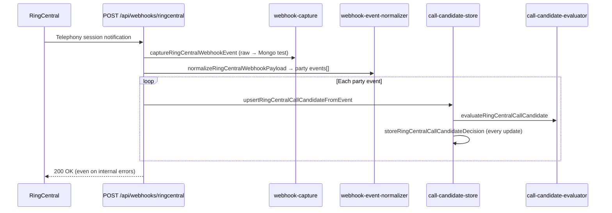
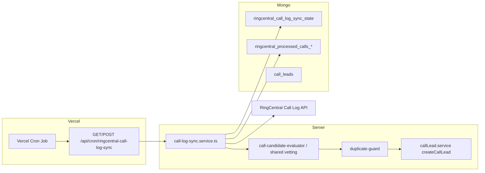

# RingCentral Hybrid Call-Lead Implementation Plan

**Purpose:** Handoff document for the next one or two agents to complete **testing** of the hybrid RingCentral strategy (webhooks + scheduled Call Log / Analytics), then **production** rollout with duplicate rules and optional post-summary validation.

**Status (as of June 2026):** Both workflows are now **implemented**. See the companion **[`RINGCENTRAL-PRODUCTION-RUNBOOK.md`](./RINGCENTRAL-PRODUCTION-RUNBOOK.md)** for the as-built business logic, control flow, env toggles, schema changes, and cutover steps. The webhook path now does session-level aggregation + narrow per-number filters; the cron path (`/api/cron/ringcentral-call-log-sync`) shares the same vetting + ingest + duplicate guard. Real `call_leads` are still gated behind `RINGCENTRAL_CREATE_CALL_LEADS=false` (default dry-run) until Phase P3 sign-off. Offline proof: `pnpm ringcentral:workflow:test` (29/29 checks).

---

## 1. Executive summary

| Layer | Today | Next (testing) | After testing (production) |
|-------|--------|----------------|----------------------------|
| **Webhooks** | Account-wide telephony session filter; per-`partyId` candidates; every event writes a decision | Narrow filters (4 toll-frees); session-level aggregation; env toggles; optional Call Log reconcile on terminal | Production webhook URL; production collections; `RINGCENTRAL_CREATE_CALL_LEADS=true` when approved |
| **Call Log / Analytics** | Scripts only (`api-probe`, `call-log-validate`) | Vercel cron route + shared sync service; idempotent processing cursor | Same cron in production; Analytics for reconciliation reporting only |
| **Duplicates** | Raw webhook dedupe by `uuid`; no call-lead duplicate logic | Spec + implementation in sync layer | Prevent double leads from webhook + cron + manual API |
| **Call leads** | `wouldCreateCallLead` flag only | Continue dry-run or shadow writes to a staging collection | `createCallLead()` with RingCentral metadata fields |

---

## 2. Repository layout (RingCentral)

### 2.1 Runtime services — `api/services/ringcentral/`

| File | Role |
|------|------|
| `auth.ts` | JWT exchange, refresh, cache invalidation on 401 |
| `client.ts` | `ringCentralRequest()` — authenticated `fetch` to `RC_SERVER_URL` |
| `token-store.ts` | `RC_TOKEN_STORE=file` (local) or `mongo` (production) |
| `file-token-store.ts` | `.ringcentral-token-cache.json` (gitignored) |
| `mongo-token-store.ts` | `integration_tokens` / key `ringcentral:oauth-token` |
| `call-lead-sources.ts` | `RINGCENTRAL_INBOUND_NUMBER_TO_SOURCE` — 4 toll-frees → `sourceLabel` / `sourceCompany` |
| `INBOUND-NUMBERS-AND-QUEUES.md` | Queue names, extension numbers (514/516/529/519), owner vs RC naming |
| `phone-normalization.ts` | E.164-like normalization for webhook + probe |
| `webhook-capture.ts` | Raw webhook persistence; filter constant; preview/sanitize |
| `webhook-event-normalizer.ts` | Payload → `NormalizedRingCentralPartyEvent[]` |
| `call-candidate-types.ts` | Mongo document shapes for events, candidates, decisions |
| `call-candidate-store.ts` | Upsert candidates/decisions (test collections) |
| `call-candidate-evaluator.ts` | Qualification rules; `CALL_LEAD_MINIMUM_ANSWERED_SECONDS = 120` |
| `call-candidate.test.ts` | Unit tests for evaluator + source mapping |
| `webhook-subscriptions.ts` | Subscription metadata → `ringcentral_webhook_subscriptions` + local JSON |

### 2.2 HTTP routes — `api/routes/ringcentral-webhook.routes.ts`

Mounted from `api/index.ts`.

| Method | Path | Purpose |
|--------|------|---------|
| GET/POST | `/api/webhooks/ringcentral` | RingCentral delivery + validation handshake |
| GET | `/api/dev/ringcentral/webhook-events` | List raw test events (non-prod or debug token) |
| GET | `/api/dev/ringcentral/call-candidates` | List test candidates |
| GET | `/api/dev/ringcentral/call-candidate-decisions` | List test decisions |
| GET | `/api/dev/ringcentral/call-candidates/:telephonySessionId` | Session detail |

Dev routes require `NODE_ENV !== "production"` **or** header/query matching `RINGCENTRAL_DEV_DEBUG_TOKEN`.

### 2.3 Scripts — `scripts/ringcentral/`

| Script | `pnpm` command | Purpose |
|--------|----------------|---------|
| `ringcentral-diagnose.ts` | `ringcentral:diagnose` | Auth + extension sanity |
| `ringcentral-call-log-validate.ts` | `ringcentral:call-log:validate` | Account vs extension call log boundary; writes gitignored JSON |
| `ringcentral-call-lead-api-probe.ts` | `ringcentral:call-lead:api-probe` | Call Log + Analytics vs lead rules; writes `ringcentral-call-lead-api-probe-output.json` |
| `ringcentral-webhook-create.ts` | `ringcentral:webhook:create` | Create RC subscription → webhook URL |
| `ringcentral-webhook-list.ts` | `ringcentral:webhook:list` | List subscriptions |
| `ringcentral-webhook-delete.ts` | `ringcentral:webhook:delete` | Delete by `RINGCENTRAL_SUBSCRIPTION_ID` |
| `ringcentral-webhook-monitor.ts` | `ringcentral:webhook:monitor` | Poll test collections (`-- --watch`) |
| `webhook_collection_example.md` | — | Sample inbound queue webhook document |

### 2.4 Cursor / internal docs

| Path | Content |
|------|---------|
| `.cursor/rules/ringcentral-integration.mdc` | Auth, env, no-secrets, current phase = test only |
| `.cursor/rules/ringcentral-call-lead-candidates.mdc` | Qualification rules, test collections, ngrok |
| `api/services/ringcentral/INBOUND-NUMBERS-AND-QUEUES.md` | Numbers, queues, extensions |

### 2.5 Related (non–RingCentral folder) lead code

| Path | Relevance |
|------|-----------|
| `api/models/CallLead.ts` | Production collection `call_leads` — **no RingCentral fields yet** |
| `api/services/leads/callLead.service.ts` | `createCallLead()` — target for promotion |
| `api/services/leads/duplicateLead.service.ts` | Form duplicate + `hasFormFillForCallLead` — pattern for call duplicate rules |

---

## 3. How the current webhook pipeline works



**Subscription filter (today):**

```text
/restapi/v1.0/account/~/telephony/sessions
```

Defined in `webhook-capture.ts` as `RINGCENTRAL_TELEPHONY_SESSIONS_EVENT_FILTER` and used by `ringcentral-webhook-create.ts`.

**Candidate key (today):** `(provider, telephonySessionId, partyId)` — one document per party, not per call session.

**Qualification (evaluator):**

1. `direction === "Inbound"` on the party
2. `to.phoneNumber` matches `RINGCENTRAL_INBOUND_NUMBER_TO_SOURCE`
3. Call answered (`answered` / `answeredAt`; not missed without answer)
4. Answered duration ≥ **120 seconds** (`CALL_LEAD_MINIMUM_ANSWERED_SECONDS`)
5. Caller phone present (`from.phoneNumber` normalized)

**Important behaviors:**

- Decisions are recomputed and **stored on every webhook** for that party.
- `wouldCreateCallLead: true` does **not** call `createCallLead()`.
- Duration before terminal status uses **elapsed time since `answeredAt`** (best-effort).
- Raw events dedupe when the same RingCentral `uuid` is seen again (`duplicateRawEvent: true` in response).

**Local webhook setup:**

1. `pnpm dev:local` (port 3000)
2. ngrok → set `RINGCENTRAL_NGROK_WEBHOOK_URL` (base URL; script appends `/api/webhooks/ringcentral`)
3. `pnpm ringcentral:webhook:create`
4. Place test calls; `pnpm ringcentral:webhook:monitor -- --watch`

---

## 4. Planned webhook improvements (testing phase)

### 4.1 Narrow event filters (per toll-free)

Replace single account-wide filter with **four** filters (one per mapped inbound number):

```text
/restapi/v1.0/account/~/telephony/sessions?direction=Inbound&phoneNumber=+18883164387
/restapi/v1.0/account/~/telephony/sessions?direction=Inbound&phoneNumber=+18883083612
/restapi/v1.0/account/~/telephony/sessions?direction=Inbound&phoneNumber=+18887240625
/restapi/v1.0/account/~/telephony/sessions?direction=Inbound&phoneNumber=+18884779232
```

**Implementation tasks:**

- Add `buildRingCentralTelephonyEventFilters()` in `call-lead-sources.ts` or `webhook-capture.ts`
- Update `ringcentral-webhook-create.ts` to pass all filters
- **Recreate subscription:** delete old subscription, create new (RingCentral does not always patch filters in place)

RingCentral supports `direction`, `phoneNumber`, `statusCode`, `missedCall` on telephony session filters — **not queue name**. Queue signal remains in party payload (`queueCall`, `uiCallInfo`, `to.extensionId`).

### 4.2 Session-level aggregation (not per-party lead)

**Problem:** One inbound call generates multiple parties (queue, agent, etc.). Today each `partyId` can produce separate candidate rows.

**Target:**

- Aggregate state at **`telephonySessionId`**
- Select **canonical inbound party** (prefer `queueCall`, inbound direction, `to.phoneNumber` on mapped toll-free)
- State machine: `not_candidate` → `candidate` → `pending_buffer` → `qualified` | `rejected`
- Write **decision documents only on status transitions**, not every webhook tick

### 4.3 Optional Call Log validation on summary completion

When a session reaches a terminal status (`Disconnected`, `Gone`, etc.) **and** webhook path says `qualified`:

| Env flag | Behavior |
|----------|----------|
| `RINGCENTRAL_WEBHOOK_CALL_LOG_VALIDATE=false` (default in early test) | Keep best-effort webhook duration only |
| `RINGCENTRAL_WEBHOOK_CALL_LOG_VALIDATE=true` | Fetch account call-log record for `telephonySessionId` / time window; confirm inbound, answered, duration ≥ 120s, target number; downgrade to `needs_review` or `rejected` on mismatch |

Reuse vetting logic from `ringcentral-call-lead-api-probe.ts` (extract shared module under `api/services/ringcentral/`).

### 4.4 Hybrid mode env flags (webhook path)

Proposed variables (implement central config module e.g. `ringcentral-config.ts`):

| Variable | Purpose | Suggested test | Suggested prod |
|----------|---------|----------------|----------------|
| `RINGCENTRAL_WEBHOOK_ENABLED` | Process webhooks | `true` | `true` |
| `RINGCENTRAL_WEBHOOK_COLLECTION_SUFFIX` | `_test` vs `` | `_test` | `` (production names below) |
| `RINGCENTRAL_WEBHOOK_CALL_LOG_VALIDATE` | Post-terminal reconcile | `true` after probe stable | `true` |
| `RINGCENTRAL_CREATE_CALL_LEADS` | Actually call `createCallLead()` | `false` | `true` when approved |
| `RINGCENTRAL_SHADOW_CALL_LEADS` | Write to staging collection only | optional `true` | `false` |

Auth (unchanged): `RC_SERVER_URL`, `RC_CLIENT_ID`, `RC_CLIENT_SECRET`, `RC_JWT`, `RC_TOKEN_STORE=mongo` on Vercel.

Webhook URL: `RINGCENTRAL_WEBHOOK_URL` (production HTTPS) or `RINGCENTRAL_NGROK_WEBHOOK_URL` (local).

---

## 5. Call Log / Analytics processing workflow (cron path)

### 5.1 What APIs are used (validated by probe)

| API | Endpoint pattern | Use |
|-----|------------------|-----|
| **Call Log (Detailed)** | `GET /restapi/v1.0/account/~/call-log?view=Detailed` | **Primary** — per-call records, caller, duration, result, legs |
| **Analytics Aggregate** | `POST /analytics/calls/v1/accounts/~/aggregation/fetch` | **Secondary** — company-number and queue rollups; reconciliation / dashboards; not caller-level leads |

**Not available:** RingCentral does **not** offer webhook subscriptions for Call Log or Analytics (confirmed in probe session and RC event-filter docs).

**Analytics caveat:** `timeTo` must not be in the future — probe uses ~2 minute end buffer (`ANL-302` otherwise). Requires app permission **Analytics**.

### 5.2 Proposed cron architecture



**Implementation tasks (testing):**

1. Add `api/services/ringcentral/call-log-sync.service.ts` — shared with probe vetting
2. Add `api/routes/ringcentral-cron.routes.ts` (or under existing cron pattern if one exists)
3. Add `vercel.json` `crons` entry (e.g. every 5–15 minutes; tune after volume study)
4. Protect route with `CRON_SECRET` / `Authorization: Bearer` (Vercel cron header)
5. Store **high-water mark** (`lastSuccessfulSyncTo`) in `ringcentral_call_log_sync_state`
6. For each qualified call-log row: upsert idempotency record then optionally create lead

**Cron env flags:**

| Variable | Purpose |
|----------|---------|
| `RINGCENTRAL_CALL_LOG_SYNC_ENABLED` | Master switch for cron path |
| `RINGCENTRAL_CALL_LOG_SYNC_INTERVAL_MINUTES` | Documentation / default window sizing |
| `RINGCENTRAL_ANALYTICS_RECONCILE_ENABLED` | Optional nightly analytics compare |
| `RINGCENTRAL_CREATE_CALL_LEADS` | Same as webhook — must be false until cutover |

**Lookback window:** e.g. `lastSync - 15 minutes overlap` to catch late-arriving call-log rows.

### 5.3 Hybrid strategy matrix

| Mode | Webhook | Cron | Validate on webhook complete | Creates real leads |
|------|---------|------|------------------------------|-------------------|
| **A – Webhook only** | on | off | optional | when flag on |
| **B – Cron only** | off | on | n/a | when flag on |
| **C – Hybrid (recommended)** | on | on | recommended `true` | when flag on |
| **D – Dry run** | on | on | on | **off** (current) |

Cron catches missed webhooks; webhooks give near-real-time candidates; optional validation reduces false positives from webhook timing.

---

## 6. Duplicate rules (to implement)

Today:

- **Raw webhooks:** duplicate acknowledgment by event `uuid` in `webhook-capture.ts`
- **Call leads:** no `duplicate` field on `CallLead`; form leads use `duplicateLead.service.ts`

### 6.1 Proposed idempotency keys

| Key | Scope | Action |
|-----|-------|--------|
| `telephonySessionId` | Global RingCentral | Primary — one lead per session |
| `callLogRecordId` / `sessionId` | Call-log path | Map to same session when possible |
| `(source_company, normalized_phone, calendar_day)` | Business duplicate | Secondary — same caller, same source, same Florida day |

### 6.2 Processing guards

Before `createCallLead()`:

1. If a lead already exists with `ringcentral_telephony_session_id` (new field) → **skip**
2. If `ringcentral_processed_calls` already has `status: lead_created` for this id → **skip**
3. If another non-`created_on_unmatched` call lead exists for same `source_company` + normalized phone within **N hours** (configurable, start with 24h) → mark as **duplicate_call** in processed collection; **do not** create (or create with `created_on_unmatched` + flag — product decision)

Align with form-fill behavior: `hasFormFillForCallLead()` already runs on manual `createCallLead()`.

### 6.3 Cross-path duplicates (webhook + cron)

Both paths must call the same `assertCanCreateRingCentralCallLead()` guard so a webhook-qualified session is not inserted again when cron runs 10 minutes later.

---

## 7. RingCentral API documentation

### 7.1 Official guides (bookmark)

| Topic | URL |
|-------|-----|
| Call Log | https://developers.ringcentral.com/guide/voice/call-log |
| Detailed Call Log | https://developers.ringcentral.com/guide/voice/call-log/details |
| Account Call Log API | https://developers.ringcentral.com/api-reference/Call-Log/readCompanyCallLog |
| Analytics API | https://developers.ringcentral.com/guide/analytics |
| Analytics Aggregation | https://developers.ringcentral.com/api-reference/Analytics/readAnalyticsCallsAggregation |
| Account Telephony Sessions notifications | https://developers.ringcentral.com/guide/notifications/event-filters/account-telephony-sessions |
| Telephony session notifications | https://developers.ringcentral.com/guide/voice/telephony-session-notifications |
| Event filters index | https://developers.ringcentral.com/guide/notifications/event-filters |
| Subscriptions API | https://developers.ringcentral.com/api-reference/Subscriptions/createSubscription |

### 7.2 In-repo API usage reference

- Probe script: `scripts/ringcentral/ringcentral-call-lead-api-probe.ts` — working request bodies for Analytics grouping (`CompanyNumbers`, `Queues`)
- Validator: `scripts/ringcentral/ringcentral-call-log-validate.ts` — account `~/call-log?view=Detailed` vs extension scope
- Sample payload: `scripts/ringcentral/webhook_collection_example.md`

---

## 8. MongoDB collections

### 8.1 Current test collections (in use)

| Collection | Written by | Purpose |
|------------|------------|---------|
| `ringcentral_webhook_events_test` | `webhook-capture.ts` | Raw webhook payloads + headers |
| `ringcentral_call_candidates_test` | `call-candidate-store.ts` | Per-party candidate state |
| `ringcentral_call_candidate_decisions_test` | `call-candidate-store.ts` | Decision audit trail |
| `ringcentral_webhook_subscriptions` | `webhook-subscriptions.ts` + scripts | Subscription metadata (not suffixed `_test`; safe for prod metadata) |

**Indexes (candidates):** unique on `(provider, telephonySessionId, partyId)`; consider migrating to `(provider, telephonySessionId)` when session aggregation lands.

### 8.2 Shared / production infrastructure (exists)

| Collection | Key / notes |
|------------|-------------|
| `integration_tokens` | `key: "ringcentral:oauth-token"` — OAuth cache for `RC_TOKEN_STORE=mongo` |
| `call_leads` | Mongoose model `CallLead` — real leads today come from API/manual flows only |

### 8.3 Production collections to create (not yet in code)

| Collection | Purpose |
|------------|---------|
| `ringcentral_webhook_events` | Production raw capture (optional retention/TTL) |
| `ringcentral_call_candidates` | Production session/party state |
| `ringcentral_call_candidate_decisions` | Production decision transitions only |
| `ringcentral_processed_calls` | Idempotency: `telephonySessionId`, `callLogId`, `source`, `status`, `callLeadId`, timestamps |
| `ringcentral_call_log_sync_state` | Cron cursor: `lastSyncTo`, `lastRunAt`, `lastError` |
| `ringcentral_analytics_snapshots` | Optional daily rollup snapshots for reconciliation |

**Cutover approach:**

1. Introduce `RINGCENTRAL_COLLECTION_MODE=test|production` or suffix env (section 4.4)
2. Dual-write during validation week (optional)
3. Stop writing `_test` in production deployment
4. Do **not** auto-migrate test data to prod — test data is ngrok/noisy

### 8.4 CallLead schema extensions (production)

Add fields to `CallLead` (or embedded subdoc) when promoting leads:

- `ringcentral_telephony_session_id` (unique sparse index)
- `ringcentral_session_id`, `ringcentral_party_id` (optional)
- `ringcentral_call_log_id`
- `ringcentral_source_label`
- `ingestion_source`: `webhook` | `call_log_sync` | `manual`
- `qualification_reason`, `answered_at`, `terminal_at`

---

## 9. Environment variables reference

### 9.1 Required (all environments)

| Variable | Description |
|----------|-------------|
| `RC_SERVER_URL` | e.g. `https://platform.ringcentral.com` |
| `RC_CLIENT_ID` | OAuth app |
| `RC_CLIENT_SECRET` | OAuth app secret |
| `RC_JWT` | JWT for initial token exchange |
| `MONGO_URI` | Required for webhook capture and candidates |

### 9.2 Webhook / local

| Variable | Description |
|----------|-------------|
| `RINGCENTRAL_NGROK_WEBHOOK_URL` | Local dev public base URL |
| `RINGCENTRAL_WEBHOOK_URL` | Production webhook base URL |
| `RINGCENTRAL_SUBSCRIPTION_ID` | For `webhook:delete` |
| `RINGCENTRAL_DEV_DEBUG_TOKEN` | Access dev inspect routes in prod-like envs |

### 9.3 Token storage

| Variable | Description |
|----------|-------------|
| `RC_TOKEN_STORE` | `file` (scripts) or `mongo` (Vercel/production) |

### 9.4 Validation scripts

| Variable | Description |
|----------|-------------|
| `RC_VALIDATE_DATE_FROM` / `RC_VALIDATE_DATE_TO` | ISO range for call-log validator |

### 9.5 Proposed hybrid / cron (implement)

See sections 4.4 and 5.2.

### 9.6 Vercel cron (implement)

| Variable | Description |
|----------|-------------|
| `CRON_SECRET` | Validates `Authorization: Bearer` on sync route |

---

## 10. Testing phase checklist (next agent)

### Phase T1 — Webhook filter + aggregation (no real leads)

- [ ] Implement `buildRingCentralTelephonyEventFilters()` and update `ringcentral-webhook-create.ts`
- [ ] Delete old RC subscription; create new with 4 filters
- [ ] Refactor `call-candidate-store.ts` to session-level canonical party
- [ ] Decisions only on state transitions; verify with `webhook:monitor` and dev routes
- [ ] Extend `call-candidate.test.ts` for multi-party sessions
- [ ] Run `pnpm test` and `pnpm typecheck`

### Phase T2 — Call Log sync (dry run)

- [ ] Extract shared vetting from `ringcentral-call-lead-api-probe.ts` into service module
- [ ] Implement cron route + `call-log-sync.service.ts`
- [ ] Add `vercel.json` crons; test with `vercel dev` or deployed preview
- [ ] Populate `ringcentral_processed_calls_test` (or prod name with `_test` suffix pattern)
- [ ] Compare probe output vs sync output for same 24h window

### Phase T3 — Optional webhook Call Log validate

- [ ] Implement terminal-hook reconcile behind `RINGCENTRAL_WEBHOOK_CALL_LOG_VALIDATE`
- [ ] Log mismatches to decisions collection with reason `call_log_mismatch`

### Phase T4 — Duplicate guards

- [ ] Implement `assertCanCreateRingCentralCallLead()`
- [ ] Unit tests: webhook then cron same session → single lead intent
- [ ] Unit tests: same phone same day → blocked or flagged per product rule

### Phase T5 — Shadow / staging leads (optional)

- [ ] `RINGCENTRAL_SHADOW_CALL_LEADS=true` writes to `ringcentral_shadow_call_leads_test` without touching `call_leads`

**Validation commands:**

```bash
cd vantage-main-server
pnpm ringcentral:diagnose
pnpm ringcentral:call-log:validate
pnpm ringcentral:call-lead:api-probe
pnpm ringcentral:webhook:monitor
pnpm test
pnpm typecheck
```

**Manual test matrix:**

| Case | Expected |
|------|----------|
| Inbound to `+18883164387`, answered ≥120s | `qualified`, `wouldCreateCallLead: true` |
| Inbound &lt;120s then hang up | `rejected` / `under_120_seconds` |
| Outbound call | `not_inbound` |
| Wrong toll-free | `target_number_not_matched` |
| Webhook missed; call appears in call log only | Cron path creates candidate (when enabled) |

---

## 11. Production cutover checklist (after testing)

### Phase P1 — Infrastructure

- [ ] Set `RC_TOKEN_STORE=mongo`; verify `integration_tokens` refresh on Vercel
- [ ] Set production `RINGCENTRAL_WEBHOOK_URL` to Vercel deployment URL
- [ ] Recreate RingCentral subscription pointing to production (4 filters)
- [ ] Create production Mongo collections (section 8.3) and indexes
- [ ] Configure Vercel cron + `CRON_SECRET`

### Phase P2 — Enable hybrid dry-run in production

- [ ] `RINGCENTRAL_WEBHOOK_ENABLED=true`
- [ ] `RINGCENTRAL_CALL_LOG_SYNC_ENABLED=true`
- [ ] `RINGCENTRAL_CREATE_CALL_LEADS=false` — monitor candidates/processed for 3–7 days
- [ ] `RINGCENTRAL_WEBHOOK_CALL_LOG_VALIDATE=true`

### Phase P3 — Go live

- [ ] `RINGCENTRAL_CREATE_CALL_LEADS=true`
- [ ] Confirm sheet sync fires (`scheduleFullSheetSyncProcess` on create)
- [ ] Monitor duplicate rate vs manual call leads
- [ ] Disable or reduce raw webhook retention if volume is high (TTL index)

### Phase P4 — Operations

- [ ] Document rollback: set `RINGCENTRAL_CREATE_CALL_LEADS=false` (processing continues without inserts)
- [ ] Alert on cron failures (`ringcentral_call_log_sync_state.lastError`)
- [ ] Weekly Analytics reconcile job (optional)

---

## 12. Probe findings (reference for testers)

Last successful probe characteristics (June 2026):

- **Call Log:** Reliable for per-call matching to toll-frees and ≥120s answered inbound.
- **Analytics:** Works after **Analytics** permission; use end-time buffer; good for aggregate counts, not per-caller leads.
- **Queue Analytics grouping:** May return zero rows under narrow filters — do not block lead pipeline on this alone.

Artifact: `ringcentral-call-lead-api-probe-output.json` (gitignored).

---

## 13. Agent handoff notes

**Do not** commit `.env`, JWT, tokens, or probe output JSON.

**Do not** enable `RINGCENTRAL_CREATE_CALL_LEADS` until Phase P3 sign-off.

**Start here for code changes:**

1. `api/services/ringcentral/call-candidate-store.ts` — session aggregation
2. `api/services/ringcentral/webhook-capture.ts` + `scripts/ringcentral/ringcentral-webhook-create.ts` — filters
3. New: `api/services/ringcentral/call-log-sync.service.ts`, `ringcentral-config.ts`, `ringcentral-duplicate-guard.ts`
4. New route: cron + `vercel.json` crons array
5. `api/models/CallLead.ts` — RingCentral metadata fields before real inserts

**Regression tests:** `api/services/ringcentral/call-candidate.test.ts` must pass after refactors.

**Related transcript:** Prior exploration and probe work are in agent transcript `37cccc11-3cfc-4617-bae4-24fd7df90c50`.

---

## 14. Document history

| Date | Change |
|------|--------|
| 2026-06-03 | Initial hybrid implementation plan for test → production handoff |
