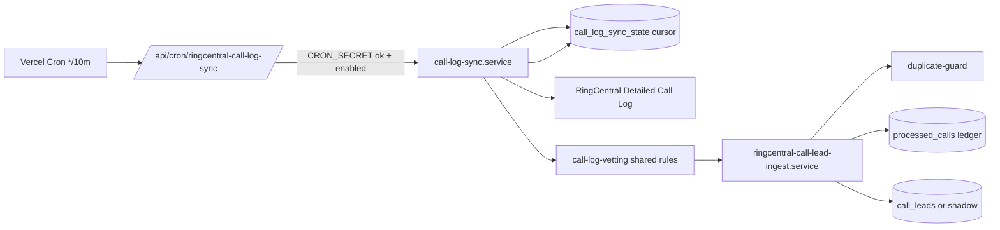

# RingCentral Call-Lead Production Runbook

**Companion to** `RINGCENTRAL-HYBRID-IMPLEMENTATION-PLAN.md` (the plan). This
document describes the **implemented** hybrid system: the business logic, the
programmatic control flow, exactly how it behaves in production once the
production webhook + cron are enabled, the environment variables that switch
strategies on/off, and the MongoDB schema changes.

Everything here is live in code under `api/services/ringcentral/`,
`api/routes/ringcentral-*.routes.ts`, and `scripts/ringcentral/`.

---

## 1. Business logic (what counts as a call lead)

A RingCentral inbound call becomes a **call lead** only when **all** of the
following are true (identical rules on both the webhook and cron paths, shared
via `call-candidate-evaluator.ts` and `call-log-vetting.ts`):

1. **Inbound** — `direction === "Inbound"`.
2. **To a mapped number** — the called number (`to.phoneNumber` on a party /
   call-log leg) is one of the four toll-frees in `call-lead-sources.ts`. The
   number maps to a `sourceLabel` + `sourceCompany`. (Queue name / extension —
   514/516/529/519 — is a secondary human identifier; the **number is the
   authoritative key**, and is the only thing RingCentral lets us filter
   subscriptions on.)
3. **Answered** — the call was actually picked up (`Answered` status / a
   connected/completed call-log result), not missed or sent to voicemail
   without answer.
4. **Duration over 120 seconds** — answered talk time
   `>= CALL_LEAD_MINIMUM_ANSWERED_SECONDS` (120).
5. **Caller phone present** — a usable `from.phoneNumber` to attribute the
   lead.

### Duplicate rule (`duplicate: boolean`)

> "A call should be marked with a flag `duplicate: boolean` if the same number
> / source company successful call comes in. This is important for the owner to
> avoid extra lead spend."

Implemented in `ringcentral-duplicate-guard.ts`:

- A qualified call is flagged **`duplicate: true`** when **another non-duplicate
  call lead already exists for the same `source_company` + same normalized
  caller phone** within the duplicate window (`RINGCENTRAL_DUPLICATE_WINDOW_HOURS`,
  default **24h**).
- Duplicates **are still recorded** (for visibility) but are created with
  **`cpl = 0`** so the owner is never charged twice for the same caller/source.
- This is distinct from **idempotency** (the same *call* creating two leads),
  which is prevented separately by the unique `ringcentral.telephony_session_id`
  index + the `ringcentral_processed_calls` ledger.

---

## 2. The two strategies and how env vars switch them

> "Environment variables will determine if one, both or neither strategy is
> live."

All toggles are resolved centrally in `ringcentral-config.ts`.

| Strategy | Switch | Effect |
|----------|--------|--------|
| **Webhook** (near real-time) | `RINGCENTRAL_WEBHOOK_ENABLED` (default `true`) | `POST /api/webhooks/ringcentral` processes telephony sessions |
| **Cron** (Call Log catch-up) | `RINGCENTRAL_CALL_LOG_SYNC_ENABLED` (default `false`) | Vercel cron hits `/api/cron/ringcentral-call-log-sync` |
| **Analytics reconcile** (reporting only) | `RINGCENTRAL_ANALYTICS_RECONCILE_ENABLED` (default `false`) | Vercel cron hits `/api/cron/ringcentral-analytics-reconcile` |

`resolveRingCentralHybridMode()` reports the effective mode:

| webhook | cron | mode |
|---------|------|------|
| on | on | `C_hybrid` (recommended for production) |
| on | off | `A_webhook_only` |
| off | on | `B_cron_only` |
| off | off | `Z_disabled` |

### Lead write posture (the safety gate)

`resolveRingCentralLeadWriteMode()` decides what actually happens to a
qualified call:

| Mode | Condition | Behavior |
|------|-----------|----------|
| `create` | `RINGCENTRAL_CREATE_CALL_LEADS=true` | Inserts a real `call_leads` document |
| `shadow` | create off, `RINGCENTRAL_SHADOW_CALL_LEADS=true` | Writes to `ringcentral_shadow_call_leads` only |
| `dry_run` | both off (**default**) | Records the decision in `ringcentral_processed_calls`; no lead |

**`RINGCENTRAL_CREATE_CALL_LEADS` is the master kill switch. Keep it `false`
through all testing and the production dry-run window. Flipping it to `true` is
the only "go-live" action.**

---

## 3. Control flow

### 3.1 Webhook path

```mermaid
sequenceDiagram
  participant RC as RingCentral
  participant WH as POST /api/webhooks/ringcentral
  participant Cap as webhook-capture
  participant Norm as webhook-event-normalizer
  participant PStore as call-candidate-store (per-party)
  participant SStore as call-session-store (aggregate)
  participant Agg as call-session-aggregator
  participant Ingest as ringcentral-call-lead-ingest.service
  participant Dup as ringcentral-duplicate-guard
  participant Lead as createRingCentralCallLead

  RC->>WH: Telephony session notification
  WH->>Cap: capture raw event (audit, always)
  alt RINGCENTRAL_WEBHOOK_ENABLED=false
    WH-->>RC: 200 (ack only, no processing)
  else enabled
    WH->>Norm: normalize -> party events[]
    loop each party event
      WH->>PStore: upsert per-party candidate + decision
    end
    WH->>SStore: processRingCentralCallSession(sessionId)
    SStore->>Agg: aggregate parties -> canonical decision
    SStore->>SStore: persist session; record decision on transition
    alt session qualified AND terminal (ingestEligible)
      WH->>Ingest: ingestRingCentralQualifiedCall(webhook)
      Ingest->>Ingest: idempotency check (processed_calls / session id)
      Ingest->>Dup: classify duplicate (same source+phone in window)
      Ingest->>Lead: create / shadow / dry-run per env
      Ingest->>Ingest: upsert processed_calls ledger
    end
    WH-->>RC: 200 (storedRawEvent, candidateUpdates, sessionUpdates)
  end
```

Key behaviors:

- The webhook **only ingests a lead when the session is `qualified` AND
  `terminal`** (`ingestEligible`), so durations are final. A still-live call
  that has already passed 120s is `qualified` but waits for hang-up. Anything
  the webhook misses is caught by the cron path.
- The endpoint **always returns 200** (even on internal error) so RingCentral
  does not disable the subscription.
- Session decisions are written **only on status transitions**, keeping the
  audit trail readable.

### 3.2 Cron path (Call Log)



- Window = `[lastSyncTo - overlap, now]` (or `[now - lookback, now]` on first
  run). Overlap (`RINGCENTRAL_CALL_LOG_SYNC_OVERLAP_MINUTES`, default 15) catches
  late-arriving call-log rows; the cursor only advances on success.
- Every qualified record goes through the **same ingest service** as the
  webhook, keyed by `telephonySessionId`, so a call already turned into a lead
  by the webhook is **skipped**, not duplicated.

### 3.3 Cross-path idempotency + duplicate (the two different guards)

| Guard | Question | Mechanism | Outcome |
|-------|----------|-----------|---------|
| **Idempotency** | Is this the *same call* again? | `ringcentral_processed_calls` keyed by `telephonySessionId` + unique `call_leads.ringcentral.telephony_session_id` index | **Skip** (no second lead) |
| **Duplicate** | Is this a *different call* from the same caller+source within the window? | `ringcentral-duplicate-guard` query on `call_leads` | **Create but flag `duplicate:true`, `cpl:0`** |

---

## 4. Production cutover — step by step

### Phase P1 — Infrastructure (no leads yet)

1. **Token storage:** set `RC_TOKEN_STORE=mongo` on Vercel (uses
   `integration_tokens`, key `ringcentral:oauth-token`).
2. **Collections:** set `RINGCENTRAL_COLLECTION_MODE=production` so the pipeline
   writes the unsuffixed collections (see §6). Leave it unset (test) anywhere
   you don't want to touch production state.
3. **Webhook URL:** confirm `RINGCENTRAL_WEBHOOK_URL` points at the production
   Vercel deployment, e.g.
   `https://vantage-movers-main-server.vercel.app/api/webhooks/ringcentral`.
4. **Recreate the subscription against production** with the narrow filters:
   - `pnpm ringcentral:webhook:list` → note the old id
   - `RINGCENTRAL_SUBSCRIPTION_ID=<old> pnpm ringcentral:webhook:delete`
   - `pnpm ringcentral:webhook:create` (defaults to per-number filters)
5. **Cron secret:** set `CRON_SECRET` on Vercel (the cron routes reject without
   it; Vercel automatically sends `Authorization: Bearer $CRON_SECRET`).
6. The `crons` array in `vercel.json` is already wired:
   - `/api/cron/ringcentral-call-log-sync` every 10 min
   - `/api/cron/ringcentral-analytics-reconcile` daily at 06:00 UTC

### Phase P2 — Production dry-run (observe, still no leads)

```
RINGCENTRAL_WEBHOOK_ENABLED=true
RINGCENTRAL_CALL_LOG_SYNC_ENABLED=true
RINGCENTRAL_CREATE_CALL_LEADS=false        # <- still off
RINGCENTRAL_WEBHOOK_CALL_LOG_VALIDATE=true # optional accuracy boost
RINGCENTRAL_COLLECTION_MODE=production
```

Monitor for 3–7 days via the dev inspection routes (§5) and the
`ringcentral_processed_calls` ledger. Optionally set
`RINGCENTRAL_SHADOW_CALL_LEADS=true` to materialize shadow leads for review
without touching `call_leads`.

### Phase P3 — Go live

```
RINGCENTRAL_CREATE_CALL_LEADS=true
```

That single flip turns dry-run/shadow decisions into real `call_leads`
inserts (which already schedule the existing Google Sheet sync via
`scheduleFullSheetSyncProcess`). Watch the duplicate rate vs. manual leads.

### Phase P4 — Rollback

Set `RINGCENTRAL_CREATE_CALL_LEADS=false`. Processing/auditing continues; no
new leads are inserted. Alert on `ringcentral_call_log_sync_state.lastError`.

---

## 5. Inspection & live testing

Dev routes (open when `NODE_ENV !== production`, else require
`x-debug-token: $RINGCENTRAL_DEV_DEBUG_TOKEN`):

| Route | Shows |
|-------|-------|
| `GET /api/dev/ringcentral/config` | Effective runtime config / hybrid mode |
| `GET /api/dev/ringcentral/webhook-events` | Raw captured webhooks |
| `GET /api/dev/ringcentral/call-candidates` | Per-party candidates |
| `GET /api/dev/ringcentral/call-sessions` | Session aggregates |
| `GET /api/dev/ringcentral/call-session-decisions` | Session decision transitions |
| `GET /api/dev/ringcentral/processed-calls` | Ingest ledger (idempotency + duplicate audit) |
| `GET /api/dev/ringcentral/call-candidates/:telephonySessionId` | One session + its parties |

Commands:

```bash
cd vantage-main-server

# Offline, deterministic proof of BOTH workflows (no DB / creds needed).
# Writes ringcentral-workflow-test-output.json + ringcentral-workflow-test.log
pnpm ringcentral:workflow:test

# Automated unit proof (evaluator, aggregator, duplicate guard, vetting)
pnpm test

# Live webhook test (local): start dev, tunnel with ngrok, create sub, monitor
pnpm dev:local
pnpm ringcentral:webhook:create
pnpm ringcentral:webhook:monitor -- --watch

# Live cron test (local), same code Vercel cron runs; safe in dry-run posture
pnpm ringcentral:call-log:sync:run
pnpm ringcentral:analytics:reconcile:run -- --hours 24
```

The cron route can also be exercised directly:

```bash
curl -H "Authorization: Bearer $CRON_SECRET" \
  https://<deployment>/api/cron/ringcentral-call-log-sync
```

---

## 6. MongoDB schema & collections

### 6.1 `call_leads` (extended)

New fields on `CallLead` (`api/models/CallLead.ts`):

- `duplicate: boolean` (indexed) — business duplicate flag.
- `ringcentral` subdocument — provenance/qualification:
  `telephony_session_id` (unique sparse index), `session_id`, `party_id`,
  `call_log_id`, `source_label`, `ingestion_source`
  (`webhook | call_log_sync | manual`), `qualification_reason`, `answered_at`,
  `terminal_at`, `duration_seconds`.

Indexes added: unique sparse on `ringcentral.telephony_session_id`;
`{ source_company, normalized_phone_number, duplicate }` for the duplicate
lookup. Manual/API call leads leave `ringcentral` undefined — fully
backward-compatible.

### 6.2 RingCentral pipeline collections

Names come from `ringcentral-config.ts`. In **test** collection mode (default)
each gets a `_test` suffix; in **production** mode the base name is used.

| Base name | Written by | Purpose |
|-----------|-----------|---------|
| `ringcentral_webhook_events` | webhook-capture | Raw webhook audit |
| `ringcentral_call_candidates` | call-candidate-store | Per-party state |
| `ringcentral_call_candidate_decisions` | call-candidate-store | Per-party decision trail |
| `ringcentral_call_sessions` | call-session-store | Session aggregates |
| `ringcentral_call_session_decisions` | call-session-store | Session decision transitions |
| `ringcentral_processed_calls` | ingest service | Idempotency + duplicate ledger |
| `ringcentral_call_log_sync_state` | call-log-sync | Cron cursor (`key: account`) |
| `ringcentral_shadow_call_leads` | ingest service | Shadow leads (when enabled) |
| `ringcentral_analytics_snapshots` | analytics-reconcile | Daily reconciliation rollups |
| `ringcentral_webhook_subscriptions` | webhook-subscriptions | Subscription metadata (**never** suffixed) |

---

## 7. Environment variable reference

### Required (all environments)
`RC_SERVER_URL`, `RC_CLIENT_ID`, `RC_CLIENT_SECRET`, `RC_JWT`, `MONGO_URI`.

### Strategy toggles (`ringcentral-config.ts`)

| Variable | Default | Meaning |
|----------|---------|---------|
| `RINGCENTRAL_WEBHOOK_ENABLED` | `true` | Process webhooks |
| `RINGCENTRAL_CALL_LOG_SYNC_ENABLED` | `false` | Run Call Log cron |
| `RINGCENTRAL_ANALYTICS_RECONCILE_ENABLED` | `false` | Run Analytics snapshot cron |
| `RINGCENTRAL_CREATE_CALL_LEADS` | `false` | **Master switch** for real `call_leads` |
| `RINGCENTRAL_SHADOW_CALL_LEADS` | `false` | Write shadow leads instead |
| `RINGCENTRAL_WEBHOOK_CALL_LOG_VALIDATE` | `false` | Reserved: reconcile webhook qualification against Call Log |
| `RINGCENTRAL_COLLECTION_MODE` | `test` | `test` (suffix `_test`) or `production` |
| `RINGCENTRAL_WEBHOOK_FILTER_MODE` | `per-number` | `per-number` (4 narrow filters) or `account` |
| `RINGCENTRAL_DUPLICATE_WINDOW_HOURS` | `24` | Duplicate lookback window |
| `RINGCENTRAL_CALL_LOG_SYNC_LOOKBACK_MINUTES` | `30` | First-run window size |
| `RINGCENTRAL_CALL_LOG_SYNC_OVERLAP_MINUTES` | `15` | Re-scan overlap each run |
| `RINGCENTRAL_ANALYTICS_END_BUFFER_MINUTES` | `2` | Trim Analytics `timeTo` (avoids ANL-302) |

### Infra / webhook / cron

| Variable | Meaning |
|----------|---------|
| `RC_TOKEN_STORE` | `file` (scripts) or `mongo` (Vercel/prod) |
| `RINGCENTRAL_WEBHOOK_URL` | Production webhook base URL |
| `RINGCENTRAL_NGROK_WEBHOOK_URL` | Local ngrok base URL |
| `RINGCENTRAL_SUBSCRIPTION_ID` | For `webhook:delete` |
| `RINGCENTRAL_DEV_DEBUG_TOKEN` | Access dev routes in prod-like envs |
| `CRON_SECRET` | Auth for `/api/cron/ringcentral-*` (Vercel cron bearer) |

---

## 8. File map (what was implemented)

Runtime services — `api/services/ringcentral/`:

- `ringcentral-config.ts` — all env toggles + collection-name resolver
- `ringcentral-mongo.ts` — shared DB accessor
- `call-lead-sources.ts` — `buildRingCentralTelephonyEventFilters()` added
- `call-session-aggregator.ts` — pure session aggregation
- `call-session-types.ts` — session document shapes
- `call-session-store.ts` — persist aggregates + decision transitions
- `ringcentral-duplicate-guard.ts` — business duplicate classification
- `processed-calls-store.ts` — idempotency/duplicate ledger
- `shadow-call-leads-store.ts` — shadow staging
- `ringcentral-call-lead-ingest.service.ts` — shared ingest (both paths)
- `call-log-vetting.ts` — shared Call Log record vetting
- `call-log-sync.service.ts` — cron Call Log sync
- `call-log-sync-state.store.ts` — cron cursor
- `analytics-reconcile.service.ts` — Analytics snapshot

Routes:

- `api/routes/ringcentral-webhook.routes.ts` — session aggregation + ingest + dev routes
- `api/routes/ringcentral-cron.routes.ts` — cron endpoints (CRON_SECRET)

Model: `api/models/CallLead.ts` (+ `createRingCentralCallLead` in
`api/services/leads/callLead.service.ts`).

Scripts — `scripts/ringcentral/`:

- `ringcentral-workflow-test.ts` — offline proof harness (`ringcentral:workflow:test`)
- `ringcentral-call-log-sync-run.ts` — manual cron sync (`ringcentral:call-log:sync:run`)
- `ringcentral-analytics-reconcile-run.ts` — manual reconcile (`ringcentral:analytics:reconcile:run`)
- `ringcentral-webhook-create.ts` — now emits the narrow per-number filters

Tests: `call-session-aggregator.test.ts`, `ringcentral-duplicate-guard.test.ts`,
`call-log-vetting.test.ts` (plus the existing `call-candidate.test.ts`).

---

## 9. Document history

| Date | Change |
|------|--------|
| 2026-06-03 | Initial production runbook for the implemented hybrid pipeline |
